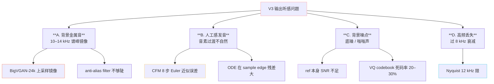
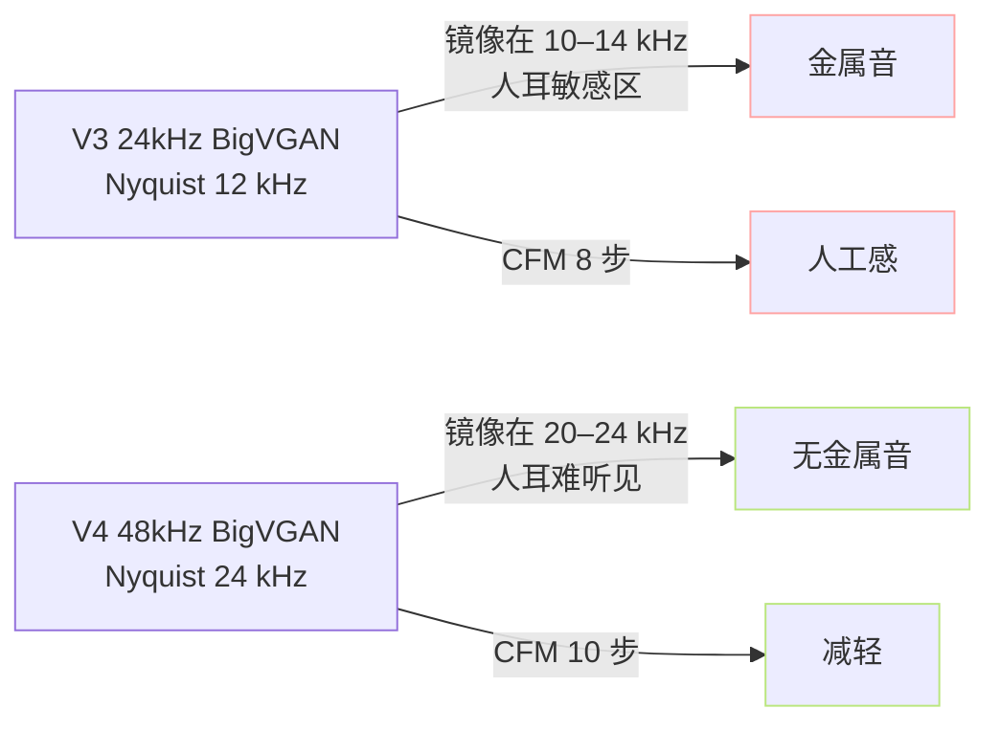

> 📎 **前置**：BigVGAN 上采样伪信号；Mel 频谱重建；NSF（Neural Source Filter）；anti-aliased upsample；[[10.4 V3（2025-02，407M，CFM 化）]]、[[10.5 V4（48k 原生 + 修复金属噪声）]]。

## 0. 定位

> 「V3 金属音与人工感是二代 CFM 架构的生长痛。」V4 推出后 80% 问题已解决，但仍有 20% 残余靠工程参数和 ref 选型缓解。本节把「现象 → 根因 → 缓解 → 彻底修复」四层都写透。

## 1. 问题分层

## 2. 根因 A：BigVGAN-24k 高频镜像

BigVGAN 上采样链：mel 80-band @100Hz → 转置卷积 ×8 ×8 ×4 ×2 = ×512 → wav @24kHz。每级转置卷积都会在 Nyquist 附近产生 **镜像谱**：

$$Y(f) = X(f) + X(f_s - f) \cdot H(f)$$

其中 $H(f)$ 是 anti-alias 滤波器响应。V3 的 BigVGAN snake activation + low-pass 不够陡，10–14 kHz 残留镜像，听感是「金属铃」。

> [💡] **为什么人耳尤其敏感**：人耳对 8–12 kHz 的纯音失真最敏感（Fletcher-Munson 曲线）。镜像谱恰好落在这一区，听感是「带铃的人声」。

## 3. 根因 B：CFM 8 步 ODE 误差

CFM 的 ODE：

$$\frac{dx_t}{dt} = v_\theta(x_t, t, c), \quad t \in [0, 1]$$

Euler 法 $x_{t+Delta t} = x_t + Delta t cdot v_theta$，局部截断误差 $O(Delta t^2)$。8 步即 $Delta t = 0.125$，累计误差与步长平方相关：

|步数|$\Delta t$|累计误差|金属音|人工感|
|---|---|---|---|---|
|4|0.25|高|明显|明显|
|**8 (V3)**|**0.125**|**中**|**有**|**有**|
|10 (V4)|0.1|低|少|少|
|16|0.0625|极低|无|无|
|32|0.031|—|无|无|

> [🤔] **能否上 RK4？** RK4 局部误差 $O(Delta t^5)$，4 步 RK4 ≈ 16 步 Euler 质量，但每步要 4 次 $v_\theta$ 评估，总开销持平。社区实验 RK2 (Heun) 在 8 步下质量介于 Euler 8 与 16 步之间，是性价比最佳折中。

## 4. 根因 C：codebook 死码与 ref 噪声

- VQ K=1024 实测利用率 70–80%，残 20–30% 死码 → 推理时遇到「未被训过的语义槽」会被 CFM 当噪声重建

- ref 本身底噪（SNR < 30 dB）→ ref_mel 被 CFM 当条件 → 噪声直接拷贝到输出

- 训练集 LibriSpeech / WenetSpeech 混入了 SNR 25–35 dB 的样本 → 模型对噪声「见怪不怪」

## 5. V3 → V4 修复路径

关键观察：**V4 不是修镜像，而是把镜像推到人耳听不见的频段**。镜像现象的物理本质没变，但人耳 16 kHz 后听觉灵敏度下降 40 dB，听感上等同于消失。

## 6. 社区缓解手段（V3 仍要用时）

|手段|金属音收益|代价|
|---|---|---|
|升 V4（推荐）|★★★★★|显存 2×|
|CFM 8 → 12 步|★★★|推理慢 50%|
|CFM Euler → RK2|★★★|推理慢 100%|
|cfg 2.0 → 3.0|★★（部分场景）|偶发吞字|
|后置低通 12 kHz|★★★|**损高频细节**|
|ref 换为 SNR ≥35 dB|★★|需选片源|
|ref 后置 UVR5 DeEcho|★★|—|

## 7. 工程判断

> 🔧 **生产环境 V3 遇金属音 → 直接升 V4。** 调参与 DSP 修补永远比换版本麻烦且效果差。

> ⚠️ **加后置低通会损高频细节**：低通到 12 kHz 把齿音、清辅音 (s/sh/ch) 的能量也削掉，听感是「闷住的人声」。

> 💡 **V4 仍残留人工感时**：80% 是 ref 问题，不是模型。改 ref（顶质量 7s + 中性语调 + SNR ≥30）比调任何参数都有效。

> 🤔 **未来方向**：CFM 蒸馏到 Consistency Model 1–2 步同时保留质量，是 V5/V6 最可能的演进方向（见 13.5）。

## 参考文献

1. Lee, S. et al. (2023). _BigVGAN: A Universal Neural Vocoder with Large-Scale Training_. ICLR.

1. Lipman, Y. et al. (2023). _Flow Matching_. ICLR.

1. Fletcher, H. & Munson, W. (1933). _Loudness, its definition, measurement and calculation_. JASA.

1. 仓库 issue #1023 V3 金属音讨论 / issue #1156 V4 修复说明.