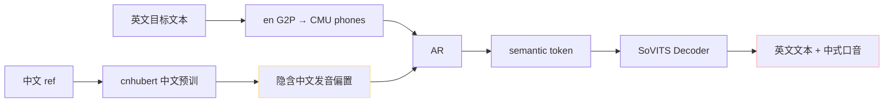
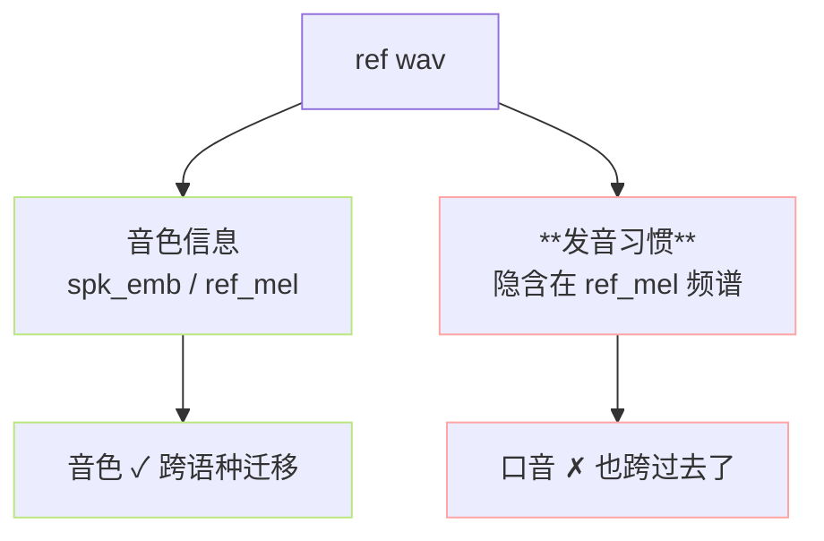

> 📎 **前置**：phoneme 跨语种共享表；SSL 表征语种偏置；IPA（国际音标）；WavLM / XLS-R 多语种 SSL；[[3.2 G2P（Grapheme-to-Phoneme）]]。

## 0. 定位

> 「中文 ref 读英文 → 中式口音；英文 ref 读中文 → 美式腔。」跨语种是 GPT-SoVITS 现阶段最明显弱项，根因是 SSL 中文偏置 + 训练数据语种不均，无法靠调参解决。

## 1. 现象与定量



社区评测主观分（5 分制）：

|组合|发音准确|音色相似|口音自然|综合 MOS|
|---|---|---|---|---|
|中文 ref → 中文目标|4.7|4.5|4.6|**4.6**|
|英文 ref → 英文目标|4.5|4.3|4.2|**4.3**|
|中文 ref → 英文目标|4.0|4.0|**2.8**|**3.5**|
|英文 ref → 中文目标|3.5|3.8|**3.0**|**3.4**|
|日文 ref → 中文目标|3.5|3.6|3.2|3.4|
|code-switch 单句|3.0|3.5|2.5|**3.0**|

## 2. 四层根因分析

|层|原因|详解|
|---|---|---|
|SSL|**cnhubert 中文预训**|WenetSpeech 1 万小时全中文 → semantic token 隐含中文发音偏置|
|音素|**phoneme 表共享但语义独立**|中英都用同一 vocab，但 `"a"` 在中文是 $a$、英文是 $æ/ɑ$，模型靠上下文区分|
|语义|**BERT 仅中文版**|chinese-roberta-wwm-ext-large 对英文输入退化为字符 embedding，韵律信号弱|
|数据|**训练集偏中**|中文 ~70% / 英文 ~20% / 日韩粤 ~10%；模型对中文 phone-prosody 联合分布学得最好|

## 3. 音色泄漏 vs 口音泄漏



> [💡] **音色与口音难以解耦**：音色 = 声带 / 共鸣腔等生理特征；口音 = 发音习惯（如把 `"th"` 发成 `"s"`）。SoVITS Decoder 没有显式解耦头，ref_mel 的频谱细节里两者纠缠在一起。NaturalSpeech 3 的 FACodec 是显式三重解耦尝试。

## 4. code-switch 单句尤其难

```jsx
输入："我昨天看到一个 amazing 的 demo"
```

phone 流：`w o3 - z uo2 t ian1 - k an4 d ao4 - y i2 g e0 - AH M EY Z IH NG - d e1 - D EH M OW`

> [⚠️] **语种边界出现势诡**：phone 流跨语种时，cnhubert 预训不了的 CMU phones (AH M EY Z IH NG) → semantic token 分布偏离 → AR 在边界处更容易吞字 / 跳字 / 口音突然切换。

## 5. 缓解方案（按收益排序）

|方案|口音收益|实施难度|代价|
|---|---|---|---|
|**同语种 ref**|★★★★★|★|需准备多语种 ref 库|
|1–2 min 目标语种 SFT|★★★★|★★|需少量目标语音频|
|**多语种 ref 拼接**（前 3s 中文 + 后 3s 英文）|★★★|★★|仅 zero-shot 可用|
|切换到 WavLM-large SSL|★★★★|★★★★★|需重训 SoVITS 7000h|
|code-switch 强制分句|★★|★|失自然韵律|
|提高 cfg + temperature|★|★|偶发吞字|

## 6. 同语种 ref 实操

```python
# 推理伪代码
lang = detect_language(target_text)  # 'zh' / 'en' / 'ja'
ref_path = REF_LIB[speaker_id][lang]  # 同一说话人不同语种 ref
sovits.infer(target_text, ref_path=ref_path, ref_text=REF_TEXT[ref_path])
```

> [🔧] **生产建议**：维护一个「说话人 × 语种」二维 ref 表。每个说话人至少 3 种语种 ref，每条 5–7 s。这是 SECS > 0.85 跨语种的工程必经路。

## 7. 长期方向：跨语种 SSL

|SSL|训练数据|语种数|跨语种潜力|
|---|---|---|---|
|cnhubert（现）|WenetSpeech 1 万 h 全中|1|低|
|WavLM-large|Mix 94 k h 多语|多|**中**|
|XLS-R|VoxPopuli 436 k h|**128**|**高**|
|w2v-BERT 2.0|4.5M h|>100|**高**|

## 8. 工程判断

> 🔧 **跨语种 zero-shot 仅能保 70–80% MOS**：严要求场景请用同语种 ref，或上 1–2 min 目标语种 fine-tune。

> ⚠️ **仓库默认不完全支持 code-switch 单句**：「Hello 世界」会在语种边界出现势诡（吞字/口音切换）。社区推荐先 split → 分别生成 → crossfade 拼接。

> 💡 **V2/V2Pro 跨语种比 V3/V4 稳**：因为 V2 时代多语种 G2P + BERT 已经成熟，而 V3/V4 训练集英文比例反而更低（资源向 CFM 倾斜）。

> 🤔 **未来彻底修复需重训**：换 SSL（WavLM/XLS-R）+ 跨语种 BERT（mBERT/XLM-R）+ 多语种平衡训练集，这是 V5 / V6 的合理预期路线。

## 参考文献

1. Chen, S. et al. (2022). _WavLM: Large-Scale Self-Supervised Pre-Training for Full Stack Speech Processing_. JSTSP. arXiv:2110.13900.

1. Babu, A. et al. (2022). _XLS-R: Self-supervised Cross-lingual Speech Representation Learning at Scale_. INTERSPEECH.

1. 仓库 issue #345 cross-lingual quality.

1. NaturalSpeech 3 FACodec 解耦讨论. arXiv:2403.03100.