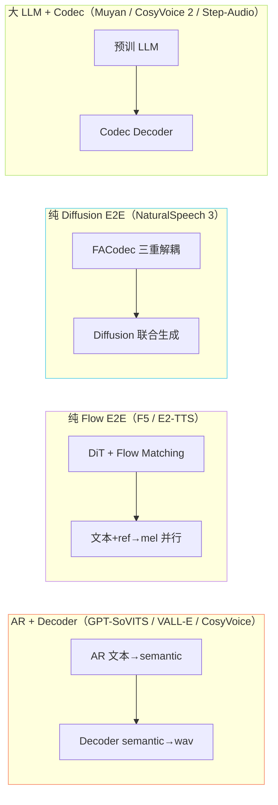
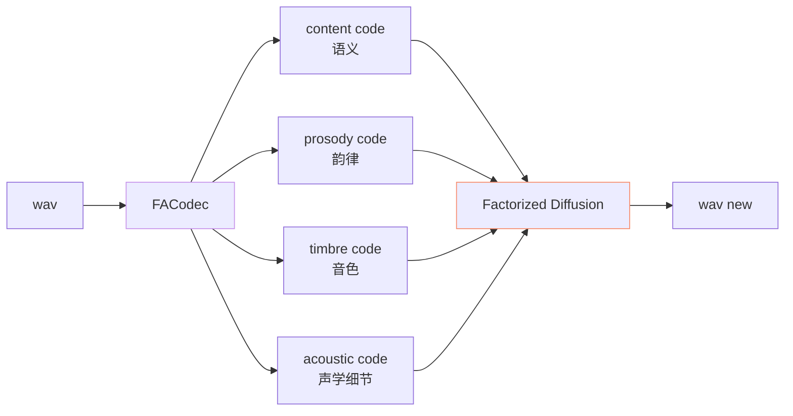

> 📎 **前置**：CFM (Conditional Flow Matching)；F5-TTS；E2-TTS；NaturalSpeech 3；Consistency Model；DiT (Diffusion Transformer)；蒸馏。

## 0. 定位

> 「AR + CFM 是 2024–2025 的中间态，未来三年似乎是纯 Flow / Diffusion 端到端。」本节梳理 4 条主要替代路线、与 GPT-SoVITS 的距离、以及 Consistency Model 蒸馏作为渐进升级的可行性。

## 1. 范式坐标



## 2. 四条路线对比

|路线|代表|训练数据|对齐|并行|延迟|zero-shot|
|---|---|---|---|---|---|---|
|AR + CFM（现）|GPT-SoVITS V3/V4|~7,000h|**隐式**（AR 已决）|否|中|强|
|纯 Flow E2E|F5-TTS、E2-TTS|~100,000h|**隐式**（filler token）|**是**|**低**|中|
|纯 Diffusion + 解耦|NaturalSpeech 3|60,000h|FACodec|是|低|中|
|大 LLM + Codec|CosyVoice 2 / Muyan|≥170,000h|显式 token|否|中-高|**强**|

## 3. F5-TTS / E2-TTS 路线深读

```mermaid
flowchart LR
  T[文本 "hello"] --> F[filler-padded<br/>h e l l o _ _ _ _ _ _]
  R[ref wav] --> M[ref mel]
  F --> DiT[DiT + Flow Matching]
  M --> DiT
  N[noise] --> DiT
  DiT --> MEL[target mel<br/>**并行生成**]
  MEL --> VOC[Vocoder]
  VOC --> WAV

  style F fill:\#1d2433,stroke:#5CCFE6,color:\#5CCFE6
  style DiT fill:\#1d2433,stroke:#C792EA,color:\#C792EA
  style MEL fill:\#1d2433,stroke:#BAE67E,color:\#BAE67E
```

关键设计：

- **filler token 隐式对齐**：把文本用空白 token padding 到目标长度，让模型自己学对齐，**无需 duration predictor、无需 MAS**

- **DiT backbone**：Transformer 处理 (time, channel) 二维 patch，自然并行

- **Flow Matching loss**：$\mathcal L_{\text{FM}} = \mathbb E\|v_\theta(x_t, t, c) - (x_1 - x_0)\|^2$，比 diffusion 训练简洁

> [💡] **F5 = Fast and Faithful + Flow + Filler**：去除 AR 后，整段 mel 一次推理出，单次前向延迟低于 AR 自回归一个数量级。代价是需要 100,000h 数据让模型自己学对齐。

## 4. Consistency Model：CFM 蒸馏到 1–2 步

Consistency Model 自一致性条件：

$$f_\theta(x_t, t) = f_\theta(x_{t'}, t'), \quad \forall\ t, t' \in [\epsilon, T]$$

训练方法：先训 teacher CFM 收敛 → 用 student $f_\theta$ 学到「任意时刻 t 跳到 t=0 的映射」。推理时一步到位。

|方案|步数|质量 MOS|推理速度|
|---|---|---|---|
|CFM Euler 8 步（V3）|8|4.3|baseline|
|CFM Euler 10 步（V4）|10|4.4|0.8×|
|**Consistency 1 步**|**1**|4.1|**8–10×**|
|**Consistency 2 步**|**2**|4.3|**4–5×**|
|Rectified Flow 蒸馏|1–2|4.2|5–8×|

> [🤔] **为什么 GPT-SoVITS 还没做？** Consistency Model 训练需要 teacher CFM 完整 ODE 轨迹 → 训练时间长 + 调参敏感（EMA、time scheduler、loss 权重）。社区 v5 路线图中已列入。

## 5. NaturalSpeech 3 FACodec 解耦



FACodec 把 wav 拆成 4 个独立码本：**内容 / 韵律 / 音色 / 声学**。可独立控制——比如保留音色码、替换韵律码 → 同一人不同情感。

> [💡] **GPT-SoVITS 仅靠 ref 隐式解耦**：ref_mel 同时含音色 + 韵律 + 声学，无法解耦。FACodec 是未来若 GPT-SoVITS 需要「可控情感」时最自然的升级路径。

## 6. GPT-SoVITS 的三条未来路径

|路径|动作|难度|预期收益|
|---|---|---|---|
|**A. 保持 AR + 蒸馏 CFM**（最可能）|Consistency Model 训练|★★|推理速度 5×，质量持平|
|**B. 替换 AR → 大 LLM**（Muyan 路线）|Qwen-7B + SoVITS Decoder|★★★|跨语种 + 上下文推理|
|**C. 转 F5/E2 端到端**|全重写|★★★★★|低延迟，但需 100,000h 数据|
|**D. 引入 FACodec 解耦**|替换 cnhubert+VQ|★★★★|可控韵律 / 情感|

## 7. 工程判断

> 🔧 **短期（半年内）最可能**：Consistency Model 蒸馏 CFM 到 1–2 步，作为 V5 释出。质量持平、推理 5× 加速、显存不变，是性价比最高的演进。

> 🤔 **中期（1–2 年）**：换 LLM 后端（Qwen/Llama + SoVITS Decoder）解决跨语种与可控性，但需 24GB+ 部署门槛。

> 💡 **长期（3 年+）**：纯 Flow E2E 若能解决对齐问题且开源 100k+ 高质量数据出现，可能是终极形态。但 GPT-SoVITS 社区生态（一键包 / WebUI / SFT 教程）使它在 AR 路线上还能跑很久。

> ⚠️ **不要盲目追 SOTA**：F5/NS3 在论文 metric 上领先，但开源复现难（数据 / 算力 / 调参敏感），社区可复刻性远低于 GPT-SoVITS。工程价值不能仅看 MOS。

## 参考文献

1. Chen, Y. et al. (2024). _F5-TTS: A Fairytaler that Fakes Fluent and Faithful Speech with Flow Matching_. arXiv:2410.06885.

1. Eskimez, S. et al. (2024). _E2 TTS: Embarrassingly Easy Fully Non-Autoregressive Zero-Shot TTS_. arXiv:2406.18009.

1. Ju, Z. et al. (2024). _NaturalSpeech 3: Zero-Shot Speech Synthesis with Factorized Codec and Diffusion Models_. arXiv:2403.03100.

1. Song, Y. et al. (2023). _Consistency Models_. ICML. arXiv:2303.01469.

1. Liu, X. et al. (2022). _Rectified Flow: A Marginal Preserving Approach to Optimal Transport_. arXiv:2209.14577.