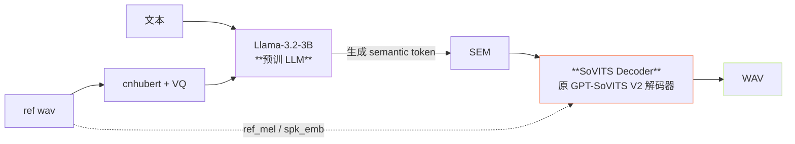
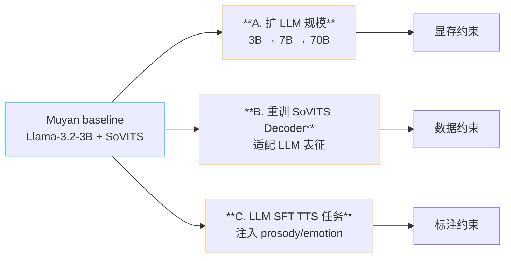
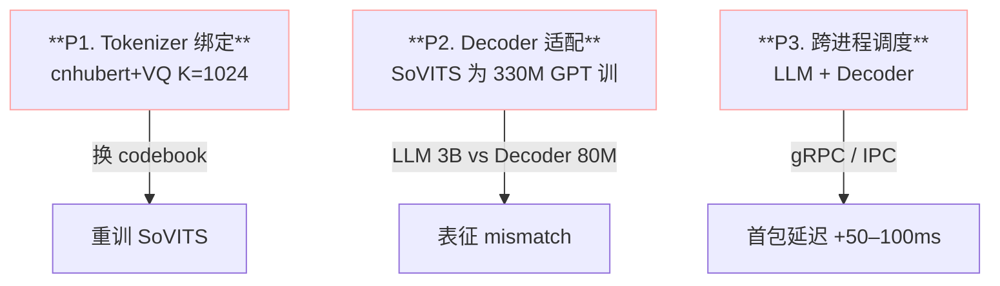
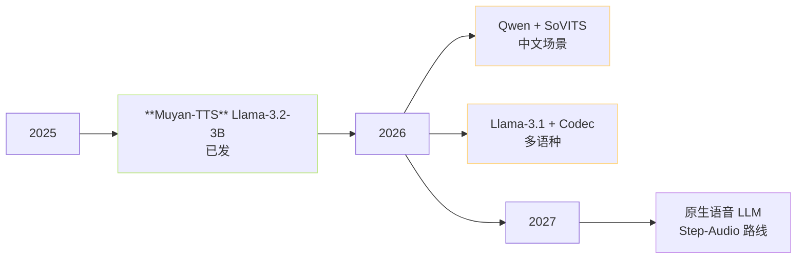

> 📎 **前置**：Muyan-TTS (Llama-3.2-3B + SoVITS Decoder)；CosyVoice 2 (Llama-style LLM)；FireRedTTS；Spark-TTS (Qwen-7B)；Step-Audio (130B 全双工)；[[11.4 vs Muyan-TTS（Llama-3.2-3B + SoVITS Decoder）|11.4 vs Muyan-TTS（Llama-3.2-3B + SoVITS Decoder）]]。

## 0. 定位

> 「把 GPT-SoVITS 自训的 AR 换成预训 LLM」是当下最可行的范式升级。Muyan 已证明工程可行；本节分析三条扩展路径、资源约束、社区落地路线图。

## 1. Muyan 范式回顾

核心改动：**只换 AR、不换 Decoder**。SoVITS Decoder 当作「通用声学后端」复用，AR 从自训 330M 换为 Llama-3.2-3B（3.2B 参数）。

## 2. 三条扩展路径

## 3. 资源占用对比

|架构|AR 参数|总参数|推理显存（BF16）|RTF（A100）|适合场景|
|---|---|---|---|---|---|
|GPT-SoVITS V4|330M|~407M|~6 GB|**~5×**|端侧 / 边缘|
|**Muyan (Llama-3.2-3B)**|**3.2B**|~3.3B|~24 GB|~2×|中小商用|
|Qwen2.5-7B + SoVITS|7B|~7.5B|~40 GB|~1×|中文优化云端|
|Llama-3.1-8B + SoVITS|8B|~8.5B|~48 GB|~0.8×|多语种云端|
|Llama-3.1-70B + SoVITS|70B|~70.5B|~280 GB (TP4)|~0.2×|研究 / 顶级 API|

> [⚠️] **显存跳跃**：3B → 7B 显存从 24 → 40 GB，越过单卡 A100/4090 (24 GB) 红线，需 H100 (80 GB) 或多卡 TP。这是 Muyan 选 3B 而非 7B 的工程根因。

## 4. 三大可扩展性瓶颈

|瓶颈|详解|缓解|
|---|---|---|
|**P1 Tokenizer**|cnhubert+VQ 是中文 SSL，跨语种弱；换 FSQ/FACodec 需重训整个 Decoder|等 v5 重训|
|**P2 表征 mismatch**|LLM 输出 3072–4096 维 hidden，SoVITS Decoder 期望 192 维 semantic；需 projection + 微调|Muyan：加 4-layer adapter|
|**P3 跨进程调度**|LLM 与 Decoder 通常跨进程 / 跨卡；gRPC 序列化 + KV cache 不共享 → 首包 +50–100ms|同进程 + CUDA stream|

## 5. 大 LLM 带来的能力跃升

|能力|GPT-SoVITS V4|Muyan (3B)|Qwen-7B + SoVITS|
|---|---|---|---|
|跨语种 zero-shot|中|**好**|**优**|
|歧义句重音判断|弱|**强**|**强**|
|上下文情感推断|无|中|**强**|
|长文本一致性|中|**强**|**强**|
|多音字消歧|g2pW 97%|**LLM 自动**|**LLM 自动**|
|稀有词读音|弱（OOV）|**强**（LLM 上下文）|**强**|

> [💡] **「免费迁移」效应**：预训 LLM 自带世界知识、多语种能力、上下文推理。例如 Muyan 能根据 "乐" 在 "音乐" / "快乐" 中正确发 yuè / lè，无需 g2pW；能在 "她说：'我去？！'" 的反问语境下加重音。

## 6. 未来 1–2 年的预期

## 7. 与 GPT-SoVITS 本体的关系

> [🤔] **GPT-SoVITS 会变成「Decoder 提供商」**：未来 GPT-SoVITS 的核心价值可能从「全栈 TTS」转为「通用声学 Decoder」。LLM 由第三方供（Llama / Qwen / Step），SoVITS Decoder 当作即插即用的发声器。这恰是 Muyan 已经走的路。

## 8. 工程判断

> 🔧 **资源受限（< 8GB 显存）** → GPT-SoVITS V4 仍是首选，没有替代。

> 🔧 **中小商用（24GB 单卡）** → Muyan 或自研 "Qwen-3B + SoVITS V4 Decoder"，跨语种 / 上下文能力跃升。

> 🔧 **云端高质量 API（40+GB）** → Qwen-7B / Llama-3.1-8B + SoVITS / Codec 是合理选型，但需 H100 部署。

> 🤔 **GPT-SoVITS 自身路线图** ：v5 是否会内置 LLM 后端尚未官方表态，但社区已有 PR 尝试集成 Qwen2.5-3B + SoVITS V2Pro Decoder（issue 跟踪中）。

> ⚠️ **不要低估部署成本**：3B LLM + Decoder 跨进程 + KV cache 管理 + batch 调度，单机 QPS 比 V4 低 5–10×。"换 LLM" 的工程量远比换模型权重大。

## 参考文献

1. Li, Z. et al. (2025). _Muyan-TTS: A Trainable Text-to-Speech Model Optimized for Podcast Scenarios with a $50K Budget_. arXiv:2504.19146.

1. Du, Z. et al. (2024). _CosyVoice 2: Scalable Streaming Speech Synthesis with Large Language Models_. arXiv:2412.10117.

1. Wang, J. et al. (2025). _Spark-TTS: An Efficient LLM-Based Text-to-Speech Model with Single-Stream Decoupled Speech Tokens_. arXiv:2503.01710.

1. Step-Audio. [https://github.com/stepfun-ai/Step-Audio](https://github.com/stepfun-ai/Step-Audio)

1. FireRedTTS. [https://fireredtts.github.io](https://fireredtts.github.io)