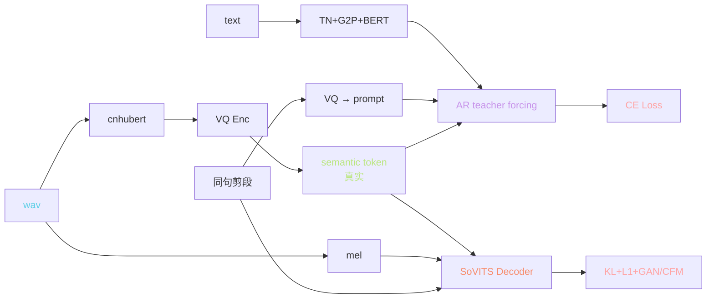
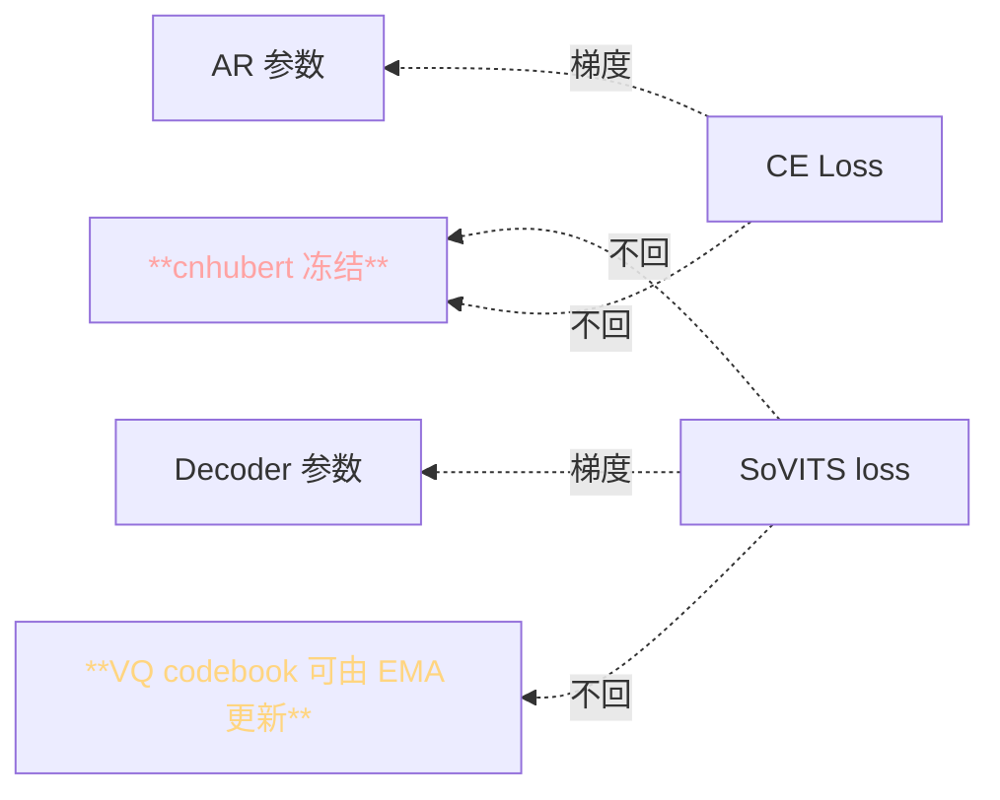
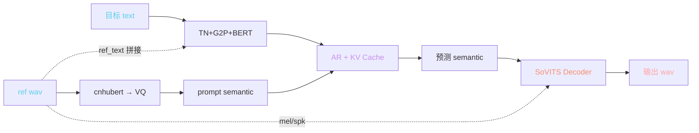
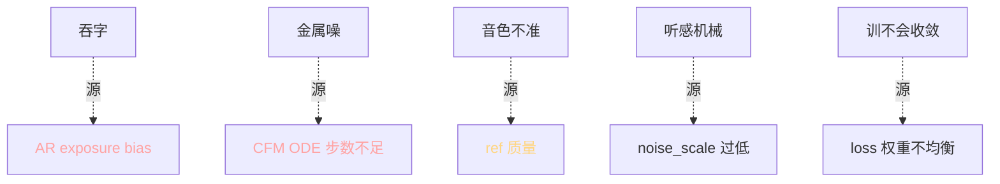

> 📎 **前置**：[[私人与共享/GPT-SoVITS 系列全栈总纲/2. GPT-SoVITS 整体架构|2. GPT-SoVITS 整体架构]]；teacher forcing 与自回归推理差异；KV Cache；exposure bias。

## 0. 定位

> 「一页把训练态与推理态的数据流画完整，让你能指到任意一个张量的来源。」本节全面清点两态下的 8 个关键张量、反向传播路径、显存瓶颈、距禕 distribution shift 根源。

## 1. 张量表（8 个核心张量）

|张量|shape|在哪产生|在哪消费|dtype|
|---|---|---|---|---|
|`wav`|[B, T_wav]|输入|cnhubert / mel|float32|
|`mel`|[B, 100, T_mel]|STFT|SoVITS posterior|float32/16|
|`hubert_hidden`|[B, T_h, 768]|cnhubert L9|VQ|float32|
|`semantic_token`|[B, T_s]|VQ 量化|AR + Decoder|int64|
|`phoneme`|[B, T_p]|TN+G2P|AR encoder|int64|
|`bert_emb`|[B, T_p, 1024]|BERT|AR encoder|float16|
|`prompt_semantic`|[B, T_ps]|ref 走 cnhubert+VQ|AR (prompt)|int64|
|`spk_emb`|[B, 256/192]|SoVITS spk encoder / ERes2NetV2|Decoder|float16|

## 2. 训练期数据流

### 反向传播路径

> [⚠️] **cnhubert 冻结**：SSL 预训不调，梯度不会传回。VQ codebook 是 EMA 更新（非梯度）。AR 与 Decoder 是两条完全独立的梯度路径。

## 3. 推理期数据流

## 4. 两态关键差异详表

|维度|训练态|推理态|后果|
|---|---|---|---|
|**AR 输入 semantic**|真实序列|AR 自己生成|exposure bias|
|**AR 计算**|teacher forcing 整段并行|KV Cache 逐 token|训 / 推费用不对称|
|**Decoder 输入**|真实 semantic + 真实 mel|预测 semantic + ref mel|不一致是低频 distribution shift|
|**参考 ref**|**同条 wav 截段**（防泄露）|**不同句** ref_audio + ref_text|设定不一致 = distribution shift|
|**显存瓶颈**|mel batch|**AR KV Cache 累积**|推理会随长度增加|
|**开启 dropout**|是|否|多样性不同|
|**LayerNorm**|训练模式|eval 模式|BN 类似问题|
|**失败模式**|不收敛 / mode collapse|hallucination / 吞字 / 金属音|错误表象完全不同|

## 5. exposure bias 数学与缓解

$$P_\text{train}(s_t \mid s_{<t}, \text{ref}) \ne P_\text{infer}(s_t \mid \hat s_{<t}, \text{ref})$$

训练时 $s_{<t}$ 是真实历史，推理时是自己生成的 $\hat s_{<t}$。一旦某个 token 出现偏差，后面都会被拰乱。

|缓解手段|机制|GPT-SoVITS 采用|
|---|---|---|
|**top_k**|限采样 k 个高概率|是（默认 5–20）|
|**top_p**|限采样累积概率 p|是（默认 1.0·不限制）|
|**temperature**|采样分布冷热调节|是（0.8–1.2）|
|**repetition_penalty**|重复 token 惩罚|是（1.0–1.35）|
|**early_stop**|超过比例提前终止|是（1.2× 预估）|
|**Scheduled Sampling**|训练时随机用预测代替真实|未采用【未来向】|

## 6. 资源需求对比

|阶段|动作|计算量|显存|
|---|---|---|---|
|训练 (s2)|2k h · 24h × 4 A100|**O(NT)** N=batch|40 GB|
|训练 (s1)|2k h · 12h × 4 A100|O(NT²) AR|30 GB|
|推理 V2|1 句 5s|O(T²) KV cache|4 GB|
|推理 V4|1 句 5s|O(T² + N_text{ode}T_m)|**12 GB**|

## 7. 常见距问题谱系

## 8. 工程判断

> 🔧 **训练与推理是同一架构的两条路径**：训走绿路（teacher forcing + 真实 mel），推走红路（KV Cache + ref mel）。不要互相修改代码分支。

> ⚠️ **训练 ref 是同条 wav 截段，推理 ref 是不同句**。这个「什么是 ref」的设定不一致是 distribution shift 的主要来源之一。**这是设计限制，不是生产的 bug**。

> 💡 **训练双路独立 → 可多阶段安排**：先训 SoVITS → 跑 [3-get-semantic.py](http://3-get-semantic.py) → 再训 AR。AR 不影响 Decoder 且 vice versa。

> 🤔 **为什么 cnhubert 冻结 —— 是资源计算 vs 表达力的取舍**。可以 unfreeze 后期 Transformer 2 层微调能提升 SECS 0.02–0.04，但计算量×2。社区 `gsv-hubert-tune` 讨论中。

## 9. 子页面

[[2.1.1 训练期数据流|2.1.1 训练期数据流]]

[[2.1.2 推理期数据流|2.1.2 推理期数据流]]

## 参考文献

1. 仓库 `s1_train.py` / `s2_train.py` / `inference_webui.py`

1. Ranzato, M. et al. (2016). _Sequence Level Training with Recurrent Neural Networks_. ICLR.

1. Schmidt, F. (2019). _Generalization in Generation: A Closer Look at Exposure Bias_. ACL.