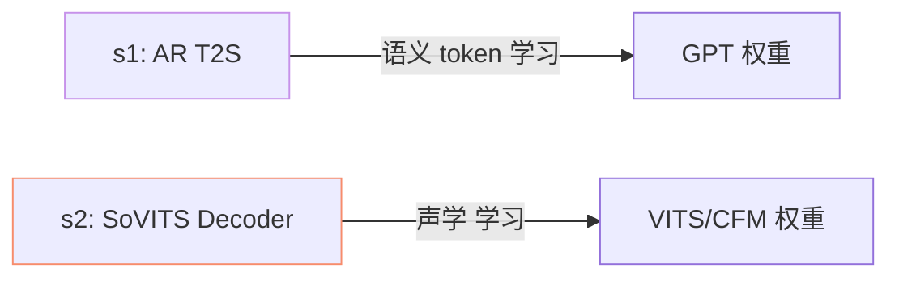
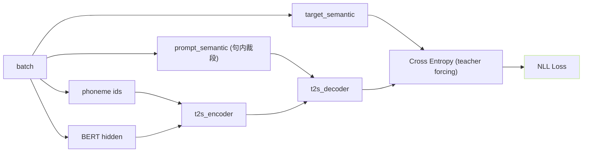
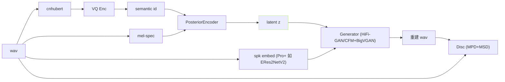

## 前置知识

> [!important]
> 
> 先读 [[2.1 高层架构图与数据流|2.1 高层架构图与数据流]]。本页聊训练态。

---

## 0. 定位

> **一句话**：训练期是「**有 ground truth 的绿路」**、一次前向 + 损失反传，与推理期逐 token 生成被动当不同。

---

## 1. 训练双阶段

- **stage 1**: `s1_train.py` 训练 AR；dataloader 提供（phoneme + BERT + prompt_semantic、target_semantic）。

- **stage 2**: `s2_train.py` 训练 SoVITS Decoder；dataloader 提供（semantic + mel + spk + wav）。

- 两阶段**独立训练、共享 VQ codebook**。

---

## 2. stage 1 详细流程

- **teacher forcing**：decoder 看到 ground-truth semantic shift right 作为输入，预测下一个 token。

- **prompt 序列**：同句 wav 的某段手说句作为 in-context example（防信息泄露需化裁段）。

---

## 3. stage 2 详细流程

### 损失

$$\mathcal L_{s2} = \mathcal L_{KL} + \lambda_1 \mathcal L_{mel} + \lambda_2 \mathcal L_{fm} + \lambda_3 \mathcal L_{adv} + \lambda_4 \mathcal L_{dur}$$

- v3/v4 额外加 **CFM 损失** 替换 Generator。

---

## 4. 参考裁段 与 推理裁段的不一致

> [!important]
> 
> **训练时 ref 是同一句裁段**（防泄露），推理时 ref 是**不同句的 reference audio**。这是 distribution shift 主要来源。 SoVITS 采用 augmentation（SpecAug + pitch shift） 缓解。

---

## 5. 关键文件

|路径|职责|
|---|---|
|`GPT_SoVITS/s1_train.py`|AR 训练入口|
|`GPT_SoVITS/s2_train.py`|SoVITS 训练入口|
|`GPT_SoVITS/AR/data/dataset.py`|AR dataset|
|`GPT_SoVITS/module/data_utils.py`|SoVITS dataset|
|`prepare_datasets/`|预处理 (audio slicing, VQ encode, BERT cache)|

---

## 参考文献

1. GPT-SoVITS Repo `s1_train.py` / `s2_train.py`.

1. Lightning Trainer Docs.