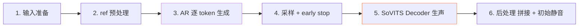
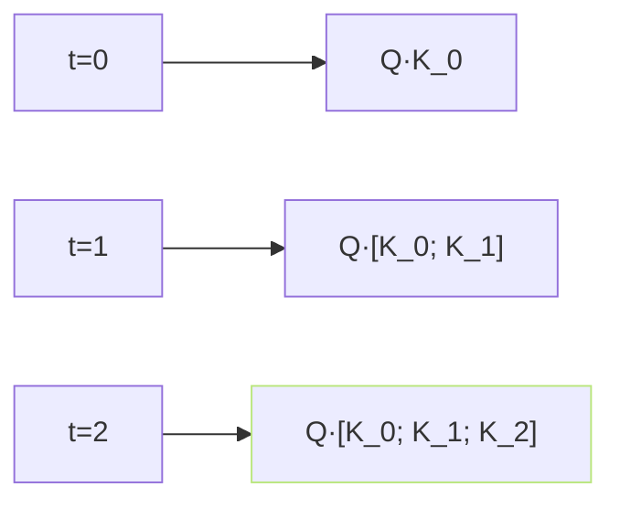

## 前置知识

> [!important]
> 
> 先读 [[2.1 高层架构图与数据流|2.1 高层架构图与数据流]]。本页聊推理态。

---

## 0. 定位

> **一句话**：推理期是「**无 ground truth 的红路**」、AR 逐 token 生成 + Decoder 一次出声、 需处理 KV Cache 、采样、early stop。

---

## 1. 推理六阶段



### 阶段 1：输入准备

- target_text → TN → phoneme → BERT。

- ref_text → TN → phoneme → BERT 拼在 target 前面。

- ref_audio → cnhubert → VQ → prompt_semantic。

### 阶段 2：AR 逐 token 生成

```python
# 伪代码
kv_cache = None
semantic_tokens = prompt_semantic.tolist()
for step in range(early_stop_num):  # 1600
    logits, kv_cache = ar_decoder.forward_one_step(
        encoder_out, semantic_tokens[-1:], kv_cache)
    # 采样
    next_token = sample(logits, top_k=15, top_p=0.8, 
                        temperature=0.7, repetition_penalty=1.35)
    if next_token == EOS: break
    semantic_tokens.append(next_token)
```

### 阶段 3：SoVITS 生声

- 输入：predicted_semantic + ref_mel + spk_embed。

- 输出：wav。

- v1/v2：Generator 一次出声。

- v3/v4：CFM 走 8/10 步 ODE 出 mel、再交给 BigVGAN 出 wav。

---

## 2. KV Cache 机制



- 每个时间步将新 K/V 追入 cache。

- **显存随生成长度线性增长**：$M_{KV} \approx 2 L \cdot H \cdot d_h \cdot T \cdot b$。

- **monkey-patch**：`AR/modules/transformer.py::patched_mha_with_cache`。

---

## 3. 采样参数默认值

|参数|默认|作用|
|---|---|---|
|top_k|15|限 候选|
|top_p|0.8|nucleus sampling|
|temperature|0.7|控随机度|
|repetition_penalty|1.35|防卷同一 token|
|early_stop_num|1600|最多生成 token 数（0.64s×25Hz=16s）|

---

## 4. 常见问题

> [!important]
> 
> - **吞字**：early_stop_num 太小或 EOS 误触发 → 升 early_stop → 升 repetition_penalty。
> 
> - **复诰的人**：repetition_penalty 太低 → 升到 1.5–1.7。
> 
> - **金属感**：v3 BigVGAN-v2 问题，与 AR 无关。
> 
> - **语调猛跳**：temperature 太高 → 降到 0.5–0.6。

详见 [[13.1 长文本稳定性（吞字 - 重复 - 漏读）|13.1 长文本稳定性（吞字 - 重复 - 漏读）]]。

---

## 5. 关键文件

|路径|职责|
|---|---|
|`GPT_SoVITS/inference_webui.py`|Gradio UI|
|`GPT_SoVITS/TTS_infer_pack/TTS.py`|主推理类|
|`GPT_SoVITS/AR/models/t2s_model.py::infer_panel`|AR 推理|

---

## 参考文献

1. GPT-SoVITS Repo `inference_webui.py`.

1. Wu et al. (2020). _KV Cache for fast Transformer inference_.