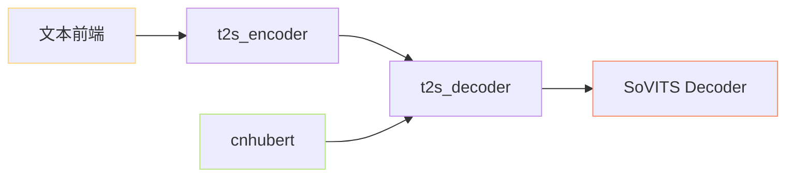

> 📎 **前置**：[[2. GPT-SoVITS 整体架构]]；SSL / VQ / Transformer / VITS 基础。

## 0. 定位

> 把架构图上的四个方块逐一展开：每个组件的输入 / 输出 / 参数量 / 是否冻结。

## 1. 组件职责拓扑

## 2. 详细对照表

|组件|输入|输出|参数量|可训|关键文件|
|---|---|---|---|---|---|
|**cnhubert**|wav 16k|`[T, 1024]` SSL|~95M|❌|`feature_extractor/cnhubert.py`|
|**t2s_encoder**|phoneme id + BERT 768-d|`[Lt, d_model]`|~5M|✅|`AR/models/t2s_model.py`|
|**t2s_decoder**|prompt semantic + enc out|semantic token logits|v1 ~150M / v3 ~300M|✅|`AR/models/t2s_model.py`|
|**SoVITS 解码端**|semantic + mel + spk|wav|v1 ~70M / v3 ~77M|✅|`module/models.py` / `models_v3.py`|

## 3. 箭头语义

- TF → ENC：文本信息进入 conditioner。

- HUB → DEC：参考 prompt semantic 提供 ICL 上下文。

- DEC → SOV：预测的 semantic token 作为 SoVITS 的主输入。

## 4. 工程判断

> 🔧 cnhubert 是「只读模块」，所有 token 字典由 SoVITS VQ 决定。二者必须同步训/同步冻。

> 💡 t2s_encoder 是「文本侧 conditioner」，t2s_decoder 才是真正的 GPT-like AR。两者联起来才等于「AR 阶段」。

> ⚠️ 如果只微调 SoVITS Decoder，记得**冻住 VQ codebook**；否则 AR 上次学到的 token 会在 codebook 走偏后完全失效。

## 5. 子页面

[[2.2.1 cnhubert 子系统]]

[[2.2.2 t2s_encoder]]

[[2.2.3 t2s_decoder（自回归核心）]]

[[2.2.4 SoVITS 解码端]]

## 参考文献

- 仓库 `GPT_SoVITS/AR/models/t2s_model.py`

- chinese-HuBERT-base