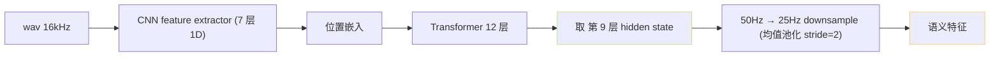
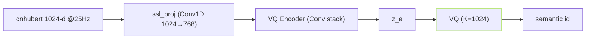

## 前置知识

> [!important]
> 
> 先读 [[1.3.3 cnhubert（Chinese-HuBERT-base）|1.3.3 cnhubert（Chinese-HuBERT-base）]] 、[[2.2 四大核心组件职责|2.2 四大核心组件职责]]。

---

## 0. 定位

> **一句话**：cnhubert 子系统 = 「**语音 16kHz → 1024-d 语义表达 @ 50Hz → 下采样 25Hz**」的微匆 SSL 快走。必需参与训练 stage 2，但**不梯度**、作为冻结特征提取器。

---

## 1. 架构



- 参数量：~95M。

- 输入采样率：16kHz。

- 中间采样率：50Hz（CNN stack 下采样 320×）。

- **输出采样率：25Hz**（额外 stride=2 池化）。

---

## 2. 代码实现

```python
# GPT_SoVITS/feature_extractor/cnhubert.py
class CNHubert(nn.Module):
    def __init__(self, path):
        self.model = HubertModel.from_pretrained(path)
    def encode(self, wav_16k):
        with torch.no_grad():
            feats = self.model(wav_16k, output_hidden_states=True)
        return feats.hidden_states[9]  # [B, T, 1024]
```

- pretrained：`TencentGameMate/chinese-hubert-base`。

- 输出后接入 SoVITS PosteriorEncoder 与 VQ。

---

## 3. SSL → semantic 路径



- `ssl_proj` 是调口、不是 BERT 拼接。

- **VQ 定义在 SoVITS 里、所以 AR 训练需先跑完 SoVITS 训练 抽取 codebook**。

---

## 4. 为什么选择「不训 cnhubert」

> [!important]
> 
> - **预训练资源**：WenetSpeech 10000h，越 7000h 的 GPT-SoVITS 训练集 —— 不需重训。
> 
> - **冻结保护 codebook stability**：同一个音频多次 forward 得出同一个 token。
> 
> - **训 cnhubert 会冲冻 VQ**：会使 AR 上次学到的 token 定义失效。

---

## 5. 与其他说话人 SSL 路线的对比

||cnhubert|ContentVec|XLS-R|WavLM|
|---|---|---|---|---|
|语言|中文主|多语|多语|多语|
|说话人解耦|部分|强解耦|中|中|
|参数|95M|95M|300M|95M|
|GPT-SoVITS 采用|✅|❌|❌|❌|

---

## 参考文献

1. GPT-SoVITS Repo `feature_extractor/cnhubert.py`.

1. [https://huggingface.co/TencentGameMate/chinese-hubert-base](https://huggingface.co/TencentGameMate/chinese-hubert-base)