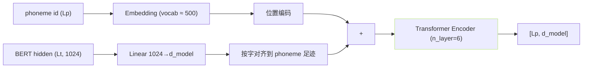
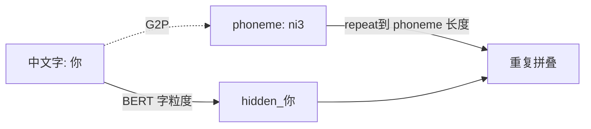

## 前置知识

> [!important]
> 
> 先读 [[2.2 四大核心组件职责]]。

---

## 0. 定位

> **一句话**：t2s_encoder = 「**语言侧 conditioner**」，负责将 phoneme + BERT hidden 融合为 AR Decoder 可以 attend 的 conditioning sequence。仅 5M 参数、轻量。

---

## 1. 架构



- d_model：v1/v2 = 512；v3/v4 = 768。

- n_layer：6（较轻量）。

- BERT hidden 被「拼加」到 phoneme embedding 上（同 phoneme 则享 BERT 表达。

---

## 2. BERT 与 phoneme 的对齐



- BERT 是**字粒度**、phoneme 为**音素粒度**，需重复广播 BERT 临表达、以足 phoneme 跳走。

- **作用**：助 AR 理解「该音素在什么语义上下文」，避免同音字误说。

---

## 3. 代码位置

```python
# GPT_SoVITS/AR/models/t2s_model.py
class Text2SemanticDecoder(nn.Module):
    def __init__(self, ...):
        self.bert_proj = nn.Linear(1024, hidden_dim)
        self.ar_text_embedding = TokenEmbedding(hidden_dim, phoneme_vocab_size)
        # ... 后面 t2s_encoder 拼上后传给 AR Decoder
```

- **未独立为一个 class**，逻辑住在 `Text2SemanticDecoder.__init__`。不要被名字误导。

---

## 4. 依赖的上游

|代码|职责|
|---|---|
|`text/chinese.py`|中文 G2P|
|`text/cleaner.py`|TN 清洗|
|`text/symbols.py`|phoneme vocab|
|`BERT/chinese-roberta-wwm-ext-large`|中文 BERT|

---

## 5. 为什么 BERT 不是必选

> [!important]
> 
> - v1 原判：使用 BERT、提升中文同音字发音。
> 
> - v2/v3/v4：保留 BERT、加多语选项。
> 
> - **英文 / 日文**：也可以用 BERT 但贡献较小（同音字问题不严重）。

---

## 参考文献

1. GPT-SoVITS Repo `AR/models/t2s_model.py`.

1. Cui, Y. et al. (2020). _Chinese-RoBERTa-wwm-ext-large_.