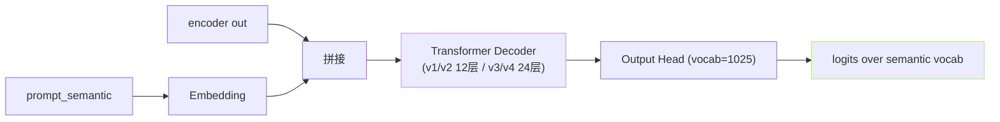

## 前置知识

> [!important]
> 
> 先读 [[2.2 四大核心组件职责]]。本页是 AR 架构总览、详细实现遵 L2-5。

---

## 0. 定位

> **一句话**：t2s_decoder = 「**GPT-like 自回归语义生成器**」，接受「encoder 输出 + prompt_semantic」作为 context，逐 token 预测语义 token。是 GPT-SoVITS 中出「GPT」名字的地方。

---

## 1. 架构



### 参数

|资源|v1/v2|v3/v4|
|---|---|---|
|n_layer|12|24|
|d_model|512|768|
|d_ffn|2048|3072|
|n_head|8|12|
|max_ctx|1024|2048|
|参数量|150M|330M|

### vocab

- semantic vocab = 1024 codebook + 1 EOS = **1025**。

- 参赛与 VQ codebook 同步。

---

## 2. KV Cache monkey-patch

```python
# GPT_SoVITS/AR/modules/transformer.py
def patched_mha_with_cache(self, q, k, v, kv_cache=None, ...):
    if kv_cache is not None:
        k = torch.cat([kv_cache['k'], k], dim=2)
        v = torch.cat([kv_cache['v'], v], dim=2)
    new_cache = {'k': k, 'v': v}
    return F.scaled_dot_product_attention(q, k, v, ...), new_cache
```

- **原平 PyTorch nn.MultiheadAttention 不支持 cache**，需 monkey-patch。

- 推理调 `forward_one_step` 、训练调 `forward`。

---

## 3. 训练损失

$$\mathcal L_{AR} = -\sum_{t=1}^T \log p_\theta(s_t | s_{<t}, c)$$

- ignore_index = -100（padding）。

- 使用 label smoothing = 0.0（未启用）。

- 梯度裁剪 1.0。

---

## 4. 推理采样

```python
# AR/models/t2s_model.py::infer_panel
logits = self.ar_predict_layer(decoder_out)
logits = repetition_penalty_fn(logits, semantic_tokens, penalty=1.35)
logits = logits / temperature
logits = top_k_top_p_filtering(logits, top_k=15, top_p=0.8)
probs = F.softmax(logits, dim=-1)
next_token = torch.multinomial(probs, num_samples=1)
```

详见 [[2.1.2 推理期数据流]]。

---

## 5. 训练 资源估算

||v1/v2|v3/v4|
|---|---|---|
|训练 GPU|1×A100 (40G)|4×A100 (80G)|
|样本 batch|16-32|8-16|
|step 频又|100k-300k|500k+|
|训练时间|~3 天|~2 周|

---

## 参考文献

1. GPT-SoVITS Repo `AR/models/t2s_model.py`, `AR/modules/transformer.py`.

1. [[5. AR - T2S 模型（GPT 语义建模阶段）]]中详细推导。