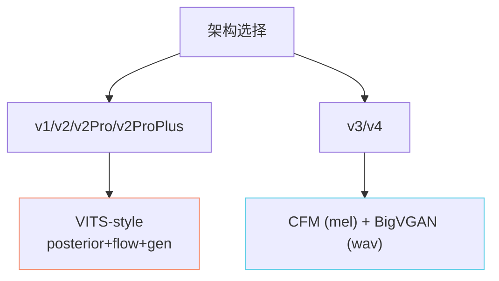
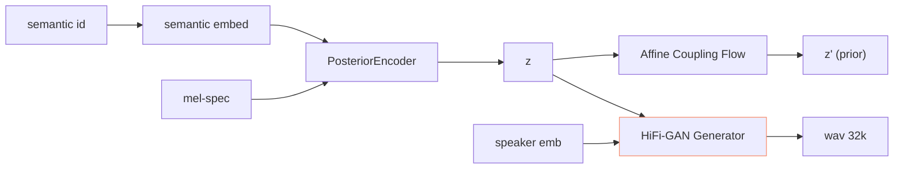
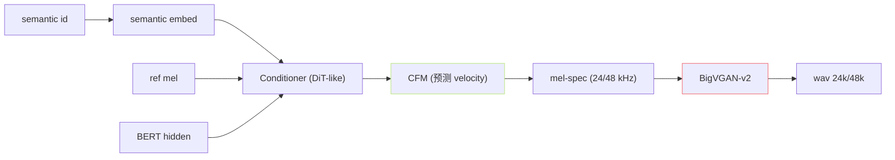

## 前置知识

> [!important]
> 
> 先读 [[2.2 四大核心组件职责|2.2 四大核心组件职责]]。本页是 SoVITS 解码器总览、详细实现遵 L2-6。

---

## 0. 定位

> **一句话**：SoVITS 解码器 = 「**语义 token → 波形**」的声学生成器。v1/v2/v2Pro 采用 VITS，v3/v4 采用 CFM + BigVGAN。

---

## 1. 两条架构路线

---

## 2. VITS 架构 (v1/v2/v2Pro)

### 高颒点

- v2Pro/v2ProPlus：加入 **ERes2NetV2** 说话人嵌入（192-d，预训 VoxCeleb1-O EER ~0.6%）。

- 重建损失：L1 (mel) + KL (z) + GAN (MPD+MSD)。

- 输出采样率：v1 24k / v2 32k / v2Pro 32k。

---

## 3. CFM + BigVGAN 架构 (v3/v4)

### 训练损失

$$\mathcal L_{\text{CFM}} = \mathbb E_{t, z_0, x_1} \| v_\theta(x_t, t, c) - (x_1 - z_0) \|^2$$

### 推理参数

- v3: NFE = 8, CFG w = 2.0, BigVGAN-v2 24khz-100band-256x。

- v4: NFE = 10, BigVGAN-v2 48khz-100band-512x 原生 48kHz，修复 v3 金属感。

---

## 4. 参数表

|版本|SoVITS 参数|采样率|架构|
|---|---|---|---|
|v1|70M|24kHz|VITS|
|v2|70M|32kHz|VITS|
|v2Pro|75M|32kHz|VITS + ERes2NetV2|
|v2ProPlus|90M|32kHz|VITS + ERes2NetV2 + 额外优化|
|v3|77M|24kHz|CFM + BigVGAN-v2|
|v4|80M|48kHz|CFM + BigVGAN-v2 (修复版)|

---

## 5. 关键文件

|路径|职责|
|---|---|
|`module/models.py`|VITS Generator + Discriminator (v1/v2/v2Pro)|
|`module/models_v3.py`|v3 CFM Decoder|
|`module/models_v4.py`|v4 CFM Decoder|
|`module/quantize.py`|VQ Encoder|
|`BigVGAN/bigvgan.py`|BigVGAN 声码器|

---

## 参考文献

1. GPT-SoVITS Repo `module/`, `BigVGAN/`.

1. [[私人与共享/GPT-SoVITS 系列全栈总纲/6. SoVITS 解码器（声学生成阶段）|6. SoVITS 解码器（声学生成阶段）]] 详细推导。