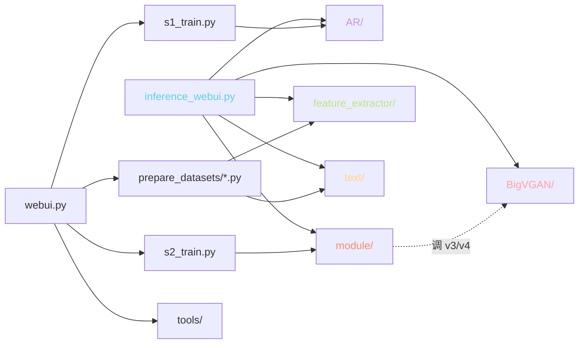
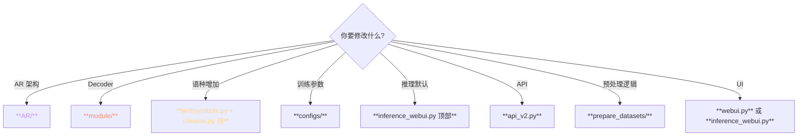

> 📎 **前置**：clone 完仓库；Python 模块导入基础；PyTorch / Lightning 原理。

## 0. 定位

> 「迷路时回这页。」仓库 8 个核心目录的职责、入口文件、与上下游模块依赖、修改点速查。是调试与二次开发的「地图」。

## 1. 目录拓扑

```mermaid
flowchart TD
  ROOT[GPT-SoVITS/]
  ROOT --> AR[**GPT_SoVITS/AR/**<br/>AR T2S 模型]
  ROOT --> MOD[**GPT_SoVITS/module/**<br/>SoVITS Decoder]
  ROOT --> BVG[**GPT_SoVITS/BigVGAN/**<br/>v3/v4 声码器]
  ROOT --> FE[**GPT_SoVITS/feature_extractor/**<br/>cnhubert]
  ROOT --> TXT[**GPT_SoVITS/text/**<br/>TN+G2P+BERT]
  ROOT --> CFG[**GPT_SoVITS/configs/**<br/>训练/推理 yaml]
  ROOT --> PREP[**prepare_datasets/**<br/>预处理脚本]
  ROOT --> TOOLS[**tools/**<br/>UVR5/ASR/Slicer]
  ROOT --> ENTRY[**入口脚本**<br/>s1_train.py / s2_train.py / webui.py / inference_webui.py / api_v2.py]

  style ROOT fill:\#1d2433,stroke:\#5CCFE6,color:#5CCFE6
  style AR fill:\#1d2433,stroke:\#C792EA,color:#C792EA
  style MOD fill:\#1d2433,stroke:\#F78C6C,color:#F78C6C
  style BVG fill:\#1d2433,stroke:\#FFA3A3,color:#FFA3A3
  style FE fill:\#1d2433,stroke:\#BAE67E,color:#BAE67E
  style TXT fill:\#1d2433,stroke:\#FFD580,color:#FFD580
  style CFG fill:\#1d2433,stroke:\#FFD580,color:#FFD580
  style PREP fill:\#1d2433,stroke:\#BAE67E,color:#BAE67E
  style TOOLS fill:\#1d2433,stroke:\#BAE67E,color:#BAE67E
  style ENTRY fill:\#1d2433,stroke:\#FFA3A3,color:#FFA3A3
```

## 2. 八个核心目录详表

|目录|职责|线表 LOC|调用者|依赖|
|---|---|---|---|---|
|**AR/**|AR T2S 模型|~3k|s1_train, inference|PyTorch + Lightning|
|**module/**|SoVITS Decoder|~5k|s2_train, inference|PyTorch|
|**BigVGAN/**|v3/v4 声码器|~1k|module (v3/v4)|PyTorch|
|**feature_extractor/**|cnhubert|~500|prepare_datasets, inference|transformers|
|**text/**|TN+G2P+BERT|~6k|prepare_datasets, inference|jieba/pyopenjtalk/g2pW|
|**configs/**|yaml / json|—|train scripts|—|
|**prepare_datasets/**|预处理脚本|~2k|三脚本|cnhubert + VQ|
|**tools/**|UVR5/ASR/Slicer|~3k|webui|UVR5/FunASR/silero|

## 3. 关键文件速查表

|路径|内容|修改场景|
|---|---|---|
|`AR/models/t2s_model.py`|AR 主结构 (T2SEncoder + T2SDecoder)|增/减 AR 层·改架构|
|`AR/modules/transformer.py`|Transformer + KV Cache monkey-patch|加速推理|
|`AR/data/dataset.py`|AR 训练 dataset|改采样策略 / bucket|
|`module/models.py`|SoVITS Generator + Discriminator (v1/v2)|改 SoVITS 架构|
|`module/models_v3.py`|v3 CFM Decoder|改 CFM|
|`module/quantize.py`|VQ Encoder 实现|调 codebook|
|`BigVGAN/bigvgan.py`|24k / 48k 声码器|调声码器|
|`feature_extractor/cnhubert.py`|SSL 抽取|换 SSL 模型|
|`text/symbols.py`|多语种 phoneme 表|增语种|
|`text/chinese.py` / `english.py` / ...|各语种 TN+G2P|调 TN 规则|
|`configs/s2.json` / `s2v3.json` / `s2v4.json`|SoVITS 训练配置|调 batch / lr / loss 权重|
|`configs/s1.yaml`|AR Lightning 配置|调 AR 训练参数|
|`s1_train.py` / `s2_train.py`|训练入口|DDP 多卡·修改训逻辑|
|`webui.py`|训练 Gradio UI|修改训练面板|
|`inference_webui.py`|推理 Gradio UI|修改推理面板 + cut 逻辑|
|`api.py` / `api_v2.py`|HTTP API|部署服务|

## 4. 模块依赖图

## 5. 入口脚本 · 职责 · 调用链

|入口|职责|调用主要模块|资源|
|---|---|---|---|
|`webui.py`|训练主控|tools + prepare_datasets + s1/s2_train|低|
|`prepare_datasets/1-get-text.py`|TN+G2P+BERT|text/|CPU|
|`prepare_datasets/2-get-hubert-wav32k.py`|SSL 抽取|feature_extractor/|GPU|
|`prepare_datasets/3-get-semantic.py`|VQ 量化|module/quantize|GPU|
|`s2_train.py`|SoVITS 训练|module/ + BigVGAN/|4 GPU|
|`s1_train.py`|AR 训练|AR/|4 GPU|
|`inference_webui.py`|Gradio 推理|AR/ + module/ + feature_extractor/ + text/|1 GPU|
|`api_v2.py`|HTTP 推理 API|同上|1 GPU+|

## 6. 修改地图

## 7. 常见修改场景

|场景|修改点|可能连锅点|
|---|---|---|
|**新增一种语种**|text/ 加文件 + [symbols.py](http://symbols.py) 加音素 + AR vocab 重训|需重新跑脚本 1·3 + 重训 AR|
|**增大 batch**|configs/s2*.json batch_size|似存·需 DDP|
|**改采样率**|configs/s2*.json sampling_rate|需 mel_spec 同步·预处理重跑|
|**限制生成语种**|inference_[webui.py](http://webui.py) 加提示词 · G2P 限制|避免 100% AR 重训|
|**加速推理**|AR/modules/[transformer.py](http://transformer.py) FlashAttn-2|需 PyTorch >=2.1|

## 8. 工程判断

> 🔧 **修改 AR 看** `**AR/**`**；修改 Decoder 看** `**module/**`**；调推理默认参数看** `**inference_webui.py**` **顶部**。

> 🔧 **新增一种语种 →** `**text/**` **加文件 +** `**symbols.py**` **加音素 + AR vocab 重训**。三步缺一不可。

> 💡 **训练脚本与推理脚本是完全独立的两条路径，别互相修改**。改 inference 不会影响训练，反之亦然。

> 🤔 `**configs/**` **存在三代配置 (s2/s2v3/s2v4)**：架构迭代遗留。未来可能统一到一个文件加 version 字段。

## 9. 子页面

[[2.4.1 GPT_SoVITS-AR-|2.4.1 GPT_SoVITS-AR-]]

[[2.4.2 GPT_SoVITS-module-（SoVITS 部分）|2.4.2 GPT_SoVITS-module-（SoVITS 部分）]]

[[2.4.3 GPT_SoVITS-prepare_datasets-|2.4.3 GPT_SoVITS-prepare_datasets-]]

[[2.4.4 GPT_SoVITS-BigVGAN-|2.4.4 GPT_SoVITS-BigVGAN-]]

[[2.4.5 tools- 与 webui.py|2.4.5 tools- 与 webui.py]]

[[2.4.6 api.py - api_v2.py|2.4.6 api.py - api_v2.py]]

## 参考文献

1. 仓库：[https://github.com/RVC-Boss/GPT-SoVITS](https://github.com/RVC-Boss/GPT-SoVITS)

1. PyTorch Lightning: [https://lightning.ai/docs/pytorch/stable/](https://lightning.ai/docs/pytorch/stable/)