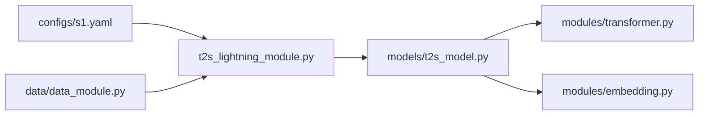

## 前置知识

> [!important]
> 
> 先读 [[2.4 仓库目录结构导航]]。

---

## 0. 定位

> **一句话**：`GPT_SoVITS/AR/` = 「**GPT 部分的全部代码**」。含模型定义、Transformer block、dataset、training loop 资源。

---

## 1. 目录结构

```jsx
GPT_SoVITS/AR/
├── data/
│   ├── bucket_sampler.py
│   ├── data_module.py
│   └── dataset.py
├── models/
│   ├── t2s_lightning_module.py
│   ├── t2s_model.py
│   └── utils.py
├── modules/
│   ├── activation.py
│   ├── embedding.py
│   ├── lr_schedulers.py
│   ├── optim.py
│   ├── patched_mha_with_cache.py
│   ├── scaling.py
│   └── transformer.py
├── text_processing/
│   └── phonemizer.py
└── utils/
    └── io.py
```

---

## 2. 关键文件职责

|文件|职责|
|---|---|
|`models/t2s_model.py`|`Text2SemanticDecoder` 主类，含训练 forward 与推理 `infer_panel`|
|`models/t2s_lightning_module.py`|Lightning `Text2SemanticLightningModule`，含优化器、损失计算|
|`modules/transformer.py`|自定义 Transformer 块（不用 nn.Transformer）、含 KV Cache|
|`modules/patched_mha_with_cache.py`|KV Cache 的 monkey-patch 实现|
|`modules/embedding.py`|TokenEmbedding + SinePositionalEmbedding|
|`data/dataset.py`|TTSDataset，加载 phoneme/BERT/semantic|
|`data/bucket_sampler.py`|以序列长度分桶采样、提高 batch 效率|

---

## 3. 依赖的上下游



---

## 4. 训练入口

```python
# s1_train.py
from GPT_SoVITS.AR.models.t2s_lightning_module import Text2SemanticLightningModule
from GPT_SoVITS.AR.data.data_module import Text2SemanticDataModule
from pytorch_lightning import Trainer

model = Text2SemanticLightningModule(config)
data = Text2SemanticDataModule(config)
trainer = Trainer(...)
trainer.fit(model, data)
```

---

## 5. 推理入口

```python
from GPT_SoVITS.AR.models.t2s_model import Text2SemanticDecoder

model = Text2SemanticDecoder.from_pretrained("s1v3.ckpt")
pred_semantic = model.infer_panel(
    all_phoneme_ids, all_phoneme_len, prompt_semantic,
    bert_feature, top_k=15, top_p=0.8, temperature=0.7)
```

---

## 参考文献

1. GPT-SoVITS Repo `GPT_SoVITS/AR/`.