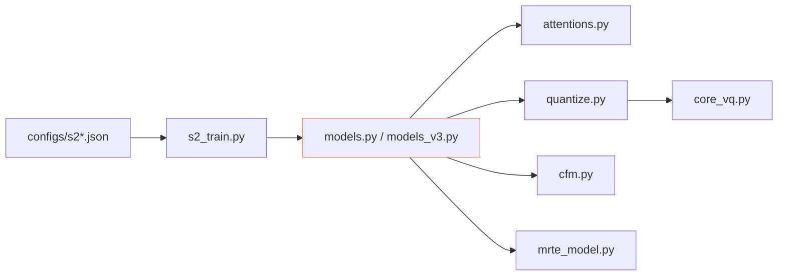

## 前置知识

> [!important]
> 
> 先读 [[2.4 仓库目录结构导航]]。

---

## 0. 定位

> **一句话**：`GPT_SoVITS/module/` = 「**SoVITS 解码器部分的全部代码**」。含 Generator、Discriminator、CFM Decoder、VQ、PosteriorEncoder 资源。

---

## 1. 目录结构

```jsx
GPT_SoVITS/module/
├── attentions.py
├── cfm.py             # v3/v4 CFM 实现
├── commons.py
├── core_vq.py         # VectorQuantize 与 EMA 更新
├── data_utils.py      # SoVITS dataset
├── losses.py          # KL/L1/GAN/CFM losses
├── mel_processing.py  # mel-spec 计算
├── models.py          # v1/v2/v2Pro 主架构
├── models_v3.py       # v3 主架构
├── models_v4.py       # v4 主架构
├── modules.py         # WaveNet block、ResBlock
├── mrte_model.py      # Mel-style 参考编码 (MRTE)
├── quantize.py        # ResidualVectorQuantizer 包装
└── transforms.py      # piecewise rational quadratic spline (NF 中)
```

---

## 2. 关键文件职责

|文件|职责|
|---|---|
|`models.py`|`SynthesizerTrn`（v1/v2/v2Pro）与 `MultiPeriodDiscriminator`|
|`models_v3.py`|`SynthesizerTrnV3`，含 CFM + DiT-like cond encoder|
|`models_v4.py`|`SynthesizerTrnV4`，原生 48kHz + 修复 v3 金属问题|
|`cfm.py`|`CFM` 类，含 `forward` (训练) 与 `sample` (Euler ODE)|
|`quantize.py`|`ResidualVectorQuantizer` 包装 + VQ codebook|
|`core_vq.py`|EMA 更新、dead code 检测与重并|
|`attentions.py`|Multi-Head Attention 与 Relative Position|
|`modules.py`|WaveNet residual block 、HiFi-GAN ResBlock|
|`mrte_model.py`|Mel 风格参考编码、提供说话人信息|

---

## 3. 架构依赖图



---

## 4. 训练入口

```python
# s2_train.py
from module.models import SynthesizerTrn, MultiPeriodDiscriminator
from module.data_utils import TextAudioSpeakerLoader, TextAudioSpeakerCollate

net_g = SynthesizerTrn(...)
net_d = MultiPeriodDiscriminator(...)
# 训练循环: Generator 与 Discriminator 交替更新
```

---

## 5. 与 AR 的在接点

- AR 训练需的 semantic id 由 `quantize.py` 生成。

- 训练顺序：**先 stage 2 (生 codebook) → 后 stage 1 (AR 训 codebook 的 token)**。

> [!important]
> 
> 不要交换顺序。AR 依赖 codebook 已经定义。

---

## 参考文献

1. GPT-SoVITS Repo `GPT_SoVITS/module/`.