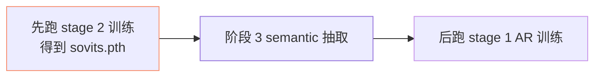

## 前置知识

> [!important]
> 
> 先读 [[2.4 仓库目录结构导航]]。

---

## 0. 定位

> **一句话**：`prepare_datasets/` = 「**从 raw 音频 → 训练就绪的 list/feature 文件**」的脱线预处理脚本。三阶段：BERT 预抽、cnhubert 预抽、semantic id 预抽。

---

## 1. 目录结构

```jsx
prepare_datasets/
├── 1-get-text.py            # 预抽 BERT hidden 与 phoneme
├── 2-get-hubert-wav32k.py   # 预抽 cnhubert SSL
└── 3-get-semantic.py        # 预抽 semantic id (VQ 编码)
```

---

## 2. 三阶段详说

### 阶段 1: `1-get-text.py`

```python
# 伪代码
for wav_path, transcript in dataset:
    phones, _ = g2p(transcript, lang)
    bert_feature = bert_model.encode(transcript)  # [Lt, 1024]
    save(phones, bert_feature, wav_path)
```

- 输出：`name2text.txt`、`{name}.bert.pt`。

### 阶段 2: `2-get-hubert-wav32k.py`

```python
for wav_path in dataset:
    wav_16k = load_resample(wav_path, 16000)
    ssl = cnhubert.encode(wav_16k)  # [T, 1024] @ 25Hz
    save(ssl, wav_path)
```

- 输出：`{name}.ssl.pt`、 同时输出 32kHz resampled wav 文件。

### 阶段 3: `3-get-semantic.py`

```python
for ssl_path in dataset:
    ssl = load(ssl_path)
    semantic_id = vq_encoder.encode(ssl)  # [T] in [0, 1024)
    save(semantic_id, ssl_path)
```

- 输出：`name2semantic.tsv`。

- **需依赖上一轮 SoVITS Generator checkpoint、才能编码**。

---

## 3. 顺序依赖



> [!important]
> 
> 不能跳阶段。VQ codebook 是二阶联动的纷胴、顺序错误会导致 AR 学习「乱码」。

---

## 4. 与 WebUI 集成

在 `webui.py` 中 「一键预处理」会依次调用三个脚本。详见：[[2.4.5 tools- 与 webui.py]]。

---

## 5. 技术重点

- **并行**：脚本使用 multiprocessing、默认 1 个 worker 「2-get-hubert」需 GPU。

- **缓存**：预处理输出缓存在 `logs/{exp_name}/` 中。

- **错误恢复**：脚本能检测已处理文件、跳过。

---

## 参考文献

1. GPT-SoVITS Repo `prepare_datasets/`.