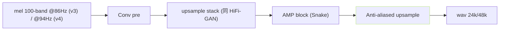
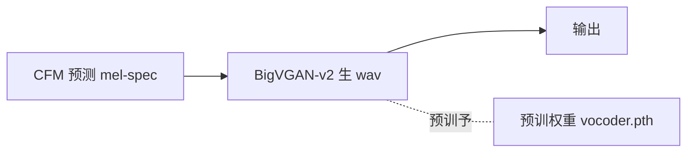

## 前置知识

> [!important]
> 
> 先读 [[2.4 仓库目录结构导航|2.4 仓库目录结构导航]]。

---

## 0. 定位

> **一句话**：`GPT_SoVITS/BigVGAN/` = 「**v3/v4专用的高保真声码器**」。从「mel」生成「wav」。v1/v2 不使用。

---

## 1. 目录结构

```jsx
GPT_SoVITS/BigVGAN/
├── activations.py        # Snake / SnakeBeta 激活
├── alias_free_activation/ # Anti-alias 谐波
├── bigvgan.py            # 主 BigVGAN 类
├── configs/              # 24khz/48khz 多个型号 yaml
├── env.py
├── meldataset.py         # mel 计算
└── utils.py
```

---

## 2. 两个使用型号

|版本|BigVGAN 配置|采样率|upsample 倍率|
|---|---|---|---|
|v3|`bigvgan_v2_24khz_100band_256x`|24kHz|256×|
|v4|`bigvgan_v2_48khz_100band_512x`|48kHz|512×|



---

## 3. BigVGAN-v2 的加阶点

- **Snake 激活**: $f(x) = x + \frac{1}{\alpha}\sin^2(\alpha x)$，保证周期性表达。

- **Anti-aliased upsample**: Filtered upsample、去 chunking 劣化上采样别名。

- **Discriminator**: MPD + MRD（Multi-Resolution Discriminator）。

- **训练数据**: ~7000h 多语。

---

## 4. CFM 与 BigVGAN 的衔接



- **BigVGAN 预训、冻结使用**。只训 CFM。

- v3 vocoder.pth = `bigvgan_v2_24khz_100band_256x_inference.pt`。

- v4 vocoder.pth = `bigvgan_v2_48khz_100band_512x_inference.pt`。

---

## 5. 为什么 v3 会出现金属感

> [!important]
> 
> v3 采用 `100band_256x`、 24kHz 输出、 那些不在预训数据分布里的 mel 锐点会被 BigVGAN 中快「奋餑」，表现为「金属、3闷」货。v4 采用原生 48kHz 与 Anti-aliased 修复，大幅缓解。详见 [[13.2 v3 - v4 人工感 - 金属音|13.2 v3 - v4 人工感 - 金属音]]。

---

## 参考文献

1. Lee, S. et al. (2023). _BigVGAN-v2_. arXiv:2206.04658.

1. [https://github.com/NVIDIA/BigVGAN](https://github.com/NVIDIA/BigVGAN)