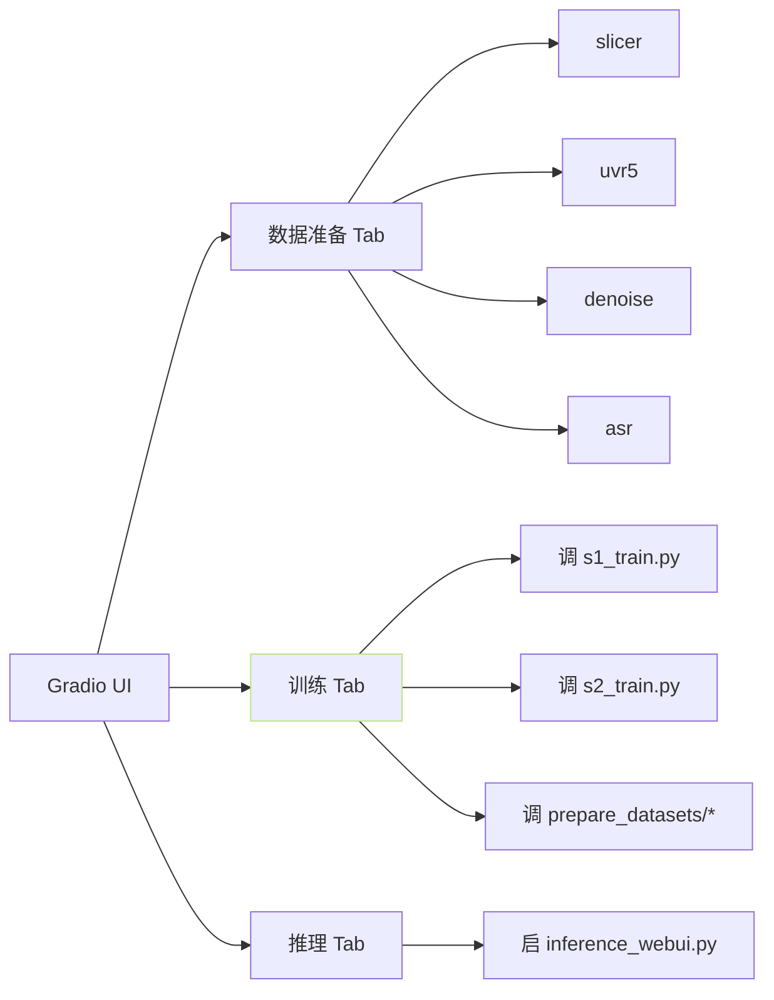

## 前置知识

> [!important]
> 
> 先读 [[2.4 仓库目录结构导航|2.4 仓库目录结构导航]]。

---

## 0. 定位

> **一句话**：`tools/` + `webui.py` = 「**数据准备 + 训练 + 推理的 Gradio 问访**」。从原始音频 到 可用模型的一站式控制台。

---

## 1. `tools/` 目录

```jsx
tools/
├── asr/                  # 语音 转文本
│   ├── funasr_asr.py    # FunASR (中文)
│   ├── faster_whisper_asr.py
│   └── ...
├── denoise/              # 降噪
├── slicer/               # 音频切分
│   └── slice_audio.py
├── uvr5/                 # 人声背景分离
└── i18n/                 # 多语 Web UI
```

### 能力总览

|子模块|能力|后端|
|---|---|---|
|`slicer/`|根据静音切分长音频|librosa|
|`uvr5/`|分离人声/背景|UVR5 (MDX-Net / Demucs)|
|`denoise/`|降噪|RNNoise / FRCRN|
|`asr/funasr_asr.py`|中文语音识别|FunASR (paraformer)|
|`asr/faster_whisper_asr.py`|多语|faster-whisper|

---

## 2. `webui.py` 架构



---

## 3. 一键流程「从 raw 到模型」

```jsx
1. 上传原始音频 → slicer → 获得供训练的 5-10s 切段
2. (可选) uvr5 去背景 → denoise
3. asr 生成转录文本
4. 调 prepare_datasets/1 预抽 BERT
5. 调 prepare_datasets/2 预抽 ssl
6. 调 stage 2 训练 (s2_train)
7. 调 prepare_datasets/3 生 semantic
8. 调 stage 1 训练 (s1_train)
9. 启动 inference_webui 推理
```

---

## 4. `inference_webui.py`

- Gradio 面板，提供 ref_audio + ref_text + target_text 推理。

- 默认启动端口 9874。

- 支持多语、多句拼接、批量生成。

---

## 5. i18n

- 语言包：zh_CN / en_US / ja_JP / ko_KR / yue / ru / fr / es / de / pt。

- Web UI 默认跳 zh_CN、可在启动参数 `--language` 切换。

---

## 参考文献

1. GPT-SoVITS Repo `tools/`, `webui.py`, `inference_webui.py`.