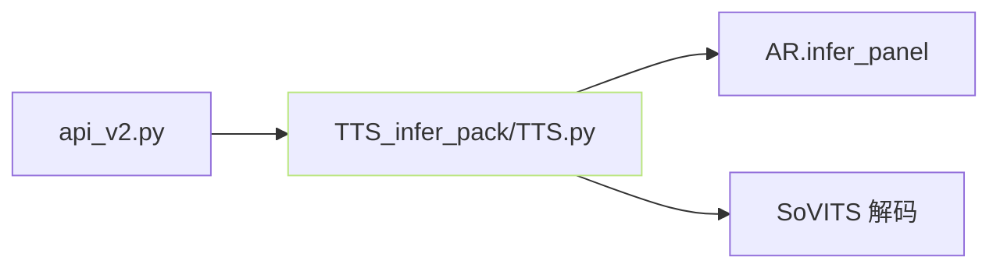

## 前置知识

> [!important]
> 
> 先读 [[2.4 仓库目录结构导航|2.4 仓库目录结构导航]]。

---

## 0. 定位

> **一句话**：`api.py` / `api_v2.py` = 「**无 Web UI 的 HTTP 推理服务**」。适合作为后端装入业务系统、或供其他客户端调用。

---

## 1. 两个版本区别

||`api.py`|`api_v2.py`|
|---|---|---|
|发表期|v1 时期|v2+|
|接口设计|简单 GET|RESTful|
|参数传递|URL query|JSON body|
|多语支持|部分|全|
|流式输出|不支持|部分支持|
|推荐|v1/v2 用户|v3/v4 用户|

---

## 2. `api_v2.py` 接口

### POST `/tts`

```json
{
  "text": "要生成的文本",
  "text_lang": "zh",
  "ref_audio_path": "path/to/ref.wav",
  "prompt_text": "参考音频的文本",
  "prompt_lang": "zh",
  "top_k": 5,
  "top_p": 1,
  "temperature": 1,
  "text_split_method": "cut0",
  "batch_size": 1,
  "speed_factor": 1.0,
  "streaming_mode": false
}
```

### POST `/set_gpt_weights`、`/set_sovits_weights`

用于动态切换模型。

### GET `/control` (补助控制)

- `?command=restart` / `exit`。

---

## 3. 底层调用



- `TTS_infer_pack/TTS.py::TTS` 如同 `inference_webui.py` 中的推理主类。

- API 层仅负责 HTTP 解析、流式输出、多并发互斥。

---

## 4. 启动

```bash
python api_v2.py -a 0.0.0.0 -p 9880 -c GPT_SoVITS/configs/tts_infer.yaml
```

- `-a` host、 `-p` port、 `-c` 推理配置 (位置载入 gpt/sovits ckpt)。

---

## 5. 部署注意

> [!important]
> 
> - **单进程**：AR + Decoder 都是 GPU 作业、 多进程会重复加载模型勳践显存。
> 
> - **流式**：仅 streaming_mode=true 下生效；选 chunk。
> 
> - **多语**： text_lang 、 prompt_lang 可不一致（跨语克隆）。
> 
> - **互斗 v3/v4**：需同时设 sovits ckpt 、 vocoder.pth。

---

## 参考文献

1. GPT-SoVITS Repo `api.py`, `api_v2.py`.

1. [[12. 工程优化与部署|12. 工程优化与部署]]详见部署依赖。