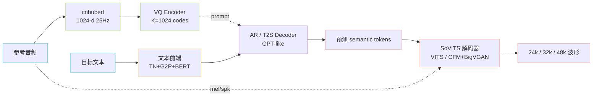

> 📎 **前置知识**：建议先通读 [[1. 前置基础与理论根基]]（VITS / VALL-E / SSL / VQ / CFM 五条主线）；熟悉 PyTorch Lightning 训练范式；理解「自回归 token 生成 + 非自回归声码解码」两段式思想。

## 0. 定位

> 「先鸟瞰、再俯冲。」把 GPT-SoVITS 拆为 **文本前端 → SSL 语义编码 → AR 语义生成 → SoVITS 声学解码** 四段流水线，并把训练态与推理态画在同一张图上对照。

## 1. 高层数据流

## 2. 四大核心组件总览

|组件|角色|模型来源|是否可训|维度/速率|
|---|---|---|---|---|
|文本前端|文本 → phoneme + BERT 隐层|OpenJTalk / G2P / chinese-roberta-wwm-ext-large|❌|BERT 768-d|
|cnhubert|音频 → SSL 表示|chinese-HuBERT-base|❌|1024-d / 25Hz|
|AR T2S|(text, BERT, prompt) → semantic|自研 GPT-like|✅|v1/v2 12层 d=512；v3/v4 24层 d=768|
|SoVITS 解码器|(semantic, ref, spk) → 波形|VITS（v1/v2）/ CFM+BigVGAN（v3/v4）|✅|24k / 32k / 48k|

## 3. 训练 vs 推理双视角

|维度|训练态|推理态|
|---|---|---|
|数据形态|(text, audio) 平行对|(target_text, ref_text, ref_audio)|
|AR 喂入|teacher forcing 整段|KV Cache 自回归逐 token|
|Decoder 喂入|真实 semantic 序列|AR 预测的 semantic 序列|
|监督信号|NLL + GAN / CFM 联合损失|无监督，采样/确定输出|
|主入口|`s1_train.py` / `s2_train.py`|`inference_webui.py` / `api_v2.py`|
|资源|单卡 ≥12GB 微调，全量数十卡|单卡 v1/v2 ≤8GB，v3/v4 ≥10GB|

## 4. 工程判断

> 🔧 **为什么 SSL + VQ 不放在 AR 内部？** —— cnhubert 25Hz × 1024-d 序列过密，直接喂 AR 会让 KV Cache 显存爆炸。VQ 离散化（K=1024 codes）后变成整数 token 序列，AR 才能高效自回归；同时 VQ 字典定义在 SoVITS 内，两阶段共享同一码本天然对齐。

> 🤔 **为什么不直接端到端？** —— E2E TTS（NaturalSpeech 3 / E2 TTS）对训练数据规模极敏感（数万小时起跳）。两段式让 AR 专注「说什么」、Decoder 专注「怎么说」，~7,000h 即可达到 SOTA zero-shot 音色克隆。

## 5. 子页面导航

[[2.1 高层架构图与数据流]]

[[2.2 四大核心组件职责]]

## 参考文献

- RVC-Boss/GPT-SoVITS Wiki: [https://github.com/RVC-Boss/GPT-SoVITS/wiki](https://github.com/RVC-Boss/GPT-SoVITS/wiki)

- DocSmith Architecture: [https://docsmith.aigne.io/docs/gpt-sovits/en/architecture-d125ca](https://docsmith.aigne.io/docs/gpt-sovits/en/architecture-d125ca)

[[2.3 训练 vs 推理两视角对比表]]

- 仓库根目录: [https://github.com/RVC-Boss/GPT-SoVITS](https://github.com/RVC-Boss/GPT-SoVITS)

[[2.4 仓库目录结构导航]]