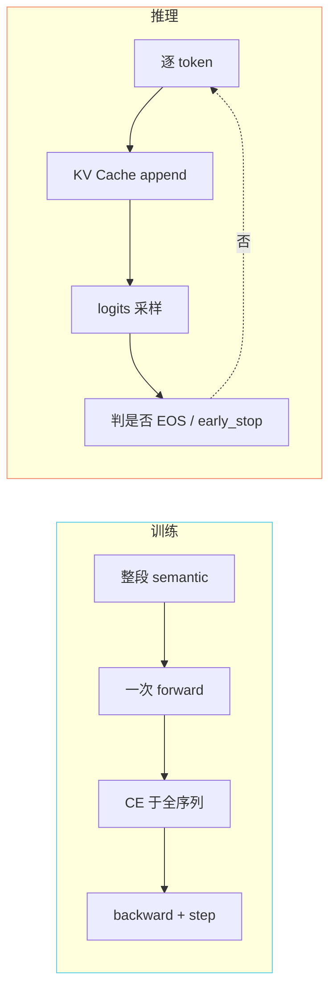

> 📎 **前置**：[[2.1 高层架构图与数据流|2.1 高层架构图与数据流]]；teacher forcing 概念。

## 0. 定位

> 把训练态与推理态在「数据 / 计算 / 资源 / 失败模式」四维度上完全展开。

## 1. 八维度对比

|维度|训练态|推理态|
|---|---|---|
|**数据形态**|(text, audio) 平行对|(target_text, ref_text, ref_audio)|
|**AR 计算**|teacher forcing 整段并行|KV Cache 逐 token|
|**Decoder 输入**|真实 semantic + 真实 mel|预测 semantic + ref mel|
|**监督**|CE / KL+L1+GAN/CFM|无监督|
|**Batch**|4–16 序列|1–4 并发|
|**显存瓶颈**|mel batch 主导|AR KV Cache 主导|
|**失败模式**|不收敛 / mode collapse|hallucination / 吞字 / 金属音|
|**关键技巧**|grad clip / bf16 / ignore_index|top_k+top_p+T+rep+early_stop|

## 2. 两态计算图

## 3. exposure bias

> ⚠️ teacher forcing 只看真实历史，推理依赖自己生成的历史 —— 一旦走出分布就雪崩。工程上用采样随机性、rep penalty、early_stop 多重防护。学术上 Scheduled Sampling / SeqGAN / MoCha 都是为了缩小这道缝。

## 4. 工程判断

> 🔧 **优化推理首包** → 优化 AR KV Cache 复用 + 流式 chunk。

> 🔧 **加速训练** → 增大 mel batch + bf16 + 梯度累积。

> 💡 两者瓶颈不同：训练恢 mel，推理恢 KV Cache。不要用同一套优化思路同时动两个。

## 参考文献

- 仓库 `s1_train.py`、`inference_webui.py`

- Exposure Bias：Ranzato et al. 2016 (Sequence-Level Training)

- Scheduled Sampling：Bengio et al. 2015