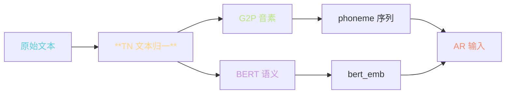
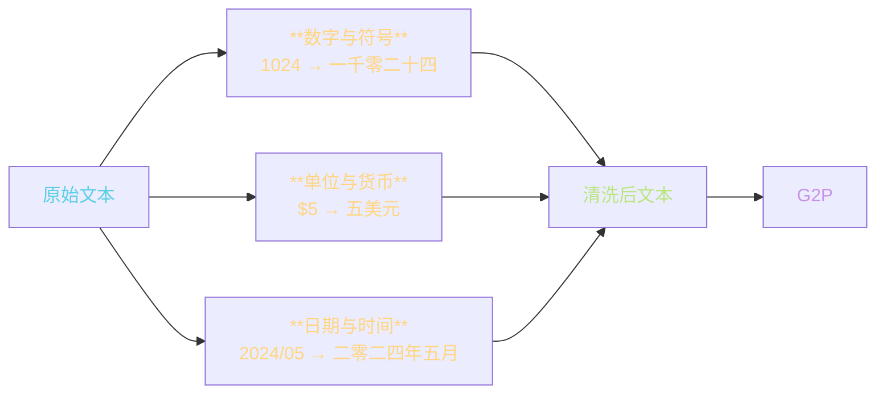
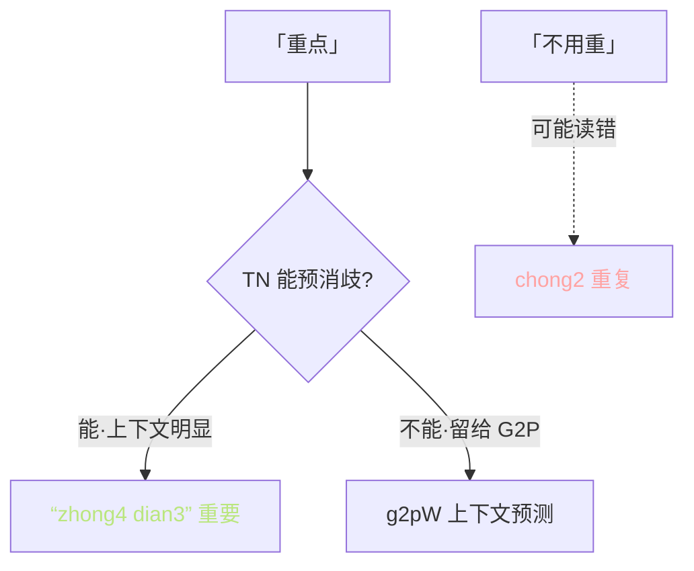
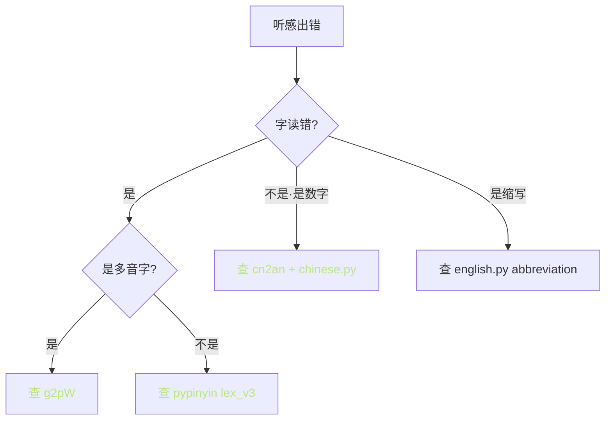

> 📎 **前置**：正则表达式；多语种字符集；中文数字读法；SSML。

## 0. 定位

> 「让文本归位。」TN（Text Normalization）把数字 / 单位 / 符号 / 缩写 / 日期转换成可读字，为下游 G2P 偏零微则。是**错误传递最上游的环节**，TN 错 → G2P 错 → AR 发错音 → 输出错。

## 1. TN 在文本前端中的位置

## 2. TN 三大类规则

## 3. 中文数字读法汽表

|场景|输入|预期输出|规则|
|---|---|---|---|
|**始读**|1024|一千零二十四|资数读法|
|**序号读**|1024 号门|一零二四号门|逐位读|
|**电话号**|13800138000|一三八零零一三八零零零|逐位·1→一·2→二|
|**年份**|2024|二零二四|逐位|
|**小数**|3.14|三点一四|点后逐位|
|**负数**|-273.15|负二百七十三点一五|负 + 资数|
|**分数**|1/2|二分之一|x 分之 y|
|**百分**|50%|百分之五十|百分之 x|
|**中零**|10086|一万零八十六|中间零不能略|

> [⚠️] **中间零怎么读是中文 TN 的难点**：1024 读一千零二十四不读一千二百零二十四。仓库 `text/chinese.py` 中用递归函数处理。

## 4. 多语种重点规则详表

|语种|重点规则|难点|仓库文件|
|---|---|---|---|
|**中文**|数字·儿化·多音字预消歧|中间零·三·多音字|`text/chinese.py`|
|**日文**|半角/全角·促音/拗音·漢字读法|多读音·使用 pyopenjtalk|`text/japanese.py`|
|**英文**|缩写展开·年份·罗马数字·序数词|Dr. → Doctor·1st → first|`text/english.py`|
|**韩文**|Jamo 切分·符号清洗|谚豁合并|`text/korean.py`|
|**粤语**|同中文 + 粤字（咪/供/咩）|口语字词|`text/cantonese.py`|

## 5. 中文特殊难点

### 5.1 多音字预消歧

### 5.2 儿化与轻声

- “点儿” → 合为 [dian3-r] 拼音

- “不是” “是”轻声读 shi5 不是 shi4

- 仓库流程：pypinyin → 手动调调

### 5.3 背景知识依赖限制

> [⚠️] **「颜丽丽」 / 「赵阳」 主人名读法资源限制**：TN 不能取代 G2P / 语义信息。这是纯规则限制。

## 6. 推荐外部库

|库|能力|GPT-SoVITS 集成状态|
|---|---|---|
|**cn2an**|中文数字·双向转换|推荐预调用|
|**WeTextProcessing**|FST 多语种 TN|社区推荐·未集成|
|**pypinyin**|多音字调拼|已集成|
|**pyopenjtalk**|日文 TN+G2P|已集成|
|**g2pW**|上下文间多音字预测|已集成|

## 7. 调试路径

> [⚠️] **TN 错误会传导到 G2P 再到 AR**。调试问题先看 TN 输出。**TN 是错误源头**。

## 8. 工程判断

> 🔧 **仓库** `**text/**` **下每个语种一个文件**，按需启用。修改某语种 TN 不影响其他语种。

> ⚠️ **TN 错误会传导到 G2P 再到 AR。TN 是错误源头，调试问题先看 TN 输出**。

> 💡 **中文推荐先用 cn2an / WeTextProcessing 做数字归一化**，再走 GPT-SoVITS 内置 TN。社区证明这个顺序出错最少。

> 🤔 **多音字预消歧是 TN 还是 G2P 职责**？严格讲是 G2P，但 TN 可为明显场景提前指定发音（如用 SSML 标记），避免 g2pW 出错。

## 9. 子页面

[[3.1.1 中文 TN（数字 - 单位 - 日期 - 货币）|3.1.1 中文 TN（数字 - 单位 - 日期 - 货币）]]

[[3.1.2 日 - 英 - 韩 - 粤 TN|3.1.2 日 - 英 - 韩 - 粤 TN]]

1. SSML W3C standard

## 参考文献

1. cn2an: [https://github.com/Ailln/cn2an](https://github.com/Ailln/cn2an)

1. WeTextProcessing: [https://github.com/wenet-e2e/WeTextProcessing](https://github.com/wenet-e2e/WeTextProcessing)

1. 仓库 `GPT_SoVITS/text/`