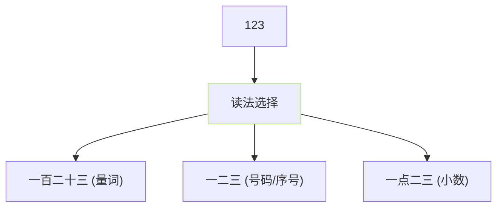

## 前置知识

> [!important]
> 
> 先读 [[3.1 文本归一化（TN）|3.1 文本归一化（TN）]]。

---

## 0. 定位

> **一句话**：中文 TN = 将「阿拉伯数字 / 货币符号 / 日期时间 / 单位 / 特殊符号」转换为**可读出的纯中文**。

---

## 1. 五大规则块

|规则块|例输入|输出|库|
|---|---|---|---|
|数字|`1024`|`一千零二十四`|`cn2an`|
|货币|`$5.5`|`五点五美元`|自定义|
|日期|`2024/5/12`|`二零二四年五月十二日`|自定义|
|单位|`100kg`|`一百公斤`|自定义|
|特殊符号|`&`|`和`|自定义|

---

## 2. 中文数字读法的复杂性



- **量词**：列表「123 只、3 个」 → 一百二十三。

- **号码**：「手机 123456789」一二三四五六七八九。

- **小数**：「<<1.23>>」 → 一点二三。

- **需上下文判别**、纯规则不够、推荐 WeTextProcessing。

---

## 3. 中文货币与单位表

|符号|中文读法|
|---|---|
|`$`|美元|
|`¥`|元 或 人民币|
|`€`|欧元|
|`£`|英镑|
|`%`|百分之|
|`kg/g/t`|公斤 / 克 / 吨|
|`km/m/cm/mm`|公里 / 米 / 厘米 / 毫米|
|`°C/°F`|摄氏度 / 华氏度|

---

## 4. 代码调用示例

```python
# GPT_SoVITS/text/chinese.py 依赖「 WeTextProcessing」预处理
from cn2an import an2cn
from tn.chinese.normalizer import Normalizer

normalizer = Normalizer()
text = normalizer.normalize("今天气温 25°C、发现 100块。")
# 输出: 今天气温二十五摄氏度、发现一百块。
```

---

## 5. 技术重点

> [!important]
> 
> - **TN 错误会传到下游**、调试问题先用 G2P 设断点、看 TN 输出。
> 
> - **多音字不属于 TN 领域**、是 G2P 阶段的任务。
> 
> - **儿化音 不是 TN 事、是 G2P**。

---

## 参考文献

1. cn2an: [https://github.com/Ailln/cn2an](https://github.com/Ailln/cn2an)

1. WeTextProcessing: [https://github.com/wenet-e2e/WeTextProcessing](https://github.com/wenet-e2e/WeTextProcessing)

1. GPT-SoVITS Repo `text/chinese.py`.