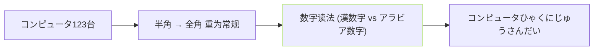

## 前置知识

> [!important]
> 
> 先读 [[3.1 文本归一化（TN）]]。

---

## 0. 定位

> **一句话**：非中文 TN = 「日 / 英 / 韩 / 粤」四个语种的字符集 / 缩写 / 数字 / 货币符号的归一化。不同语种需重关注不同问题。

---

## 1. 日文 TN 重点

- **半角/全角转换**：ASCII ·半角·与日文全角·互异。

- **数字读法**：上下文依赖、「一、ひとつ / 1, いち」互异。

- **促音 / 拗音**：pyopenjtalk 会处理、TN 不需抢走。

---

## 2. 英文 TN 重点

|输入|TN 输出|规则|
|---|---|---|
|`Dr.`|`Doctor`|缩写展开|
|`Mr.`|`Mister`|缩写展开|
|`1024`|`one thousand twenty four`|数字|
|`2024`|`twenty twenty four`|年份|
|`100%`|`one hundred percent`|百分号|
|`iv`|`four`|罗马数字|
|`1st`|`first`|序数词|

- **依赖库**：`inflect`, `unidecode`, `english_normalize`。

---

## 3. 韩文 TN 重点

- **Jamo 切分**：「안녕」 → `[ㅇ, ㅏ, ㄴ, ㄴ, ㅕ, ㅇ]`。其实 G2P 不需 · phoneme 表以 Jamo 为基。

- **符号清洗**：保留句句、去其他。

- **数字**：仅「〗1, 2、三 / 일 · · ·」两套读法。

---

## 4. 粤语 TN 重点

- **多者**：与中文 TN 几乎一致、复用 cn2an + WeTextProcessing。

- **粤以字**：「哬 / 交 / 唠 / 咉」 · 需额外字典· G2P 起效。

- **发音不同**：同字在中/粤读法不同、需区分 lang 调不同 G2P。

---

## 5. 代码位置

|文件|职责|
|---|---|
|`text/japanese.py`|日文 TN + G2P|
|`text/english.py`|英文 TN + G2P|
|`text/korean.py`|韩文 TN + G2P|
|`text/cantonese.py`|粤语 TN + G2P|

> [!important]
> 
> 每个语种一个文件、 TN 与 G2P 逻辑一起、 反调为占不多、 看「**在一起字 / 拼音 / 音素」**。

---

## 参考文献

1. GPT-SoVITS Repo `text/japanese.py`, `text/english.py`, `text/korean.py`, `text/cantonese.py`.

1. inflect: [https://github.com/jaraco/inflect](https://github.com/jaraco/inflect)