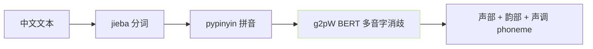

## 前置知识

> [!important]
> 
> 先读 [[3.2 G2P（Grapheme-to-Phoneme）|3.2 G2P（Grapheme-to-Phoneme）]]。

---

## 0. 定位

> **一句话**：中文 G2P = 「**汉字 → 拼音 → 声部韵部 phoneme**」。主依赖 `pypinyin`· 需加 `jieba` 分词以帮多音字上下文。

---

## 1. 三阶段流程



### 阶段职责

|阶段|输入|输出|库|
|---|---|---|---|
|1 分词|中文句|词列表|`jieba`|
|2 拼音|词列表|拼音 (含声调)|`pypinyin`|
|3 消歧|拼音候选|唯一拼音|`g2pW`|

---

## 2. 拼音 → phoneme 拆分例

|汉字|拼音|声部|韵部|声调|
|---|---|---|---|---|
|你|nǐ|n|i|3|
|好|hǎo|h|ao|3|
|中|zhōng|zh|ong|1|
|国|guó|g|uo|2|

- **phoneme 表**：声部 ~ 23 个 + 韵部 ~ 39 个 + 声调 5 个 (1-5，5 为轻声)。

- 总 vocab 约 100。

---

## 3. 代码调用

```python
# GPT_SoVITS/text/chinese.py
import jieba
from pypinyin import lazy_pinyin, Style
from GPT_SoVITS.text.g2pw import G2PWPinyin

g2pw = G2PWPinyin()

def text_to_phones(text):
    words = jieba.lcut(text)
    pinyin_list = g2pw(words)  # 含多音字消歧
    phones = []
    for py in pinyin_list:
        ph = pinyin_to_phoneme(py)
        phones.extend(ph)
    return phones
```

---

## 4. 误读例与修复

> [!important]
> 
> **促 pypinyin 默认选项** · 「行会」 读为 `háng huì` 事实上是 `xíng huì` 。 g2pW 会根据 BERT 上下文识别、升错误率 5-10 个点。

---

## 5. 子页导航

[[3.2.1.1 多音字与上下文消歧|3.2.1.1 多音字与上下文消歧]]

[[3.2.1.2 儿化音与轻声处理|3.2.1.2 儿化音与轻声处理]]

---

## 参考文献

1. pypinyin: [https://github.com/mozillazg/python-pinyin](https://github.com/mozillazg/python-pinyin)

1. g2pW: [https://github.com/GitYCC/g2pW](https://github.com/GitYCC/g2pW)

1. GPT-SoVITS Repo `text/chinese.py`.