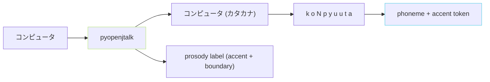
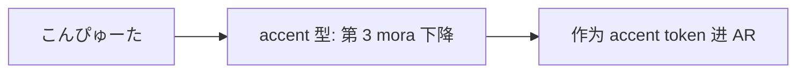

## 前置知识

> [!important]
> 
> 先读 [[3.2 G2P（Grapheme-to-Phoneme）|3.2 G2P（Grapheme-to-Phoneme）]]。

---

## 0. 定位

> **一句话**：日文 G2P = 「**汉字 / 假名 / 片假名 → 音素**」。主依赖 `pyopenjtalk`、依赖 OpenJTalk 的词典 + HMM 动态规则。

---

## 1. 流程



---

## 2. pyopenjtalk 输出结构

```python
import pyopenjtalk
label = pyopenjtalk.extract_fullcontext("コンピュータ")
# 隔行输出、每行为「上下文、音素、accent、boundary」等信息
print(label[0])
# "xx^xx-sil+k=o/A:-2+1+5/B:xx-xx_xx/C:xx_xx+xx/D:09+xx_xx/..."
```

- **k=o** 表示当前音素是 `k`、下一个是 `o`。

- **A: · B: · ...** 是 Accent (亵动 mora) 位置、Word 边界 · 。

---

## 3. accent 信息使用



- **日语重音是 mora 粒度、不是词重音**、需使用 `A: ·` 中的 mora 序位。

- GPT-SoVITS 选择「**仅使用音素不用 accent token**」，依赖 cnhubert / BERT 隐式学习。

---

## 4. 常见问题

> [!important]
> 
> - **未含词**：pyopenjtalk 词典未收录的不常东西会「乱彈」。
> 
> - **拗音**：「ん」会被识为 `N` (鼻音) 、不要误作 m/n。
> 
> - **促音**：「っ」 · 被识为 `cl` (闭锁音) 、需要保留。
> 
> - **长音**：「ー」 · 重复上一个元音。

---

## 5. 子页导航

[[3.2.2.1 pyopenjtalk 假名→音素流程|3.2.2.1 pyopenjtalk 假名→音素流程]]

---

## 参考文献

1. pyopenjtalk: [https://github.com/r9y9/pyopenjtalk](https://github.com/r9y9/pyopenjtalk)

1. OpenJTalk: [https://open-jtalk.sp.nitech.ac.jp](https://open-jtalk.sp.nitech.ac.jp)

1. GPT-SoVITS Repo `text/japanese.py`.