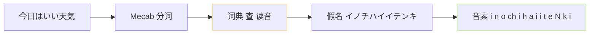

> [📎] 前置：日语假名 (kana)、音素、Open JTalk、Mecab。

> **定义**：**pyopenjtalk** = Open JTalk 的 Python 绑定·负责 东语汉字 → 假名 → 音素 + 韵律。GPT-SoVITS 仅取 音素 · 不取韵律。

## 1. 管道



## 2. 音素集

|类|例|
|---|---|
|元音|a i u e o|
|辅音|k s t n h m y r w g z d b p|
|拗音|ky sh ch ny hy my ry gy by py|
|特殊|N (抨音 ん) · Q (促音 っ)|

## 3. 仓库调用

```python
import pyopenjtalk
phones = pyopenjtalk.g2p('今日はいい天気', kana=False)
# 'k y o o w a i i t e N k i'
```

## 4. 重点误区

> [⚠️] **抨音 N 不 合并 m/n**：“N” 是独立音素 · GPT-SoVITS symbols 表 是独立 token · 错合为“n”会误读。

## 参考

1. pyopenjtalk. [https://github.com/r9y9/pyopenjtalk](https://github.com/r9y9/pyopenjtalk)

1. 仓库 text/[japanese.py](http://japanese.py).