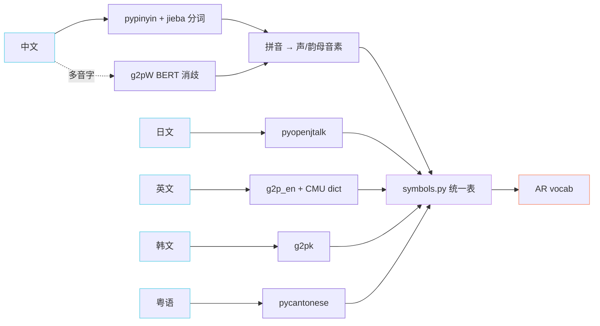

> 📎 **前置**：IPA / 拼音；CMU dict；OpenJTalk 原理。

## 0. 定位

> 「字符 → 音素。」把可读文字转换成模型能学的离散音素 id，是 AR 对齐 phoneme 表的唯一路径。

## 1. 多语种 G2P 工具链

## 2. 多音字消歧（中文）

> 💡 「行」可以是 háng / xíng。g2pW 用 BERT 隐层做分类，准确率比规则字典高 5–10 个点。仅靠 pypinyin 默认选项会出大量读音错误。

公式上可看作：$p^* = argmax_{p in P_{text{candidates}}} P(p mid text{context}, w)$，其中 $P$ 由细调后的 BERT 给出。

## 3. 统一音素表

`symbols.py` 把所有语种音素 + 标点合并成一张大表（典型 ~600 个 token），AR 模型用统一 vocab，可随意混用语言。

## 4. 工程判断

> 🔧 加新语种 = 写 G2P 包装 + 扩展 `symbols.py` + **重训 AR**（vocab size 变化）。

> ⚠️ 中文必装 g2pW；纯 pypinyin 多音字错误率高，会直接压缩模型上限。

> 💡 可用 IPA 作为跨语种中间层，但 GPT-SoVITS 仓库默认用「拼音 + CMU + OpenJTalk 三拼」而非统一 IPA，为的是在各语种上保持底层发音准确。

## 5. 子页面

[[3.2.1 中文 G2P（pypinyin + jieba）]]

[[3.2.2 日语 G2P（pyopenjtalk）]]

- pyopenjtalk: [https://github.com/r9y9/pyopenjtalk](https://github.com/r9y9/pyopenjtalk)

[[3.2.5 统一音素表 symbols.py]]

- g2p_en: [https://github.com/Kyubyong/g2p](https://github.com/Kyubyong/g2p)

## 参考文献

- pypinyin: [https://github.com/mozillazg/python-pinyin](https://github.com/mozillazg/python-pinyin)

- g2pW: [https://github.com/GitYCC/g2pW](https://github.com/GitYCC/g2pW)

[[3.2.3 英语 G2P（g2p_en - CMU dict）]]

[[3.2.4 韩 - 粤 G2P]]