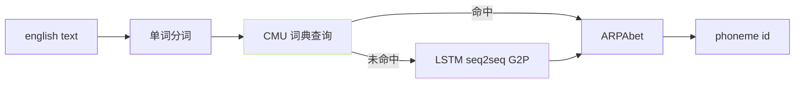
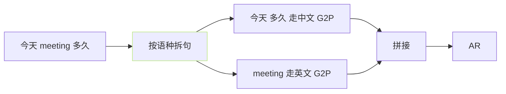

## 前置知识

> [!important]
> 
> 先读 [[3.2 G2P（Grapheme-to-Phoneme）]]。

---

## 0. 定位

> **一句话**：英文 G2P = 「**单词 → ARPAbet 音素**」。主依赖 `g2p_en` 与 CMU dict 、 加错别、未含词 走 LSTM seq2seq 后退。

---

## 1. ARPAbet 音素表

- **39 个音素**：辅音 24 个 + 元音 15 个。

- **带重音标记**：元音附 0/1/2 表示不重音 / 主重音 / 次重音。

- **例**：`HELLO` → `HH AH0 L OW1`。

---

## 2. 流程



- CMU dict 覆盖约 13.4 万单词、趋于全面。

- LSTM seq2seq 仅处理 OOV (out-of-vocabulary)、准确率 >90%。

---

## 3. 代码调用

```python
from g2p_en import G2p
g2p = G2p()
phones = g2p("Hello world")
# ['HH', 'AH0', 'L', 'OW1', ' ', 'W', 'ER1', 'L', 'D']
```

- **空格**作为词边界保留、GPT-SoVITS 会在 `cleaner.py` 里映射为 `sp` token。

---

## 4. 中英混发场景



- GPT-SoVITS 支持 **句内多语混发**、依赖「**词粒度语种检测**」走各自 G2P、拼接给同一个 AR。

---

## 5. 常见问题

> [!important]
> 
> - **单词 OOV**：LSTM 后退可能误拼、推荐手动加词典。
> 
> - **同拼不同音**：`record` (动) vs `record` (名) 重音不同、CMU 会有多个条目、`g2p_en` 默认选第一个。
> 
> - **轻重音 token**：ARPAbet 上 0/1/2 数字是表示重音的、不是声调。

---

## 参考文献

1. g2p_en: [https://github.com/Kyubyong/g2p](https://github.com/Kyubyong/g2p)

1. CMU Pronouncing Dictionary: [http://www.speech.cs.cmu.edu/cgi-bin/cmudict](http://www.speech.cs.cmu.edu/cgi-bin/cmudict)

1. GPT-SoVITS Repo `text/english.py`.