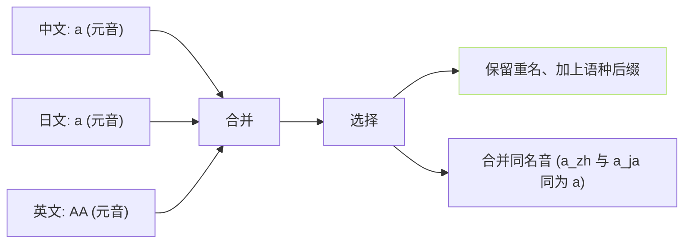
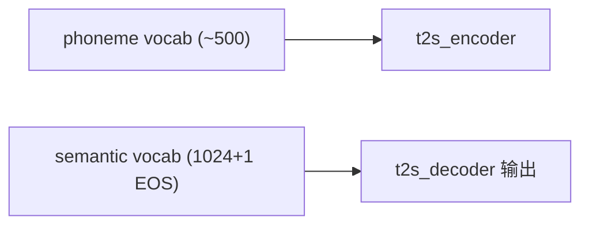

## 前置知识

> [!important]
> 
> 先读 [[3.2 G2P（Grapheme-to-Phoneme）]]。

---

## 0. 定位

> **一句话**：`symbols.py` = 「**跨语种统一 phoneme vocab**」。将 5 个语种 越 600 个顶层符号 · 拼为一张表 · 供 AR 唯一 vocab。

---

## 1. 表结构

```python
# GPT_SoVITS/text/symbols.py
_pad = '_'
_punctuation = "!?,.。，？！…。"
_chinese_phones = ['a','o','e','i','u','ü', ..., 'zh','ch','sh', ..., '1','2','3','4','5']
_japanese_phones = ['a','i','u','e','o','k','s','t','n','h','m','y','r','w','g','z','d','b','p', 'cl', 'N', ...]
_english_phones = ['AA','AE','AH','AO','AW','AY','B','CH','D', ..., 'ZH', '0','1','2']
_korean_phones = [...]
_cantonese_phones = [...]

symbols = [_pad] + list(_punctuation) + _chinese_phones + _japanese_phones + _english_phones + ...

symbol_to_id = {s: i for i, s in enumerate(symbols)}
id_to_symbol = {i: s for i, s in enumerate(symbols)}
```

- **vocab size**不同版本不同：v1 约 200、v2 拓多语后越 500、v3/v4 仍同。

- **AR phoneme embedding** 类型为 `Embedding(vocab_size, d_model)`。

---

## 2. 跨语种冲突处理



- **GPT-SoVITS 选择 “ 合并同名音 ”**、路经多语实验、同名音素发音近、不出现明显语调串发表现。

- **会压缩 vocab** 、同名音 5 语种只占 1 位。

---

## 3. 结果示例

```python
from GPT_SoVITS.text.symbols import symbols, symbol_to_id
print(len(symbols))  # ~ 500-600
print(symbol_to_id['a'])  # 5 例
print(symbol_to_id['AA'])  # 200
print(symbol_to_id['k'])  # 中/日同享
```

---

## 4. 加新语种的代价

> [!important]
> 
> - **需拓 [symbols.py](http://symbols.py)**： vocab size 变动会导致 phoneme embedding 重训。
> 
> - **需加 G2P 库**：在 `text/<lang>.py` 实现。
> 
> - **需重训 AR**。vocab size 变动后、Output Head 维度变、未重训会必然出错。

---

## 5. 与 VQ vocab 的区别



> [!important]
> 
> **phoneme vocab 与 semantic vocab 是两个不同的表**。 phoneme 为输入、semantic 为输出。不要混淆。

---

## 参考文献

1. GPT-SoVITS Repo `text/symbols.py`.