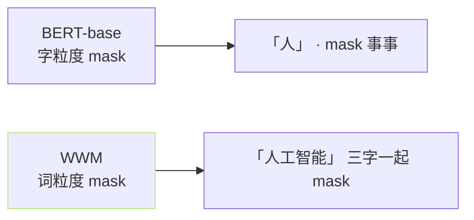
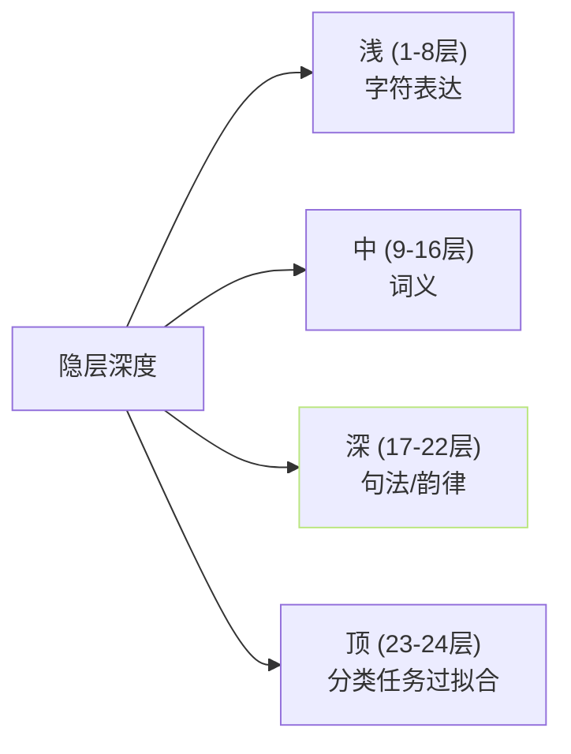

## 前置知识

> [!important]
> 
> 先读 [[3.3 BERT 文本特征注入]]。

---

## 0. 定位

> **一句话**：chinese-roberta-wwm-ext-large = 「**24 层 / 1024 隐 中文 RoBERTa**」。是 GPT-SoVITS 中文韵律注入的默认 BERT。

---

## 1. 模型参数

|维度|值|
|---|---|
|参数量|~330M|
|层数|24|
|hidden_size|1024|
|注意头数|16|
|max_seq_len|512|
|vocab_size|21128 (中文字 + 常规字符)|
|预训数据|中文 5.4B token (中文维基+新闻+社区)|

---

## 2. WWM 与 BERT-base 的区别



- **WWM (Whole Word Masking)**：同一个词中的所有字同时 mask。

- **加位中文词义**：预训任务从字粒度变为词粒度、学习词语义。

- **GPT-SoVITS 选 WWM**、原市：词粒度 hidden 能提供更好的「重音 / 句法边界」提示。

---

## 3. 隐层选择依据



- **GPT-SoVITS 选择倍数第三层 (第 22 层)**：位于「句法/韵律」区间、提供希望的重音与边界。

- **不选顶层**原因：顶层 hidden 过于面向分类任务 (mlm) 、不适合下游。

---

## 4. 代码调用

```python
from transformers import AutoModel, AutoTokenizer

tokenizer = AutoTokenizer.from_pretrained("hfl/chinese-roberta-wwm-ext-large")
model = AutoModel.from_pretrained("hfl/chinese-roberta-wwm-ext-large")

input_ids = tokenizer("你好世界", return_tensors="pt").input_ids
with torch.no_grad():
    outputs = model(input_ids, output_hidden_states=True)
bert_hidden = outputs.hidden_states[-3]  # [B, L, 1024]
```

- **冻结使用**、不参与 GPT-SoVITS 梯度。

- 预表示裂后存于 `name2bert.pkl` · 训练时 mmap 载入。

---

## 5. 子页导航

[[3.3.1.1 Whole Word Masking 策略]]

---

## 参考文献

1. Cui, Y. et al. (2020). _Revisiting Pre-Trained Models for Chinese Natural Language Processing_. arXiv:2004.13922.

1. HuggingFace: [https://huggingface.co/hfl/chinese-roberta-wwm-ext-large](https://huggingface.co/hfl/chinese-roberta-wwm-ext-large)