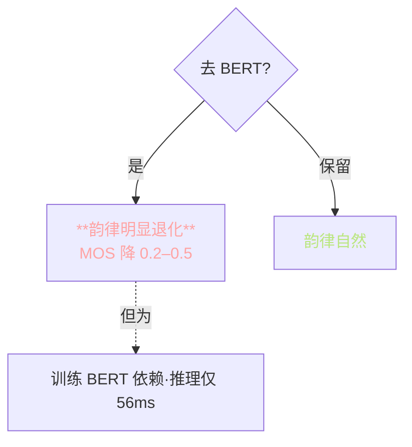

> 📎 **前置**：HuggingFace transformers；RoBERTa 结构；隐层提取概念；项目深度探针。

## 0. 定位

> 「把字符级语义注入 phoneme 级 token。」BERT 提供句法/词义/韵律的隐式标注，是 GPT-SoVITS 韵律自然的关键。去掉 BERT，韵律明显「机械化」。

## 1. BERT 注入流程

```mermaid
flowchart LR
  TXT[原文本] --> TOK[**BERT tokenizer**]
  TOK --> BERT[**RoBERTa-wwm-ext-large**<br/>24 层]
  BERT --> HID[**hidden[-3]**<br/>L_t × 1024]
  HID --> ALN[**Word → Phone 对齐**<br/>重复展开]
  ALN --> PROJ[**Linear 1024 → d_emb**]
  PROJ --> ADD((⊕))
  PEMB[phoneme embed] --> ADD
  ADD --> AR[AR encoder]

  style TXT fill:\#1d2433,stroke:\#5CCFE6,color:#5CCFE6
  style BERT fill:\#1d2433,stroke:\#C792EA,color:#C792EA
  style HID fill:\#1d2433,stroke:\#C792EA,color:#C792EA
  style ALN fill:\#1d2433,stroke:\#BAE67E,color:#BAE67E
  style PROJ fill:\#1d2433,stroke:\#FFD580,color:#FFD580
  style ADD fill:\#1d2433,stroke:\#FFD580,color:#FFD580
  style PEMB fill:\#1d2433,stroke:\#FFA3A3,color:#FFA3A3
  style AR fill:\#1d2433,stroke:\#F78C6C,color:#F78C6C
```

## 2. 核心公式

$$\text{emb}_\text{total} = E_\text{phone}[p_i] + W \cdot h^{(-3)}_{\text{aligned}(i)}$$

|符号|shape|含义|
|---|---|---|
|$E_\text{phone}$|$V \times d_\text{emb}$|phoneme embedding 表|
|$h^{(-3)}$|$L_t \times 1024$|RoBERTa 倒数第 3 层隐状态|
|$W$|$d_\text{emb} \times 1024$|可训投影|
|$\text{aligned}(i)$|scalar|phoneme i 对应的字符下标|

## 3. 为什么是「倒数第 3 层」

```mermaid
flowchart TD
  L1[Layer 1–7<br/>**字符 / 词访级**] --> CHAR[字面信息]
  L2[Layer 8–16<br/>**语义 / 词访级**] --> SEM[词义]
  L3[Layer 17–21<br/>**韵律·句法甜蜜点**] --> PROS[韵律]
  L4[Layer 22–24<br/>**任务头 / 分类**] --> CLS[分类]

  L3 -.GPT-SoVITS 选.-> CHOSEN[**hidden[-3] = Layer 22**]

  style L3 fill:\#1d2433,stroke:\#BAE67E,color:#BAE67E
  style CHOSEN fill:\#1d2433,stroke:\#BAE67E,color:#BAE67E
```

|隐层|信息偏重|适合 TTS?|
|---|---|---|
|Layer 1–7|字符·词访|差·字面重|
|Layer 8–16|词义|可·但不够|
|**Layer 22 (= -3)**|**韵律·句法**|**顶 · 甜蜜点**|
|Layer 24 (= -1)|分类偏|差·过层仅任务特化|

> [💡] **倒数第三层是韵律表达的甜蜜点**，同时保留句法与词义。这与 Pasad et al. 2021 在语音 SSL 隐层探针上的发现一致：中层表达‌音位级信息最强，以起中倒数第三层表达韵律最强。

## 4. Word → Phone 对齐策略

```mermaid
flowchart LR
  TXT[「你好世界」] --> CHAR[你 / 好 / 世 / 界]
  CHAR --> G2P[拼音 G2P]
  G2P --> PHO[ni3 / hao3 / shi4 / jie4]
  PHO --> EXPAND[**按字重复**]
  EXPAND --> ALN[你: hidden[0] · hidden[0]· · 好: hidden[1] · hidden[1] ...]

  style EXPAND fill:\#1d2433,stroke:\#BAE67E,color:#BAE67E
```

|字|BERT 位|phoneme|hidden 复制|
|---|---|---|---|
|你|0|n,i3|hidden[0]×2|
|好|1|h,ao3|hidden[1]×2|
|世|2|sh,i4|hidden[2]×2|
|界|3|j,ie4|hidden[3]×2|

> [⚠️] **Word→Phone 对齐错位会导致韵律错位**，loss 看起来正常但听感差。调试时检查 `text/chinese.py` 的 `align_to_phone()` 输出。

## 5. 多语种 BERT 选择

|语种|BERT 模型|隐层维|零向量回退|
|---|---|---|---|
|**中文**|chinese-roberta-wwm-ext-large|1024|否（主要）|
|**日文**|可选日文 BERT|768/1024|是（未配）|
|**英文**|bert-base-uncased|768|是（未配）|
|**韩 / 粤**|零向量|—|**默认零回退**|

> [⚠️] **零向量回退仍可用，但韵律表现会明显退化为「纯 phoneme 系」**。听感会「冷」「机械」。点评后外挂一个该语种 BERT 能明显提升。

## 6. BERT 推理资源占比

|阶段|BERT 耗时（1 句 20 字）|BERT 显存|
|---|---|---|
|Tokenizer|~5 ms|0|
|**BERT forward**|~50 ms|~1.5 GB|
|Linear proj|~1 ms|~10 MB|
|**总**|~56 ms|~1.5 GB|

> [🔧] **BERT 特征推荐离线 pickle 落盘，训练时 mmap 加载**，能省 30% IO。推理时可 BERT 预计算缓存给常用 ref_text。

## 7. 是否可以去 BERT？



> [🤔] **去 BERT 理论上可行（零向量回退），但韵律表现明显退化**。Spark-TTS / CosyVoice 2 都去了 BERT 改用 LLM，但需重训。GPT-SoVITS V5 可能走该路线。

## 8. 工程判断

> 🔧 **BERT 特征推荐离线 pickle 落盘，训练时 mmap 加载**，能省 30% IO。

> ⚠️ **Word→Phone 对齐错位会导致韵律错位，loss 看起来正常但听感差**。

> 💡 **零向量回退（语种无 BERT）仍可用，但韵律表现会明显退化为「纯 phoneme 系」**。

> 🤔 **倒数第三层是韵律表达的甜蜜点**——这与语音 SSL 隐层探针发现一致。未来可能采用多层加权融合代替单层。

## 9. 子页面

[[3.3.1 chinese-roberta-wwm-ext-large]]

[[3.3.2 Word → Phone 对齐策略]]

[[3.3.3 多语种 BERT 选择与零向量回退]]

[[3.3.4 BERT 特征落盘 pickle 格式]]

## 参考文献

1. RoBERTa-wwm: [https://huggingface.co/hfl/chinese-roberta-wwm-ext-large](https://huggingface.co/hfl/chinese-roberta-wwm-ext-large)

1. Pasad, A. et al. (2021). _Layer-wise Analysis of a Self-Supervised Speech Representation Model_. ASRU.

1. 仓库 `GPT_SoVITS/text/`

1. Cui, Y. et al. (2019). _Chinese-BERT-WWM_. arXiv:1906.08101