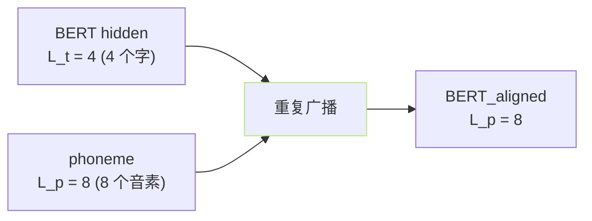
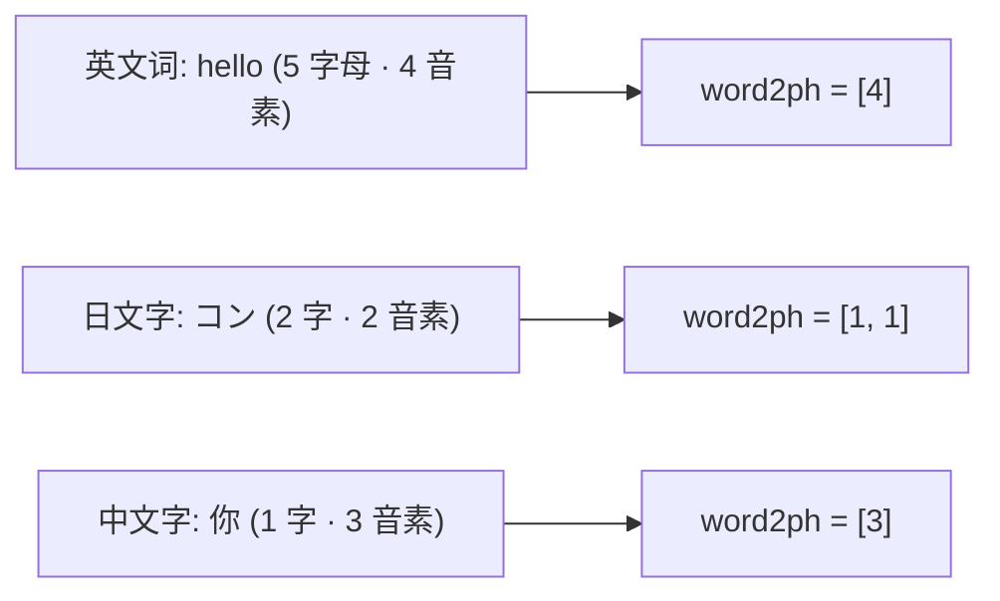

## 前置知识

> [!important]
> 
> 先读 [[3.3 BERT 文本特征注入]]。

---

## 0. 定位

> **一句话**：Word → Phone 对齐 = 「**字粒度 BERT hidden 重复广播到 phoneme 长度**」。是 BERT 注入 AR 的必需预处理。

---

## 1. 为什么需要对齐



- BERT 输出是**字粒度** 、phoneme 是**音素粒度**、长度不同。

- 需将 BERT hidden 重复到每个音素对应的字表达、以可加到 phoneme embedding。

---

## 2. 中文对齐示例

|字|拼音|phoneme|BERT hidden 重复次数|
|---|---|---|---|
|你|nǐ|n + i + 3|3|
|好|hǎo|h + ao + 3|3|
|世|shì|sh + i + 4|3|
|界|jiè|j + ie + 4|3|

- **总 phoneme 长度 = 12**、BERT_aligned 也为 12。

- **轻声不给 BERT 额外位置**、仅随词重复。

---

## 3. 代码实现

```python
# text/cleaner.py 类似
def align_bert_to_phone(text, phones, word2ph, bert_hidden):
    # word2ph: 每个字对应的 phoneme 个数、如 [3, 3, 3, 3]
    phone_level_bert = []
    for i, n in enumerate(word2ph):
        repeat_vec = bert_hidden[i].unsqueeze(0).repeat(n, 1)  # [n, 1024]
        phone_level_bert.append(repeat_vec)
    return torch.cat(phone_level_bert, dim=0)  # [L_p, 1024]
```

- `**word2ph**` 是“每个字几个音素”的映射、由 G2P 返回。

---

## 4. 多语场景



- **英文**：以词为单位、BERT subword 需拼接为词、对齐较麻烦。

- **日文**：以汉字/假名为单位。

- **中文**：以字为单位、最简单。

---

## 5. 常见问题

> [!important]
> 
> - **对齐错位**： phoneme 总长 ≠ word2ph 总和、会导致 AR 重音拺错、需严格检查。
> 
> - **标点 phoneme**：需在 word2ph 添加 0 供零向量填充、是 GPT-SoVITS 处理选项。
> 
> - **越语拼接**：需按语种分别生成 word2ph 并拼接。

---

## 参考文献

1. GPT-SoVITS Repo `text/cleaner.py`, `text/chinese.py`.