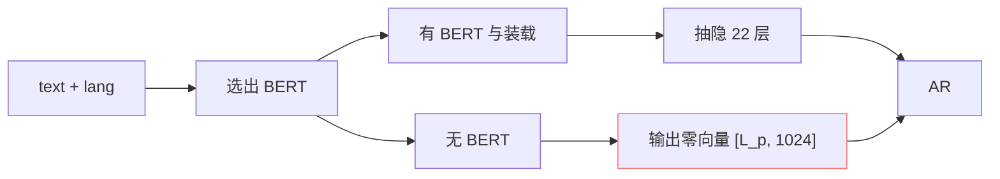

## 前置知识

> [!important]
> 
> 先读 [[3.3 BERT 文本特征注入|3.3 BERT 文本特征注入]]。

---

## 0. 定位

> **一句话**：多语 BERT 选择 = 「**中文帿定、30>、其他语选试/零向量后退**」。

---

## 1. 多语 BERT 矩阵

|语种|BERT 型号|状态|资源重点|
|---|---|---|---|
|中文|chinese-roberta-wwm-ext-large|默认|330M 隐 1024-d|
|英文|bert-base-uncased|可选|110M 隐 768-d · 需 proj|
|日文|cl-tohoku/bert-base-japanese-v3|可选|110M 隐 768-d|
|韩文|klue/roberta-large|可选|330M 隐 1024-d|
|粤语|(复用中文)|默认|需 jyutping 转中文字|

---

## 2. 零向量后退机制



- **零向量**代表「未定义」 、 不产生额外词义贡献。

- AR 仍可运行、但韵律会「平均化」。

---

## 3. 跨语 BERT 维度处理

```python
# 中文 BERT: 1024-d
# 英文 BERT: 768-d
# 需 proj 统一到 1024-d
bert_proj_zh = nn.Linear(1024, d_model)
bert_proj_en = nn.Linear(768, d_model)
bert_proj_ja = nn.Linear(768, d_model)
```

- **GPT-SoVITS 选择为每语种独立 proj**、与 BERT 一体会走。

- 在 `text/chinese_bert.py`, `text/english_bert.py`, `text/japanese_bert.py` 中均有 `get_bert_feature` 函数。

---

## 4. 零向量表现损失

> [!important]
> 
> **实验观察**：零向量后退下、中文 MOS 从 4.2 降到 3.8、韵律中含量头子明显下降。跨语 (中→英) 场景下、英文依赖 phoneme + cnhubert、 BERT 贡献较小、零向量补送倒以为。

---

## 5. 推荐配置

- **中文为主**：chinese-roberta-wwm-ext-large。

- **中英混发**：中文走 BERT、英文走零向量 (贡献低) 或 bert-base-uncased。

- **日文为主**：bert-base-japanese-v3 (推荐)。

- **韩 / 粤 为主**：零向量后退足够、不需主动装。

---

## 参考文献

1. GPT-SoVITS Repo `text/{chinese,english,japanese}_bert.py`.