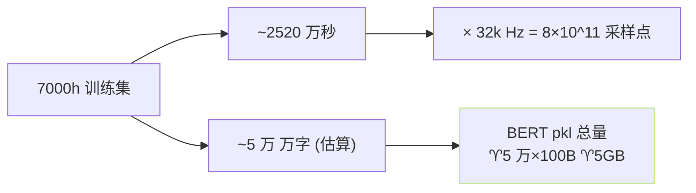

## 前置知识

> [!important]
> 
> 先读 [[3.3 BERT 文本特征注入]]。

---

## 0. 定位

> **一句话**：BERT 特征落盘 = 「**预训练抽 BERT 隐·落为 pickle ·训练时 mmap 载入**」。避免训练时重复调 BERT。

---

## 1. 为什么需要落盘

|选项|调 BERT (训练时)|落盘 + 载入|
|---|---|---|
|GPU 需求|需 4-8GB 占用|0 (跳 BERT)|
|速度|5-10× 慢 (BERT 330M forward)|只读 pickle|
|多机|需多机加载 BERT|仅需同步 pkl 文件|

> [!important]
> 
> **后者节省 GPU 序、适合多 GPU 并行、是 GPT-SoVITS 训练默认选项**。

---

## 2. pickle 格式

```python
# prepare_datasets/1-get-text.py 产出
# {exp_name}/2-name2text.txt: 存放 (name, phones, bert_path)
import pickle

with open(f"{name}.bert.pkl", "wb") as f:
    pickle.dump({
        "phone": phone_ids,         # List[int]
        "word2ph": word2ph,         # List[int] · 每个字 几个音素
        "bert_feature": bert_hidden_22, # [L_t, 1024] torch.float16
        "language": "zh",
        "text": text,
    }, f)
```

- **采用 float16**、压缩占用、30MB / 1小时音频。

- **不压缩为 tensor**、避免反序列化开销。

---

## 3. 训练时加载

```python
# AR/data/dataset.py
class TTSDataset:
    def __getitem__(self, idx):
        bert_path = self.data[idx]["bert_path"]
        with open(bert_path, "rb") as f:
            data = pickle.load(f)
        return {
            "phone": data["phone"],
            "bert": data["bert_feature"],   # [L_t, 1024]
            "word2ph": data["word2ph"],
            ...
        }
```

- **mmap 载入**推荐 、减少内存顶点。

- DataLoader `num_workers=8` 并行。

---

## 4. 磁盘占用估算



- **十 万个 wav** · 每个 pkl 、50KB、总计 5GB。

- **网盘 / NFS 能存**，**推荐 NVMe SSD**以限 IO 瓶颈。

---

## 5. 缓存位置与生命周期

|阶段|位置|
|---|---|
|BERT pkl|`logs/{exp_name}/2-name2text/{name}.bert.pkl`|
|ssl pt|`logs/{exp_name}/3-ssl/{name}.ssl.pt`|
|semantic tsv|`logs/{exp_name}/4-semantic/name2semantic.tsv`|

> [!important]
> 
> 换语种 / G2P 后需**重跑阶段 1**、避免 phoneme 序列不匹配。未重跑会静默误对齐、产生“听起来正常但韵律错位”。

---

## 参考文献

1. GPT-SoVITS Repo `prepare_datasets/1-get-text.py`, `AR/data/dataset.py`.