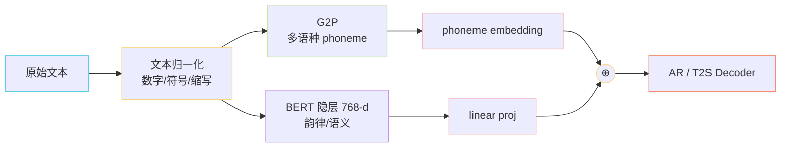

> 📎 **前置知识**：理解 TTS 前端三大步骤（TN / G2P / Prosody）；了解中文 RoBERTa 的隐层提取；熟悉多语种 phoneme 表（GPT-SoVITS 内置：zh / ja / en / ko / yue）。

## 0. 定位

> 「文字 → 模型能吃的离散符号 + 韵律向量。」文本前端把任意输入文本转成 (phoneme_ids, bert_features)，是 AR T2S 唯一的语言侧入口。

## 1. 三段式流水线

## 2. 多语种支持矩阵

|语种|TN 重点|G2P 工具|BERT 模型|
|---|---|---|---|
|中文|数字/单位/儿化/多音字|g2pW + pypinyin|chinese-roberta-wwm-ext-large|
|日文|半角全角/促音|OpenJTalk (pyopenjtalk)|日文 BERT（可选）|
|英文|缩写/罗马数字/年份|g2p-en（CMU dict）|bert-base-uncased（可选）|
|韩文|符号清洗|g2pk|韩文 BERT（可选）|
|粤语|同中文|pycantonese|复用中文 BERT|

## 3. BERT 注入设计

- 拼接公式：`emb_total = emb_phone + W · bert_hidden`，`W` 是 line 投影到 phoneme embed 维度。

- 隐层取 RoBERTa **倒数第三层**（经验最佳，太浅偏字符、太深偏分类）。

- v1 起即引入；v2 扩展到多语种独立 BERT 通道。

## 4. 工程判断

> 🔧 **为什么必须 BERT 而不能纯 phoneme？** —— phoneme 只编码发音，丢失了「词义边界、句法重音、情感倾向」。BERT 隐层补回这部分韵律信号，让 AR 知道「哪里该停顿、哪里该重读」。这就是 GPT-SoVITS 韵律比纯 phoneme 系（早期 Tacotron / FastSpeech）更自然的关键。

> ⚠️ **常见坑**：自定义词典需同时更新 G2P 与 BERT 输入端的对齐位置，否则会出现「读音对但韵律错位」。

> 💡 **直觉**：phoneme 是「乐谱音符」，BERT 是「演奏指示（强、弱、连、断）」，两者缺一不可。

## 5. 子页面导航

[[3.1 文本归一化（TN）]]

## 参考文献

- 仓库 `GPT_SoVITS/text/` 目录

- chinese-roberta-wwm-ext-large: [https://huggingface.co/hfl/chinese-roberta-wwm-ext-large](https://huggingface.co/hfl/chinese-roberta-wwm-ext-large)

- g2pW (多音字消歧): [https://github.com/GitYCC/g2pW](https://github.com/GitYCC/g2pW)

[[3.2 G2P（Grapheme-to-Phoneme）]]

- OpenJTalk: [https://open-jtalk.sp.nitech.ac.jp](https://open-jtalk.sp.nitech.ac.jp)

[[3.3 BERT 文本特征注入]]