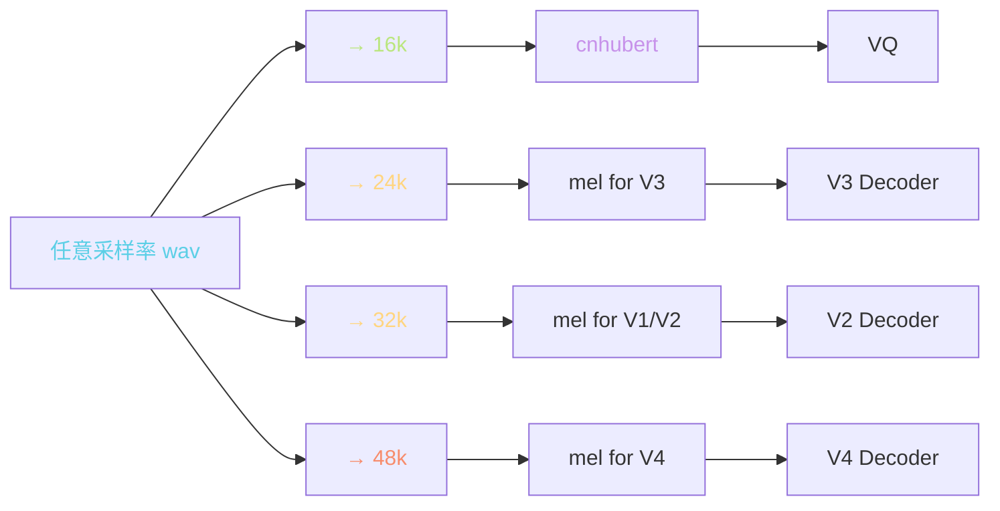
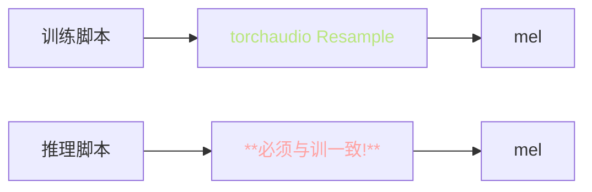
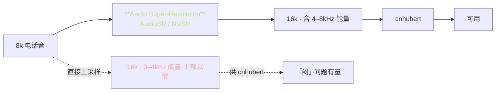

> 📎 **前置**：奈奎斯特采样定理；多相滤波；sinc 插值；torchaudio Resample。

## 0. 定位

> 「单流多速率。」同一段 wav 在不同模块期望不同采样率：cnhubert 要 16k，V2 mel 要 32k，V3 mel 要 24k，V4 mel 要 48k。重采样是数据流的「胶水」，质量差异会传递到训 / 推进而引发 distribution shift。

## 1. 采样率拓扑



## 2. 何时用哪个采样率

|模块|期望采样率|原因|原生日|
|---|---|---|---|
|**cnhubert**|**16k**|HuBERT 预训阈值|0 fps|
|**V1/V2 Generator**|**32k**|设计选择|32k|
|**V3 CFM · BigVGAN-24k**|**24k**|取捡 mel 表达 / 资源|24k|
|**V4 CFM · BigVGAN-48k**|**48k**|原生高保真|48k|
|**ASR (FunASR / Whisper)**|16k|预训阈值|0|
|**Slicer / UVR5**|32k+|保留高频|0|

## 3. 多相滤波公式

上采样比 $L$、下采样比 $M$：

$$y[n] = \sum_k h[nM - kL] \cdot x[k]$$

其中 $h$ 为低通滤波器（隔离镜像频谱）。理论上任意采样率转换 = 先 $L\times$ 上采样填零 → 过低通滤波器 → $M\times$ 抽取。

### 重采样与按例反查

|场景|L / M 比|听感与质量|
|---|---|---|
|48k → 24k|1/2|**高质**（3 倍关系）|
|48k → 32k|2/3|**中**（非整数比·需高质量滤波器）|
|32k → 16k|1/2|**高质**|
|22.05k → 16k|1024/1411|**低质**（郁闷整数比）|
|**8k → 16k**|2|**不起作用**·需 audio SR|

> [⚠️] **上采样表面率变但频谱有限**：8k 采样率只能表达 0–4kHz 频谱，上采样到8k 后在 4–8kHz 频段仅冭插值生成，不含原信息。需 audio super-resolution 去「修补」。

## 4. 实现库详细对比

|库|算法|耗时 (1×10 s)|质量 SDR|备注|
|---|---|---|---|---|
|`librosa.resample`|Kaiser / sinc|~200 ms|**高 (>40 dB)**|CPU 单线程|
|`torchaudio.transforms.Resample`|多相滤波|~50 ms (GPU)|**高 (>40 dB)**|**GPT-SoVITS 默认**|
|`soxr_hq`|SoX HQ|~80 ms|**极高 (>50 dB)**|Python 包装|
|`scipy.signal.resample_poly`|多相|~150 ms|中 (~30 dB)|numpy 生态|
|`scipy.signal.resample` (FFT)|FFT|~100 ms|低 (~25 dB)|有环效应|

## 5. torchaudio Resample 内部机制

```python
import torchaudio.transforms as T
# 默认使用 sinc 插值 + Kaiser 窗
resampler = T.Resample(
    orig_freq=44100,
    new_freq=16000,
    resampling_method='sinc_interpolation',
    lowpass_filter_width=6,    # 滤波器质量
    rolloff=0.99,              # rolloff 频率
    beta=None,                 # Kaiser 窗参数
)
resampled = resampler(wav)
```

|参数|默认|影响|
|---|---|---|
|`lowpass_filter_width`|6|大 = 质量高·计算慢|
|`rolloff`|0.99|最高保留频率比例|
|`beta` (Kaiser)|14.769|供质量取舍|

## 6. 训 / 推重采样一致性



> [⚠️] **训练与推理用不同重采样库会引入频谱 distribution shift**（尤其是高频部分）。统一用 torchaudio。社区踩过这个坑多次。

## 7. 8k 电话音质处理



> [💡] **8k 电话音质先走 audio super-resolution → 16k 再喂 cnhubert，比直接插值上采样效果好很多**。AudioSR / NVSR 能修复 4–8kHz 能量。

## 8. 工程判断

> 🔧 **训练 mmap 时统一存原始 wav，重采样在 dataloader 里做**，省磁盘。不要预重采样存多份。

> ⚠️ **训练与推理用不同重采样库会引入频谱 distribution shift**（尤其是高频部分）。统一用 torchaudio。

> 💡 **8k 电话音质先走 audio super-resolution → 16k 再喂 cnhubert**，比直接插值上采样效果好很多。

> 🤔 **为什么 cnhubert 要 16k 而不是 24k/48k**：是预训冻结的阈值，HuBERT 论文选了 16k LibriSpeech。不能改，只能送重采样到6k。

## 9. 子页面

[[4.1.1 librosa - torchaudio Resample 实现差异]]

## 参考文献

1. torchaudio: [https://pytorch.org/audio](https://pytorch.org/audio)

1. SoX: [http://sox.sourceforge.net](http://sox.sourceforge.net)

1. Oppenheim, A. & Schafer, R. _Discrete-Time Signal Processing_.

1. AudioSR: [https://audioldm.github.io/audiosr](https://audioldm.github.io/audiosr)