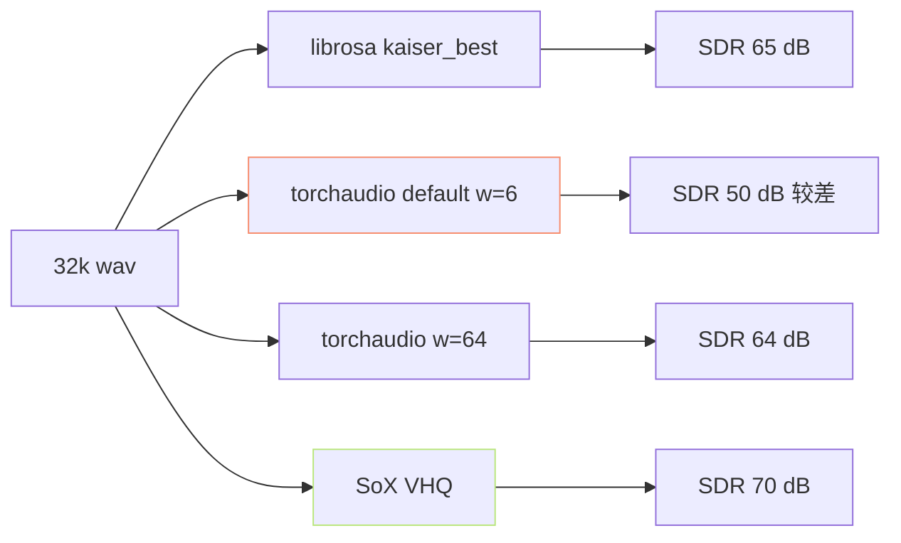

> [📎] 前置知识：DSP 重采样 · Kaiser 窗 · sinc 插值 · anti-alias 滤波。

> **定位**：GPT-SoVITS 需 16k SSL 输入 · 但原始 wav 常为 22k/32k/44.1k/48k。重采样质量影响 cnhubert 特征稳定性。本节拆 librosa vs torchaudio vs SoX 三实现。

## 1. 三库对比

|库|算法|质量|速度|GPU 支持|
|---|---|---|---|---|
|**librosa.resample**|polyphase / kaiser_best|佳|慢 (CPU)|❌|
|**torchaudio.transforms.Resample**|sinc + Kaiser 窗|佳|**快**|**✅**|
|**torchaudio.functional.resample**|同上 (函数式)|佳|快|✅|
|SoX (CLI / pysox)|VHQ (业内金标准)|**最佳**|中|❌|
|scipy.signal.resample|FFT|中|中|❌|

## 2. 库参数对齐

```python
import librosa
import torchaudio.transforms as T
import torch

# librosa
wav_16k = librosa.resample(wav, orig_sr=32000, target_sr=16000, res_type='kaiser_best')

# torchaudio
resampler = T.Resample(
    orig_freq=32000, new_freq=16000,
    lowpass_filter_width=64,   # 默认 6 · 调 64 质量近似 librosa
    rolloff=0.99,
    resampling_method='sinc_interp_kaiser',
    beta=14.769656459379492    # Kaiser beta
)
wav_16k_torch = resampler(torch.from_numpy(wav))
```

|librosa kaiser_best|torchaudio 对齐参数|
|---|---|
|num_zeros=64|lowpass_filter_width=64|
|beta=14.769|beta=14.769|
|rolloff=0.945|rolloff=0.99|

## 3. 质量对比



> [⚠️] **torchaudio 默认 lowpass_filter_width=6 质量偏低**：需 手 动 设 为 64 才 近 librosa。 GPT-SoVITS 1a/1b 阶段 默 认 不 调 · 质 量 隐 含 损失。

## 4. 仓库实际实现

```python
# tools/uvr5/uvr5_pipeline.py · 1a 阶段
import librosa
wav, sr = librosa.load(path, sr=None)        # 保原采样率
wav_16k = librosa.resample(wav, orig_sr=sr, target_sr=16000)
wav_32k = librosa.resample(wav, orig_sr=sr, target_sr=32000)
```

- 16k 给 cnhubert (SSL 输入)

- 32k 给 SoVITS Decoder (训练 · 推理)

- 48k 给 BigVGAN V4 (训练 · 推理)

## 5. 该选哪个

|场景|推荐|
|---|---|
|**预处理零拼接**|**librosa kaiser_best**|
|训练 dataloader (需 GPU)|torchaudio Resample (w=64)|
|业务金标准|SoX VHQ 预处理后读|
|推理动态|torchaudio.functional.resample|

## 6. 常见坏点

|错|后果|修|
|---|---|---|
|torchaudio w=6|高频锥纹 · cnhubert 偏移|w=64|
|FFT resample|边缘振铃 (ringing)|跳 polyphase|
|不限比|任意采样率调出 NaN|先查 gcd · 拆多步|
|错 dtype|int16 · float32 · ± 1 越界|统一 float32 [-1, 1]|

## 7. 工程判断

> [🔧] **预处理 librosa · 训练 torchaudio (w=64)**：预 处 理 阶 段 质 量 首 要 · 走 librosa kaiser_best (CPU 可 接 受)。 训 练 阶 段 速 度 首 要 · 走 torchaudio Resample (w=64 对 齐 质 量)。不 调 w 是 社 区 隐 含 坏 点。

## 参考文献

1. librosa.resample 文档。 [https://librosa.org/doc/main/generated/librosa.resample.html](https://librosa.org/doc/main/generated/librosa.resample.html)

1. torchaudio.transforms.Resample。 [https://pytorch.org/audio/stable/generated/torchaudio.transforms.Resample.html](https://pytorch.org/audio/stable/generated/torchaudio.transforms.Resample.html)

1. SoX. [http://sox.sourceforge.net](http://sox.sourceforge.net)