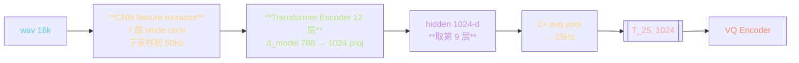
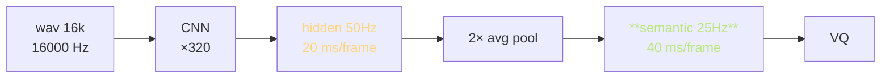
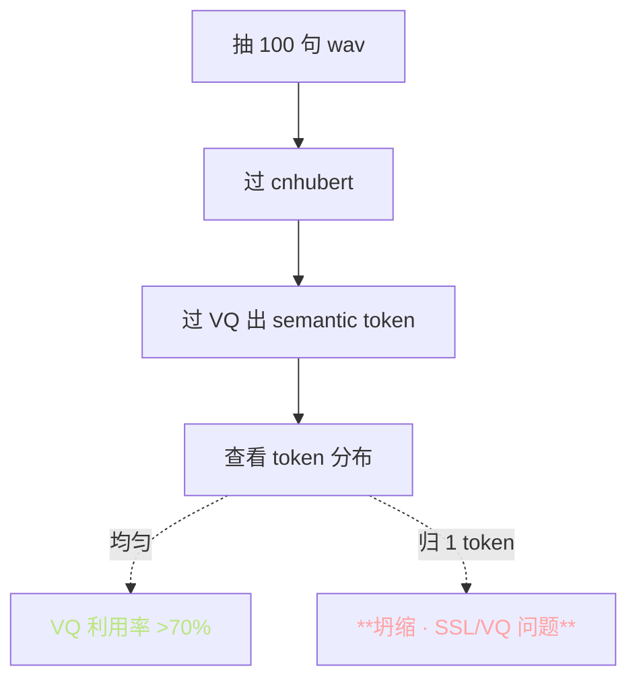

> 📎 **前置**：[[1.3 自监督语音表征（SSL Features）]]；HuBERT 论文与 mask 预测训练；隐层探针；ContentVec。

## 0. 定位

> 「把 16kHz wav 抽成 [T, 1024] 的 SSL 表征，作为 VQ 的输入。」是「说什么」信息的唯一源头；SSL 选择决定了上限。

## 1. 抽取流程



## 2. 关键参数表

|项|值|备注|
|---|---|---|
|预训模型|TencentGameMate/chinese-hubert-base|~95M|
|输入采样率|16 kHz|HuBERT 完全继承|
|CNN 下采样|hop = 320 samples → 50Hz|7 层 stride conv|
|Transformer|12 层、d=768|后接 1024-d proj|
|**取哪一层**|第 **9** 层（从 0 起）|经验最佳|
|输出帧率|50Hz → 2× 下采样 → 25Hz|为了对齐 VQ|

## 3. CNN 下采样详解

|conv 层|kernel|stride|输出采样率|
|---|---|---|---|
|conv1|10|5|3200 Hz|
|conv2|3|2|1600 Hz|
|conv3|3|2|800 Hz|
|conv4|3|2|400 Hz|
|conv5|3|2|200 Hz|
|conv6|2|2|100 Hz|
|conv7|2|2|**50 Hz**|

**总下采样率 = 5×2×2×2×2×2×2 = 320**，对应 hop = 320 samples = 20ms。

## 4. 为什么取第 9 层？

```mermaid
flowchart TD
  L0[Layer 0–2<br/>声学·频谱] --> ACOU[声学层]
  L1[Layer 3–5<br/>音位·发音] --> PHN[音位层]
  L2[Layer 6–8<br/>**音节·词**] --> SYL[音节层]
  L3[**Layer 9–10**<br/>**语义·甜蜜点**] --> SEM[**语义层**]
  L4[Layer 11<br/>mask 预测代理] --> TASK[任务层]

  L3 -.选中.-> CHOSEN[**hidden[9] · 语义 + 发音**]

  style L3 fill:\#1d2433,stroke:\#BAE67E,color:#BAE67E
  style CHOSEN fill:\#1d2433,stroke:\#BAE67E,color:#BAE67E
```

> [💡] **SSL 隐层探针表明：最后一层偏向预训任务（mask 预测）代理，不一定是下游最优；中层才能提供「语义 + 发音」联合表示**。Pasad et al. 2021 与 GPT-SoVITS 的经验选择一致。

## 5. 帧率对齐



$$\bar h_t = \frac{1}{2}(h_{2t} + h_{2t+1})$$

|层|帧率|每帧时长|用途|
|---|---|---|---|
|wav|16k Hz|62.5 μs|原始|
|CNN 后|50 Hz|20 ms|HuBERT 原生|
|pool 后|**25 Hz**|40 ms|**SoVITS VQ 要求**|
|mel|~80 Hz|12.5 ms|SoVITS Decoder|

> [⚠️] **部分版本在 cnhubert 内部预 pool，部分版本在 VQ 入口预 pool**，逻辑一致但代码位置不同。读仓库代码时注意这个肉眼。

## 6. cnhubert vs 其他 SSL 选型

|SSL 模型|训集|隐层|GPT-SoVITS 适用性|
|---|---|---|---|
|**chinese-hubert-base**|WenetSpeech 1万h 中文|1024|**主选 · 中文最优**|
|HuBERT-base|LibriSpeech 960h 英|768|中文劈化·不荐|
|ContentVec|1万h 多说话人|768|可探·需重训 VQ|
|WavLM-Large|9.4万h 英|1024|可探·需重训 VQ|
|w2v-BERT 2.0|SeamlessM4T|1024|可探·一带多语|

> [⚠️] **用普通 HuBERT-base（英文预训）替换 cnhubert 会让中文音色明显劈化**；中文项目勿跳。

## 7. SSL 质量验证方法



## 8. 缓存与存储

|产出|格式|占用|加载方式|
|---|---|---|---|
|cnhubert hidden|`.pt` (fp16)|~4 MB / 分钟|mmap|
|VQ token|`.npy` int16|~30 KB / 分钟|mmap|
|**总**（1万h）|~2.4 TB hidden / 18 GB token|·|·|

> [🔧] **cnhubert 输出可缓存为** `**.pt**`**，训练时 mmap 加载**，磁盘占用约 4MB/分钟。但 1万h 就是 2.4 TB —— 大规模训练需 NVMe 阵列。

## 9. 工程判断

> 🔧 **cnhubert 输出可缓存为** `**.pt**`**，训练时 mmap 加载**，磁盘占用约 4MB/分钟。

> ⚠️ **用普通 HuBERT-base（英文预训）替换 cnhubert 会让中文音色明显劈化**，中文项目勿跳。

> 💡 **用 ContentVec / WavLM 替换可以探索（更多独立于说话人的语义表征），但需重训 VQ**。CosyVoice 2 采用 w2v-BERT 2.0，多语能力更强。

> 🤔 **为什么选第 9 层 —— 隐层探针证明中层语义表达最强**。未来可能探索多层加权融合。

## 10. 子页面

[[4.2.1 16kHz 强制重采样的来源]]

[[4.2.2 帧率对齐（50Hz SSL ↔ 25Hz semantic）]]

## 参考文献

1. Hsu, W.-N. et al. (2021). _HuBERT_. arXiv:2106.07447

1. chinese-HuBERT-base: TencentGameMate/chinese-hubert-base

1. Pasad, A. et al. (2021). _Layer-wise Analysis_. ASRU.

1. Qian, K. et al. (2022). _ContentVec_. ICML.