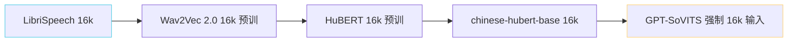
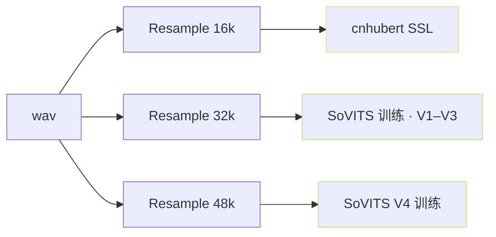

> [📎] 前置知识：HuBERT 预训 · SSL 采样率假设 · chinese-hubert-base。

> **定位**：GPT-SoVITS 强制输入 16 kHz 给 SSL · 不可调。本节拆 为何是 16k · 是不是损失 · 能否提高。

## 1. 根源绑定链路



## 2. 为何是 16k

|原因|详解|
|---|---|
|**LibriSpeech 历史采样率**|16k 是语音识别传统金标准 (电话代)|
|Wav2Vec 2.0 预训 16k|Meta 2020 选 16k|
|HuBERT 继承|Wav2Vec 2.0 架构 · 采样率不变|
|chinese-hubert-base 重训|WenetSpeech 16k|
|**绑定不可变**|换采样率 = 重训 SSL|

## 3. 人耳与 Nyquist

```jsx
采样率 fs → Nyquist = fs/2 → 可表达频镌

16k  → 8 kHz   → 人耳 · 60% (高频 失)
22k  → 11 kHz  → 人耳 · 75%
32k  → 16 kHz  → 人耳 · 95% (CD 足)
44.1k → 22 kHz → 人耳 · 100%
48k  → 24 kHz  → 超人耳
```

> [⚠️] **16k 丢失 8–16 kHz 高频**：辅 音 (s, sh, ch, f) 能 量 上 50% 在 这 个 区 间。SSL 输入 16k 意 味 该 区 间 失 · 但 语 义 信 息 主 要 在 0–8 kHz · 辅 音 量 子 不 严 重 损 失。

## 4. 损失评估

|项|16k (cnhubert)|32k (如果可)|
|---|---|---|
|语义 token 质|佳|微偏|
|发音区分度|**s/sh/ch 偏**|**佳**|
|韵律传递|中|佳|
|现阶段可行|**唯一**|需重训 SSL|

## 5. 能否提高

|路径|可行性|代价|
|---|---|---|
|HuBERT-large 16k|高 · 同采样率|200 MB → 1.2 GB|
|WavLM 16k|高 · 同采样率 · 多语种佳|HF 可下|
|**24k SSL 重训**|低 · 需从零预训|**$ 100k+**|
|**32k SSL 重训**|低 · 同上|$ 100k+|
|NeMo TitaNet 16k|高 · 但 ASR 预训 · 语义偏|可试|

## 6. 仓库实现

```python
# tools/cnhubert.py
import torch
from transformers import HubertModel, Wav2Vec2FeatureExtractor

class CNHubert(torch.nn.Module):
    def __init__(self, path):
        super().__init__()
        self.model = HubertModel.from_pretrained(path)  # chinese-hubert-base
        self.extractor = Wav2Vec2FeatureExtractor.from_pretrained(path)
        self.sample_rate = 16000  # 硬编码
    def forward(self, wav_16k):
        assert wav_16k.shape[-1] / self.sample_rate < 60  # 限长【 60 s
        feat = self.extractor(wav_16k, sampling_rate=16000, return_tensors='pt')
        out = self.model(feat.input_values, output_hidden_states=True)
        return out.hidden_states[9]  # Layer 9
```

## 7. 16k 与 32k/48k 同时保存



## 8. 工程判断

> [🔧] **16k 是锁 · 不要调**：16k 是 SSL 预 训 采 样 率 · 改 采 样 率 = 重 训 SSL。 越 调 越 坏 · 仅 能 重 训。社 区 跳 32k SSL 预 训 需 近 $ 100k 预 训 资 源 · 现 阶 段 不 可 行。

## 参考文献

1. Hsu, W.-N. et al. (2021). _HuBERT_. arXiv:2106.07447.

1. chinese-hubert-base. [https://huggingface.co/TencentGameMate/chinese-hubert-base](https://huggingface.co/TencentGameMate/chinese-hubert-base)

1. WenetSpeech. [https://wenet.org.cn/WenetSpeech/](https://wenet.org.cn/WenetSpeech/)