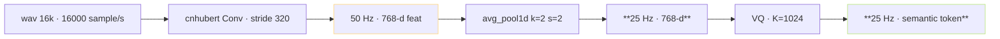

> [📎] 前置知识：SSL 帧率 (frame rate) · cnhubert 50Hz · avg_pool · semantic 25Hz。

> **定位**：SSL 输出 50Hz · VQ 输出 25Hz · AR 预测 25Hz semantic token。本节拆 帧率转换 · 对齐 · 为何 25Hz。

## 1. 帧率链路



## 2. 帧率计算

```jsx
cnhubert (HuBERT-base):
    Conv layers · 总重采样 320×
    输出帧率 = 16000 / 320 = 50 Hz
    每帧时间   = 20 ms

后接 avg_pool1d kernel=2 stride=2:
    输出帧率 = 50 / 2 = 25 Hz
    每帧时间   = 40 ms

SoVITS Decoder mel:
    n_fft=2048 hop=400 (32k 采样)
    输出帧率 = 32000 / 400 = 80 Hz
    每帧时间   = 12.5 ms
```

## 3. 为何选 25Hz

|帧率|token/秒|10s token 数|AR 错率|
|---|---|---|---|
|50 Hz|50|500|高 · 序列太长|
|**25 Hz**|**25**|**250**|**低 · 平衡**|
|12.5 Hz|12.5|125|中 · 语义损失|
|6.25 Hz|6.25|62|质量崩|

> [💡] **25Hz 是 AR 可控 与 语义保留 的平衡**：50 Hz AR 序 列 太 长 · KV cache 爆。 12.5 Hz 语 义 损失 (音 节 低 于 4 帧 不 够 表 达)。 25 Hz = 40 ms/帧 · 中 文 音 素 平 均 80–150 ms · 每 音 素 2–4 帧 · 足 表 达。

## 4. avg_pool 为何不是 Conv

|方案|优|劣|
|---|---|---|
|**avg_pool1d**|无参 · 冻结 可预测|似乎偏据损失|
|Conv stride=2|可学|需训练 · 不能冻结 SSL|
|max_pool|无参|保 出 · 但 语义偏|
|FFT downsample|保语义|计算量高|

## 5. 实现

```python
# AR 输入准备伪代码
import torch.nn.functional as F

feat_50hz = cnhubert(wav_16k)              # [B, T_50, 768]
feat_25hz = F.avg_pool1d(
    feat_50hz.transpose(1, 2),              # [B, 768, T_50]
    kernel_size=2, stride=2
).transpose(1, 2)                           # [B, T_25, 768]
semantic = vq.encode(feat_25hz)             # [B, T_25] codes ∈ [0, 1023]
```

## 6. 与 mel 帧率对齐

```jsx
semantic    25 Hz ·  40 ms/帧
mel (32k)   80 Hz ·  12.5 ms/帧
比例 1 · 3.2  → SoVITS Decoder 重采样 / 上采样 3.2× (semantic → mel 帧)
```

|阶段|输入帧率|输出帧率|上采样倍|
|---|---|---|---|
|AR 预测 semantic|25 Hz|25 Hz|1×|
|SoVITS Decoder|25 Hz|80 Hz (32k mel)|**3.2×**|
|SoVITS V4|25 Hz|120 Hz (48k mel)|**4.8×**|
|BigVGAN V4|120 Hz mel|48000 Hz wav|**400×**|

## 7. 帧率误区

|误区|后果|
|---|---|
|SSL 帧率 不 是 50|cnhubert 是 50 Hz · wav2vec 2.0 是 50 Hz · WavLM 是 50 Hz · hop=320 是 金标准|
|semantic 不 能 调|VQ 后 · 重 训 SoVITS 可 调 · 但 不 推|
|avg_pool 能 变 为 3×|50/3 ≈ 16.67 · 不 是 整 数 · 不 可|
|mel 帧率 不 能 与 semantic 联|需 保 1:N 整 数 比 · SoVITS Decoder 中 上 采 样 保|

## 8. 工程判断

> [🔧] **25 Hz 是 架 构 锁 · 不 要 动**：AR 预 测 25 Hz 是 架 构 必 保 · 变 = 重 训 SSL + VQ + SoVITS。社 区 推 荐 保 持 25 Hz · 仅 调 KV cache / ODE 步 / cut3 为 优 化 点。

## 参考文献

1. HuBERT. arXiv:2106.07447.

1. 仓库 module/[cnhubert.py](http://cnhubert.py).

1. avg_pool1d 设计 · GPT-SoVITS 仓库 PR 讨论.