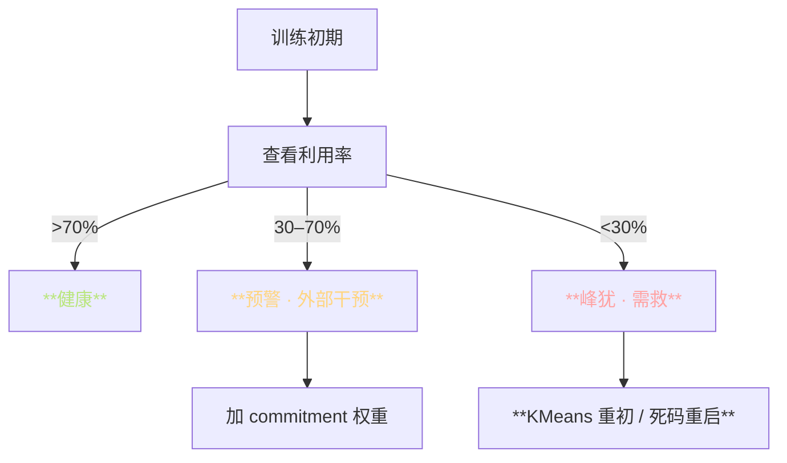
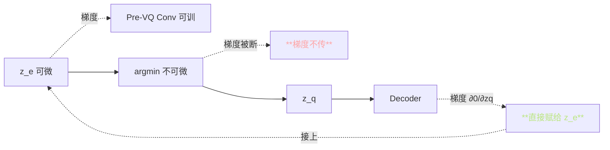
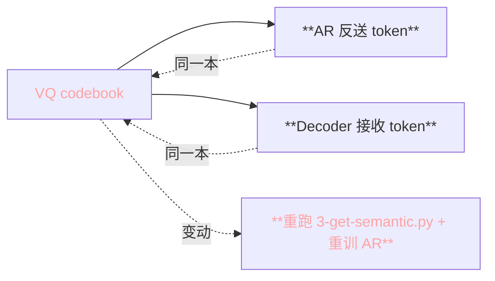

> 📎 **前置**：[[1.4 向量量化（VQ）与离散语义 Token]]；codebook lookup；EMA 更新；Straight-Through Estimator；FSQ。

## 0. 定位

> 「连续 SSL → 离散 token。」把 cnhubert 1024-d 连续向量量化成 $K=1024$ 整数 token，让 AR 能高效自回归。VQ 是 AR 与 SoVITS 的「契约」， codebook 峰犹不容。

## 1. VQ Encoder 流程

```mermaid
flowchart LR
  H[[T, 1024]<br/>cnhubert] --> CONV[**Pre-VQ Conv Stack**<br/>1D conv + GELU]
  CONV --> ZE[z_e ∈ R^{T_25, d_vq}]
  ZE --> NN[**最近邻查 codebook**]
  NN --> ZQ[z_q + 整数 token id]
  ZQ --> STE[**Straight-Through**]
  STE --> DEC[SoVITS Decoder]
  NN -.EMA 更新.-> CB[codebook E_K×d_vq]

  style H fill:\#1d2433,stroke:\#5CCFE6,color:#5CCFE6
  style CONV fill:\#1d2433,stroke:\#FFD580,color:#FFD580
  style ZE fill:\#1d2433,stroke:\#BAE67E,color:#BAE67E
  style NN fill:\#1d2433,stroke:\#C792EA,color:#C792EA
  style ZQ fill:\#1d2433,stroke:\#C792EA,color:#C792EA
  style STE fill:\#1d2433,stroke:\#FFD580,color:#FFD580
  style DEC fill:\#1d2433,stroke:\#F78C6C,color:#F78C6C
  style CB fill:\#1d2433,stroke:\#FFA3A3,color:#FFA3A3
```

## 2. 核心公式

**量化**：

$$z_q = e_k, \quad k = \arg\min_j \|z_e - e_j\|_2$$

**直通梯度 STE**：

$$\frac{\partial L}{\partial z_e} = \frac{\partial L}{\partial z_q}$$

**Commitment loss**：

$$\mathcal{L}_\text{commit} = \beta \cdot \|z_e - \text{sg}(z_q)\|_2^2$$

**EMA codebook 更新**：

$$e_k \leftarrow \gamma \cdot e_k + (1-\gamma) \cdot \text{mean}(z_e \mid \text{nearest}=k)$$

## 3. 默认配置

|参数|值|作用|
|---|---|---|
|codebook $K$|1024|AR 词典大小|
|$d_\text{vq}$|256|量化空间维度|
|EMA $\gamma$|0.99|更新平滑度|
|commitment $\beta$|0.25|防止 z_e 飘离 codebook|
|死码重启|v1❌ / v3+✅|防止 codebook 峰犹|

## 4. codebook 利用率与峰犹



|现象|原因|修复|
|---|---|---|
|利用率 <30%|初期峰犹|**KMeans 初始 / 死码重启**|
|集中 1–2 token|严重峰犹|提 β / 重启 codebook|
|EMA 不动|$\gamma$ 太大|调 γ 从 0.99 → 0.95|
|训稳但饰染|token 太交叠|提 d_vq|

> [⚠️] **训练初期 codebook 可能峰犹 → 用 KMeans 初始化或 EMA + 死码重启**。v1 未加重启，v3+ 加上。

## 5. STE 梯度传递



> [💡] **STE 是「偏審梯度」：实际上** `**argmin**` **梯度为 0，但我们伪装它是恒等函数**。误差不大（commitment loss 逼近）但推动了整个 VQ-VAE 范式。

## 6. VQ vs FSQ vs LFQ

|方案|原理|codebook 利用|EMA|采用|
|---|---|---|---|---|
|**VQ-VAE**|最近邻 + EMA + STE|~70% (需重启)|是|**GPT-SoVITS · EnCodec**|
|**FSQ**|有限标量量化|**100%**|否|**CosyVoice 2 · Fish-Speech**|
|**LFQ**|二进制量化|~95%|否|MAGVIT v2|
|RVQ|多层 VQ|~70% × N|是|SoundStream · DAC|

> [🤔] **理论上可用 FSQ / LFQ 替换 VQ（CosyVoice 2 已走），利用率 100% 且无需 EMA**；但 GPT-SoVITS 仓库仍坚持 VQ-VAE 路线。原因是兼容旧 codebook 及社区训练资产。

## 7. codebook 购买契约



> [⚠️] **VQ codebook 是「AR 与 Decoder 的契约」**，任何一边重训都必须冻结另一边的 codebook。反之令 AR 生成的 token 在 Decoder 侧语义错位。

## 8. 调试 token 质量

|现象|位点|检查|
|---|---|---|
|哑染 / 噪点|VQ 生质|查 codebook 利用率|
|AR 哑输出|token 丢失词表|查 token 分布 + commitment|
|金属音|SoVITS Decoder 推理|VQ 质量不是主因|
|音色偏离|SSL 退化|查 cnhubert 输出|

## 9. 工程判断

> 🔧 **VQ codebook 是「AR 与 Decoder 的契约」**，任何一边重训都必须冻结另一边的 codebook。

> 💡 **如果你发现 AR 生成的 token 经过 Decoder 后哑染 / 噪点，检查 codebook 利用率与峰犹是第一步**。

> 🤔 **理论上可用 FSQ / LFQ 替换 VQ（CosyVoice 2 已走），利用率 100% 且无需 EMA**；但 GPT-SoVITS 仓库仍坚持 VQ-VAE 路线。

> ⚠️ **训练初期 codebook 可能峰犹 → 用 KMeans 初始化或 EMA + 死码重启**。

## 10. 子页面

[[4.3.1 Pre-VQ Conv Stack]]

[[4.3.2 VQ Layer 实现细节]]

## 参考文献

1. van den Oord, A. et al. (2017). _Neural Discrete Representation Learning_. arXiv:1711.00937 (VQ-VAE)

1. Mentzer, F. et al. (2023). _Finite Scalar Quantization_. arXiv:2309.15505

1. 仓库 `GPT_SoVITS/module/quantize.py`

1. Zeghidour, N. et al. (2021). _SoundStream_. arXiv:2107.03312