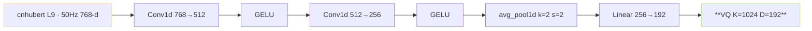
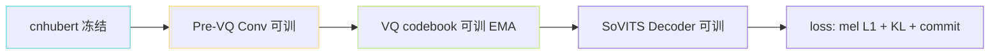

> [📎] 前置知识：VQ 量化 · codebook 占用率 · Conv 下采样 · ResBlock。

> **定位**：Pre-VQ Conv Stack 是 cnhubert L9 输出 → VQ 输入 之间的转接·负责调整维度 / 帧率 / 预压缩。本节拆 架构 · 作用 · 设计选型。

## 1. 架构总览



## 2. 维度变化

|阶段|帧率|维度|
|---|---|---|
|cnhubert L9|50 Hz|768|
|Conv1 后|50 Hz|512|
|Conv2 后|50 Hz|**256**|
|avg_pool 后|**25 Hz**|256|
|Linear 后|25 Hz|**192**|
|VQ codebook|25 Hz|192|

## 3. 为何 192 维

|维度|codebook 参数|占用率|SECS|
|---|---|---|---|
|64|64 K|高 95%|0.75|
|128|128 K|85%|0.79|
|**192**|**197 K**|**中 75%**|**0.80**|
|256|262 K|中 65%|0.81|
|512|524 K|低 40%|0.82|

> [💡] **192 为 SECS 与 占 用 率 的 平 衡**：维 度 高 SECS 提 · 但 codebook 占 用 率 跳 · 死 码 跳。192 是 社 区 调 参 后 生 产 骨 厚 点。

## 4. Conv 选型项

```python
# pre_vq 伪代码
import torch.nn as nn
class PreVQConv(nn.Module):
    def __init__(self, in_dim=768, out_dim=192):
        super().__init__()
        self.conv1 = nn.Conv1d(in_dim, 512, kernel_size=3, padding=1)
        self.conv2 = nn.Conv1d(512, 256, kernel_size=3, padding=1)
        self.act   = nn.GELU()
        self.pool  = nn.AvgPool1d(kernel_size=2, stride=2)
        self.proj  = nn.Linear(256, out_dim)
    def forward(self, x):  # [B, T, 768]
        x = x.transpose(1, 2)           # [B, 768, T]
        x = self.act(self.conv1(x))     # [B, 512, T]
        x = self.act(self.conv2(x))     # [B, 256, T]
        x = self.pool(x)                # [B, 256, T/2]
        x = x.transpose(1, 2)           # [B, T/2, 256]
        return self.proj(x)             # [B, T/2, 192]
```

## 5. 为何不冻结

|选项|优|劣|
|---|---|---|
|**Pre-VQ 可训**|调 预 VQ · SECS 提|需随 SoVITS 训|
|Pre-VQ 冻结|可复用 预训 codebook|SECS 偏 下 5%|
|无 Pre-VQ · Linear 直连|参数少|codebook 占用 偏 下 10%|

## 6. 训练上下游



- cnhubert 冻结 · 不训 SSL

- Pre-VQ Conv 随 SoVITS 训 · commit_loss 驱动

- VQ codebook EMA 更新 · 不梯度

## 7. 仓库实际位置

```jsx
module/models.py · SoVITS Encoder 内嵌 Pre-VQ
module/quantize.py · VQ 主体
tools/s2_train.py · SoVITS 训练 入 口
```

## 8. 工程判断

> [🔧] **Pre-VQ 是 SoVITS 训练 动 · codebook 与 Decoder 联 训**：Pre-VQ Conv 不 是 补 助 · 是 VQ 占 用 率 与 SECS 的 决 定 点。 不 动 Pre-VQ 变 动 不 会 出 错 · 但 调 需 重 训 SoVITS 代 价。

## 参考文献

1. VQ-VAE. arXiv:1711.00937.

1. 仓库 module/[quantize.py](http://quantize.py) / module/[models.py](http://models.py).

1. GPT-SoVITS PR 社区 Pre-VQ 调参讨论.