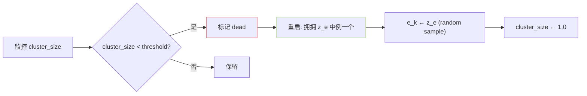

## 前置知识

> [!important]
> 
> 先读 [[4.3 SoVITS 内置 VQ Encoder]] · [[1.4.1.1 Straight-Through Estimator]]。

---

## 0. 定位

> **一句话**：VQ Layer = 「**连续 z_e → 离散 token id → 重建为 z_q**」。含最近邻匹配、STE、Codebook EMA 更新、dead code 重启。

---

## 1. 核心公式

### 量化

$$k = \arg\min_j \|z_e - e_j\|_2^2, \quad z_q = e_k$$

### Straight-Through 梯度

$$\frac{\partial \mathcal L}{\partial z_e} = \frac{\partial \mathcal L}{\partial z_q}$$

### 损失 (commitment + codebook)

$$\mathcal L_{VQ} = \|sg[z_e] - e_k\|_2^2 + \beta \|z_e - sg[e_k]\|_2^2, \quad \beta = 0.25$$

### EMA codebook 更新

$$N_k \leftarrow \gamma N_k + (1-\gamma) |\{i : \text{argmin} = k\}|$$

$$m_k \leftarrow \gamma m_k + (1-\gamma) \sum_{i: \text{argmin}=k} z_e^{(i)}$$

$$e_k = \frac{m_k}{N_k}, \quad \gamma = 0.99$$

---

## 2. 代码实现

```python
# module/core_vq.py 简化版
class VectorQuantize(nn.Module):
    def __init__(self, dim=256, codebook_size=1024, decay=0.99):
        super().__init__()
        self.codebook = nn.Parameter(torch.randn(codebook_size, dim))
        self.register_buffer('cluster_size', torch.zeros(codebook_size))
        self.register_buffer('embed_avg', self.codebook.clone())
        self.decay = decay
    def forward(self, z_e):  # [B*T, dim]
        # 最近邻
        dist = (z_e.pow(2).sum(1, keepdim=True)
                - 2 * z_e @ self.codebook.t()
                + self.codebook.pow(2).sum(1))
        ids = dist.argmin(1)
        z_q = self.codebook[ids]
        # STE
        z_q_st = z_e + (z_q - z_e).detach()
        # EMA 更新
        if self.training:
            with torch.no_grad():
                onehot = F.one_hot(ids, self.codebook.size(0)).float()
                self.cluster_size.mul_(self.decay).add_(onehot.sum(0), alpha=1-self.decay)
                self.embed_avg.mul_(self.decay).add_(onehot.t() @ z_e, alpha=1-self.decay)
                self.codebook.data.copy_(self.embed_avg / self.cluster_size.unsqueeze(1).clamp(min=1e-5))
        loss = (z_e - z_q.detach()).pow(2).mean() * 0.25
        return z_q_st, ids, loss
```

---

## 3. dead code 重启



- **threshold = 1.0**、倍 100 步检查一次。

- **重启主动**从当前 batch 中抽取 z_e 例、赋给 dead code。

- **GPT-SoVITS v3+ 开启**、v1/v2 未启用 (部分原因上越「坝缩」)。

---

## 4. 序号 与 利用率 监控

|指标|计算|健康阈|||
|---|---|---|---|---|
|Codebook usage|$frac{|{k: N_k > 0}|}{K}$|>0.7|
|Perplexity|$\exp(-\sum_k p_k \log p_k)$|>K/2|||
|Dead code 比|$frac{|{k: N_k < 1}|}{K}$|<0.1|
|Mean dist|$mathbb E \|z_e - z_q\|$|逐步下降|

> [!important]
> 
> **坍缩**：Perplexity 进程下降 · dead code 进程上升 · · 调高 束辦 + 开 dead code restart。

---

## 5. 各版本配置

|版本|K|d_vq|EMA γ|dead-restart|
|---|---|---|---|---|
|v1|1024|256|0.99|❌|
|v2|1024|256|0.99|❌|
|v2Pro|1024|256|0.99|✅|
|v3|1024|256|0.99|✅|
|v4|1024|256|0.99|✅|

---

## 参考文献

1. van den Oord et al. (2017). _VQ-VAE_. arXiv:1711.00937.

1. Razavi et al. (2019). _VQ-VAE-2 与 EMA_. arXiv:1906.00446.

1. GPT-SoVITS Repo `module/core_vq.py`, `module/quantize.py`.