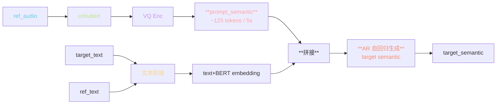
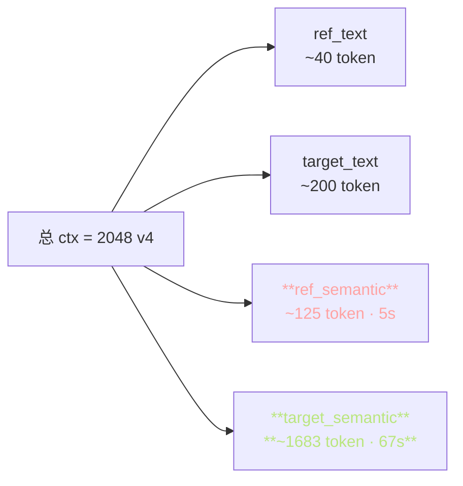
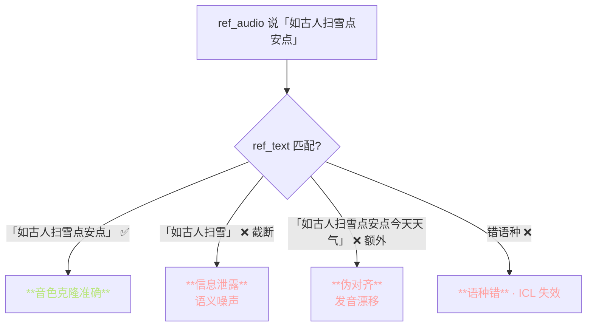
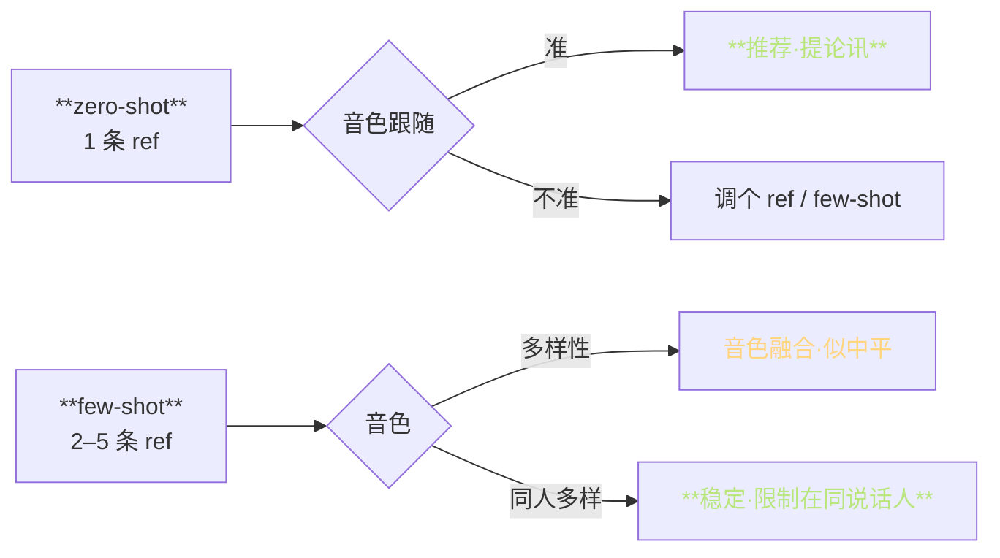

> 📎 **前置**：[[1.2 VALL-E 类范式（GPT-SoVITS 的“GPT”血统）|1.2 VALL-E 类范式（GPT-SoVITS 的“GPT”血统）]] ICL；in-context learning；AR prompt 拼接；上下文长度限制。

## 0. 定位

> 「参考音频 → AR 的条件前缀。」zero-shot 音色克隆的关键：把 ref_audio 的 semantic 当 prompt 拼在目标序列前。这是「VALL-E 范式」在 GPT-SoVITS 里的落地。

## 1. prompt 构造流程



## 2. AR 序列布局

```jsx
[BOS] [ref_text_phoneme] [SEP] [target_text_phoneme] [SEP] [ref_semantic] | [target_semantic ← AR 生成]
                                                                            ↑
                                                                    AR 从这里开始预测
```

|位|内容|贡献|
|---|---|---|
|BOS|起始符|序列错|
|ref_text_phoneme|参考文本音素|**提供 ICL 「文 ↔ 音 对应」**|
|target_text_phoneme|目标文本音素|决定生成内容|
|ref_semantic|参考音频的 semantic token|**提供音色 / 语调 ICL**|
|target_semantic|AR 生成|输出|

## 3. prompt 长度全表

|项|推荐值|说明|
|---|---|---|
|ref_audio 长度|**3–10s**|<3s 信息不足；>10s 浪费 ctx|
|prompt_semantic 长度|~75–250 tokens|25Hz × 3–10s|
|总 ctx 预算|v1/v2: **1024** · v3/v4: **2048**|决定目标可生成长度|
|目标可用 ctx|ctx - prompt - text 占用|v3/v4 可生 ~70s 单段|
|**ref 太短**|<2s|⚠️ 音色拟合差|
|**ref 太长**|>10s|⚠️ 压缩 target ctx|

## 4. 上下文预算可视化



> [💡] **v3/v4 ctx 双倍后，单段可生 ~70s**。这让 GPT-SoVITS 从「短句 TTS」进化为「长文本朝诵」。超过需 cut + 拼接。

## 5. ref_text 必须完全匹配



> [⚠️] **ref_text 必须严格匹配 ref_audio 的内容**；否则会引入语义噪声，表现为「音色未克隆准」或「发音漂移」。多语种场景下 ref_text 不能错语种。

## 6. zero-shot vs few-shot



|场景|使用|注意|
|---|---|---|
|**zero-shot · 1 ref**|默认·最多|限 1 人·1 条·5s|
|**few-shot · 同人多 ref**|不同情境/语调|拼接·加 ctx|
|few-shot · 多人 ref|勿用|**音色会融合出「平均人」**|
|fine-tune · SFT|稳定克隆|1 人·30 分钟·5 epoch|

## 7. prompt 代码示例

```python
# inference_webui.py 伪代码
import torch

ref_audio = load_wav(ref_path, 16000)
refer_hidden = cnhubert(ref_audio)            # [T, 1024]
prompt_semantic = vq_encoder(refer_hidden)    # [125] for 5s

phones_ref = get_phones(ref_text, lang)
phones_tgt = get_phones(target_text, lang)

seq = torch.cat([
    bos,
    phones_ref + sep,
    phones_tgt + sep,
    prompt_semantic
])
# AR 从 seq.shape[0] 处开始预测 target_semantic
target_semantic = ar_decoder.generate(
    seq, max_len=1500, top_k=20, top_p=0.6,
    temperature=1.0, repetition_penalty=1.35,
    early_stop_num=50
)
```

## 8. prompt 被挑的并非随机

> [🤔] **VALL-E 论文表明：prompt 质量决定 80% 克隆质量**。选 ref 时应优先考虑：

> 1. **含鲜明起伏、语调丰富** —— 避免平调

> 2. **背景净** —— 反之会学到噪声

> 3. **与 target 语种同** —— 跨语种 ICL 効果退化

> 4. **避免开头 / 结尾静默** —— cut 会让 AR 丢 BOS

## 9. 工程判断

> 🔧 **prompt 过长会挤占 target 生成预算 → 长文本推理时把 ref 截到 5s**。

> 💡 **多个 ref（拼接）= 多说话人，容易出现音色融合**。zero-shot 一般只用一条 ref。

> 🤔 **这是 VALL-E 的 ICL 范式在 GPT-SoVITS 里的落地：「不重训·只用 prompt 点灯」**。但 GPT-SoVITS 增了中文·BERT·全量预训，发音质量超过 VALL-E。

> ⚠️ **ref 太短（<2s）·背景噪·语种错误 三大坎都会导致克隆失效**。调试克隆问题先检查 ref。

## 10. 子页面

[[4.4.1 prompt 长度限制与剪裁|4.4.1 prompt 长度限制与剪裁]]

[[4.4.2 prompt 与 RefText 的配合|4.4.2 prompt 与 RefText 的配合]]

## 参考文献

1. Wang, C. et al. (2023). _VALL-E_. arXiv:2301.02111

1. 仓库 `inference_webui.py` 中 `get_phones_and_bert` + prompt 拼接逻辑

1. Chen, S. et al. (2024). _VALL-E 2_. arXiv:2406.05370