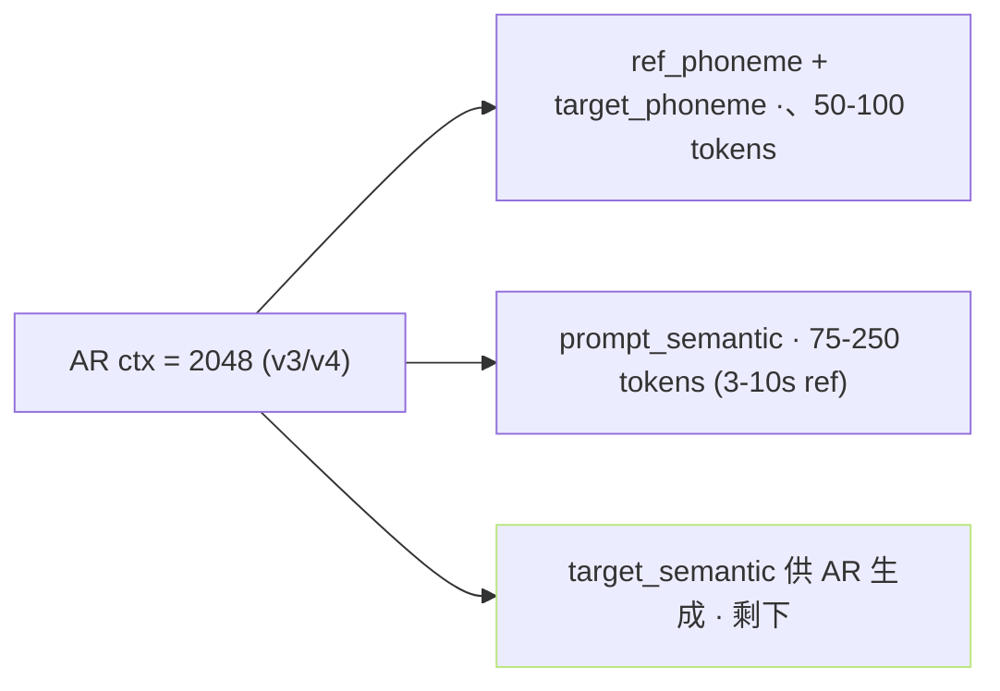
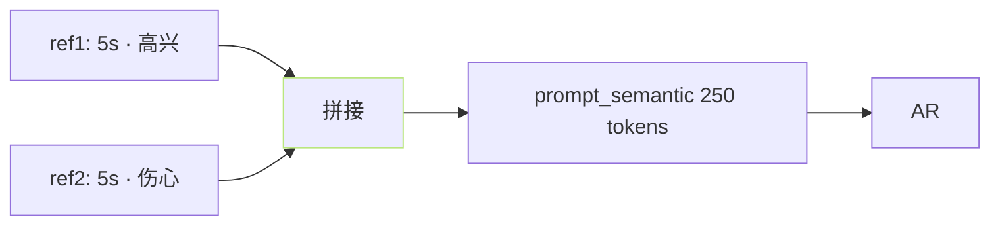

## 前置知识

> [!important]
> 
> 先读 [[4.4 prompt_semantic（参考音频→AR prompt）]]。

---

## 0. 定位

> **一句话**：prompt 长度 = 「**ref 足够表达音色 + 不挤压 target ctx**」的权衡。推荐 5s、 上限 10s、下限 3s。

---

## 1. AR ctx 费用表



### 估算公式

$$\text{ctx}_{\text{available for target}} = \text{ctx}_{\max} - L_{\text{phoneme}} - L_{\text{prompt\_semantic}}$$

- v1/v2：ctx_max = 1024、可生成 ~25s。

- v3/v4：ctx_max = 2048、可生成 ~50-70s。

---

## 2. 长度推荐表

|ref 长度|prompt_semantic|作用|
|---|---|---|
|<3s|<75 tokens|信息不足、音色克隆表现不佳|
|**5s**|**~125 tokens**|**推荐**、表达足够、费用适中|
|10s|~250 tokens|上限、不提升克隆质、挤压 target|
|>10s|>250 tokens|贱占、报坏 target ctx|

---

## 3. 裁剪策略

```python
# inference_webui.py 类似逻辑
def trim_prompt(ref_audio, max_len=10.0):
    # 1. 加载与重采样
    wav, sr = load_audio(ref_audio, 16000)
    # 2. 裁剪到 max_len
    if len(wav) > max_len * sr:
        # 裁剪中间部分 (避免首尾静音)
        center = len(wav) // 2
        half = int(max_len * sr / 2)
        wav = wav[center - half : center + half]
    return wav
```

> [!important]
> 
> **裁剪中间部分**：避免首尾静音 / 达入皆子、保留中间「说话压费」部分。

---

## 4. 多论 ref 拼接



- **作用**：装载多个 ref、为生成「多情感」表现。

- **风险**：音色可能产生「融合」、头次使用推荐单 ref。

---

## 5. 推理时警告

> [!important]
> 
> - **ref 太短 (1-2s)**：音色克隆不准、表现为「起始几句像、后面倒退」。
> 
> - **ref 含静音 / 背景**：SSL 会报干扬、表现为生成静音块。
> 
> - **限 ref 不同语种**：跨语克隆场景、需确保 ref_text 与 ref_audio 匹配 (语种不一致 OK、但内容要匹配)。

---

## 参考文献

1. GPT-SoVITS Repo `inference_webui.py`.

1. VALL-E ICL: [https://arxiv.org/abs/2301.02111](https://arxiv.org/abs/2301.02111)