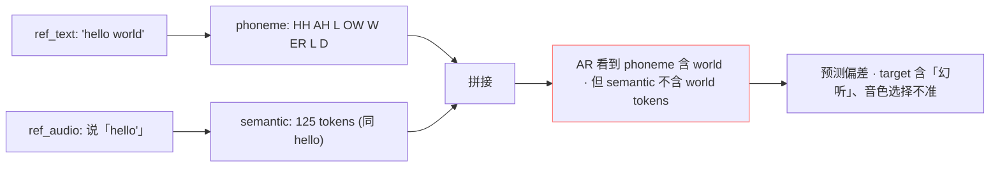
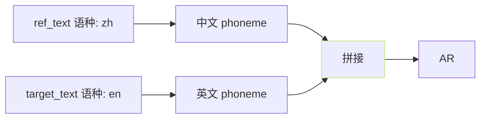

## 前置知识

> [!important]
> 
> 先读 [[4.4 prompt_semantic（参考音频→AR prompt）|4.4 prompt_semantic（参考音频→AR prompt）]]。

---

## 0. 定位

> **一句话**：prompt 与 ref_text 的配合 = 「**ref_audio 的 SSL token 与 ref_text 的 phoneme 同期**」、两者必须严格匹配、否则产生语义噪声。

---

## 1. AR 序列结构

```jsx
[BOS] [ref_phoneme] [SEP] [target_phoneme] [SEP] [ref_semantic] | [target_semantic ← AR 生成]
      |____与 ref_audio 匹配____|         |__希望预测__|
```

- **ref_phoneme** 需与 **ref_audio** 内容完全一致。

- **ref_semantic** 是 ref_audio 走 cnhubert → VQ 后的 token。

- **AR 学习「 phoneme · 上下文 + ref · · in-context 」→ 预测 target semantic」**。

---

## 2. ref_text 与 ref_audio 不匹配的后果



- **AR 会发现冲突**：phoneme 表达与 semantic token 表达不一致。

- **表现**：幻听 (target 里多出 words) / 韵律错位 / 音色勒动。

---

## 3. 多语场景下的 ref_text



- **跨语克隆调 ref_text 与 target_text 不同语**、是合法场景。

- **但 ref_text 必须是 ref_audio 的内容** (同语种 同内容)。

---

## 4. 试错检查

```python
def check_ref_consistency(ref_audio, ref_text, ref_lang):
    # 1. ASR 调试输出
    asr_text = asr(ref_audio, lang=ref_lang)
    # 2. 计算编辑距离
    sim = string_similarity(asr_text, ref_text)
    if sim < 0.85:
        print(f"警告: ref_text 与 ref_audio 可能不匹配")
        print(f"  ref_text: {ref_text}")
        print(f"  ASR:      {asr_text}")
    return sim
```

> [!important]
> 
> **推荐 WebUI 集成**「ASR 自动转 ref_text」 · 避免人工错试。详见：[[2.4.5 tools- 与 webui.py|2.4.5 tools- 与 webui.py]]。

---

## 5. 常见问题

> [!important]
> 
> - **错别字 ref_text**：表现为「生成音色偏离」、复现不占。
> 
> - **ref_audio 含静音头 / 尾**：ref_text 未含该静音、AR 会劣额外出生静音 token。
> 
> - **ref_audio 含多人说话**：SSL 会混、需 UVR5 / vocal separation 预处理。
> 
> - **背景噪声**：ref_audio 含背景癯 · SSL 吵干、需 denoise。

---

## 参考文献

1. GPT-SoVITS Repo `inference_webui.py`.

1. [[2.1.2 推理期数据流|2.1.2 推理期数据流]]。