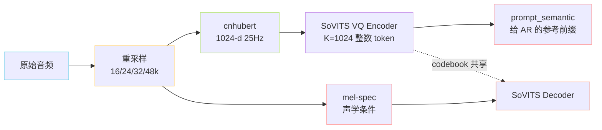

> 📎 **前置知识**：[[1.3 自监督语音表征（SSL Features）|1.3 自监督语音表征（SSL Features）]]（HuBERT / cnhubert）；[[1.4 向量量化（VQ）与离散语义 Token|1.4 向量量化（VQ）与离散语义 Token]]；采样率与梅尔谱基础。

## 0. 定位

> 「音频 → 离散 semantic token + 连续 mel 条件。」音频前端把 wav 同时拆成两路：给 AR 的离散语义流，给 Decoder 的连续声学条件。

## 1. 双路分叉

## 2. 采样率拓扑

|模块|期望采样率|备注|
|---|---|---|
|cnhubert 输入|16 kHz|HuBERT 训练默认 hop=320|
|VITS Decoder 输出（v1/v2）|32 kHz|hop = 640|
|CFM Decoder + BigVGAN（v3）|24 kHz|BigVGAN-v2 24khz-100band-256x|
|CFM Decoder + BigVGAN（v4）|48 kHz|BigVGAN 48khz-100band-512x（原生）|
|参考音频|任意，内部统一重采样|≥3s 推荐，5–10s 最佳|

## 3. cnhubert × VQ 协同

- **cnhubert**：chinese-HuBERT-base，输出 `[T, 1024]`，**25Hz 帧率**（hop = 640 @ 16kHz）

- **VQ Encoder**：1D conv 下采样 + 残差量化，codebook K=1024，输出 `[T, 1]` 整数 token

- **prompt_semantic**：参考音频 → cnhubert → VQ → semantic token 序列 → 作为 AR 的「条件前缀」（in-context learning prompt）

## 4. 工程判断

> 🔧 **为什么不直接用 mel 喂 AR？** —— mel 是连续高维特征，自回归预测连续值不稳定（high-variance regression）。SSL→VQ 把信号映射到离散语义空间，AR 变成「分类问题」，loss 收敛快、采样可控（top_k/top_p）。

> 💡 **直觉：双路解耦** —— AR 路（semantic）解决「说什么」，Decoder 路（mel/spk）解决「谁在说」。两者解耦让音色与内容可独立切换，这是 zero-shot 音色克隆的根基。

> ⚠️ **采样率坑**：参考音频若是 8kHz 电话音质，cnhubert 抽出来的 SSL 表征会严重劣化，建议先用音频超分预处理。

## 5. 子页面导航

[[4.1 重采样策略（16k - 24k - 32k - 48k）|4.1 重采样策略（16k - 24k - 32k - 48k）]]

- chinese-HuBERT-base: TencentGameMate/chinese-hubert-base

[[4.4 prompt_semantic（参考音频→AR prompt）|4.4 prompt_semantic（参考音频→AR prompt）]]

- 仓库 `GPT_SoVITS/feature_extractor/`

## 参考文献

- HuBERT: [https://arxiv.org/abs/2106.07447](https://arxiv.org/abs/2106.07447)

[[4.2 cnhubert 特征抽取|4.2 cnhubert 特征抽取]]

[[4.3 SoVITS 内置 VQ Encoder|4.3 SoVITS 内置 VQ Encoder]]