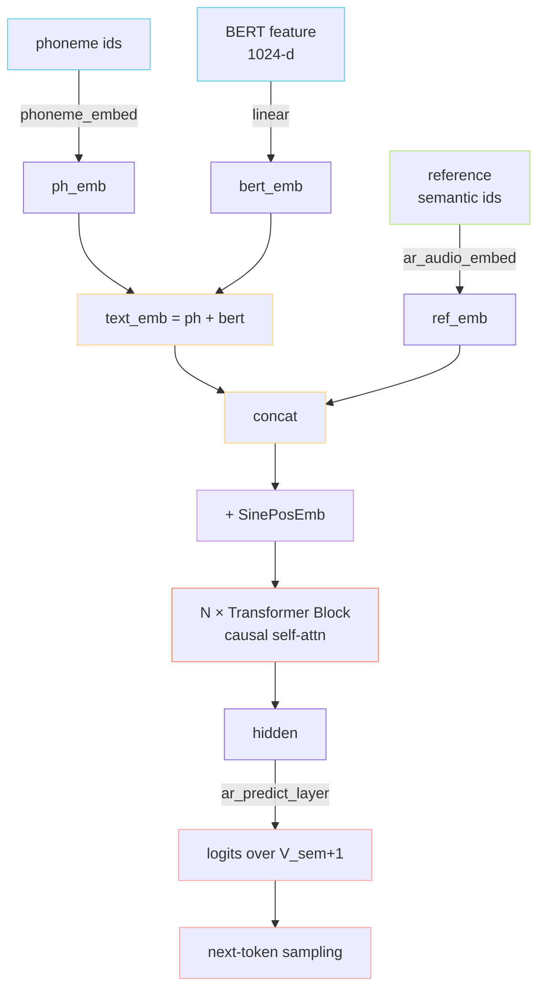

> [📎] 前置知识：Decoder-only Transformer、Causal Self-Attention、Pre-LN / Post-LN、Sinusoidal Positional Embedding、KV Cache。

> **定位**：本节拆解 GPT-SoVITS AR 侧的核心网络 `Text2SemanticDecoder`（位于 `GPT_SoVITS/AR/models/t2s_model.py`），把「输入拼接 → 位置编码 → N 层 Transformer Block → 输出 logits → KV Cache 推理」完整过一遍。

## 1. 整体数据流



## 2. 输入序列的「四段式」拼接

模型在训练 / 推理时把输入打成一个一维 token 序列：

$$\underbrace{[\text{ph}_1,\dots,\text{ph}_{T_p}]}_{\text{文本侧}} \;\Vert\; \underbrace{[\text{ref}_1,\dots,\text{ref}_{T_r}]}_{\text{参考语义}} \;\Vert\; \underbrace{[\text{tgt}_1,\dots,\text{tgt}_{T_t}, \text{EOS}]}_{\text{目标语义}}$$

- **文本侧**：phoneme embedding + BERT linear-projected embedding **相加**（同位 add，而非 concat）。BERT 提供韵律 / 语调，phoneme 提供发音单元。

- **参考语义**：从参考音频通过 cnhubert + VQ 得到的 semantic token id，经 `ar_audio_embedding` 查表。

- **目标语义**：训练时是 ground truth，推理时是已生成的 token（causal）。

> [💡] **为什么参考语义不另开通道？** 单流拼接让 self-attention 自然学到「目标 token 与参考 token 之间的音色 / 风格对齐」，无需显式 cross-attention，结构最简。代价是上下文窗口要够长（v1: 1024，v3: 2048）。

## 3. 位置编码：SinePositionalEmbedding

GPT-SoVITS 选用经典的 **正弦位置编码**（非 RoPE / ALiBi）：

$$\text{PE}(pos, 2i) = \sin\!\left(\tfrac{pos}{10000^{2i/d}}\right), \quad \text{PE}(pos, 2i+1) = \cos\!\left(\tfrac{pos}{10000^{2i/d}}\right)$$

> [🤔] **为什么不用 RoPE？** AR 序列长度上限 ~1600（25Hz × 64s），不算长；且推理时 KV Cache 已实现，RoPE 收益不显著。Sine PE 实现简单、可直接外推到训练未见过的长度（外推稳定性虽不如 RoPE，但够用）。社区有 RoPE 改造分支但未进主线。

## 4. Transformer Block 内部

每个 Block 标准结构（Pre-LN）：

```jsx
x → LN → CausalMHA → +residual
  → LN → FFN(d × 4) → +residual
```

|字段|v1 / v2|v3 / v4|
|---|---|---|
|`n_layers`|12|24|
|`d_model`|512|768|
|`n_heads`|16|16|
|`d_ffn`|2048|3072|
|参数量|~80M（AR 部分）|~330M（AR 部分）|
|上下文|1024|2048|

注意力是 **严格因果** 的下三角 mask，并且对 phoneme 段也施加 mask（即 phoneme 也按从左到右建模，与 GPT 一致），区别于 encoder-decoder 的双向 encoder。

## 5. KV Cache：把 $O(T^2)$ 砍成 $O(T)$

朴素推理：第 $t$ 步要算 $text{softmax}(QK^top / sqrt d)V$，其中 $Q, K, V in mathbb R^{t times d}$，复杂度 $O(t^2 d)$；累计 $T$ 步是 $O(T^3 d)$，灾难。

KV Cache 思想：缓存历史 $K, V$，每步只算 **新 token 的** $q$ 与历史 $K$ 的内积：

$$\text{attn}_t = \text{softmax}\!\Big(\tfrac{q_t [K_1;\dots;K_t]^\top}{\sqrt d}\Big) [V_1;\dots;V_t]$$

单步复杂度降为 $O(t d)$，总计 $O(T^2 d)$。在 GPT-SoVITS 中，KV Cache 通过 monkey-patch 实现：函数名 `patched_mha_with_cache`，在 `GPT_SoVITS/AR/modules/transformer.py` 替换 `nn.MultiheadAttention.forward`。

> [⚠️] **KV Cache 与训练不兼容**：训练时是 full-attention，没有「逐步」的概念；只在 `infer_panel_naive` 等推理函数中启用。混用会导致缓存与全量重算结果不一致。

## 6. 与同范式的对比

|模型|Decoder-only|位置编码|上下文|帧率|KV Cache|
|---|---|---|---|---|---|
|GPT-SoVITS v1|✅ 12 层|Sine PE|1024|25 Hz|patched|
|GPT-SoVITS v3 / v4|✅ 24 层|Sine PE|2048|25 Hz|patched|
|VALL-E AR|✅ 12 层|Sine PE|~2048|75 Hz|原生|
|CosyVoice 2 LLM|✅ 14 层|RoPE|8192|25 Hz|原生|
|Tortoise GPT|✅ 30 层|learned|400|—|有|

## 7. 子页面导航

[[5.1.1 输入序列拼接格式]]

[[5.1.2 SinePositionalEmbedding]]

## 参考文献

1. Vaswani, A. et al. (2017). _Attention Is All You Need_. NeurIPS.

1. Wang, C. et al. (2023). VALL-E. arXiv:2301.02111.

[[5.1.3 Transformer Block 内部]]

1. PyTorch `nn.MultiheadAttention` source — KV Cache 改造目标。

[[5.1.4 KV Cache（patched_mha_with_cache）]]

1. GPT-SoVITS source: `GPT_SoVITS/AR/models/t2s_model.py`, `GPT_SoVITS/AR/modules/transformer.py`.

[[5.1.5 模型规模演进]]