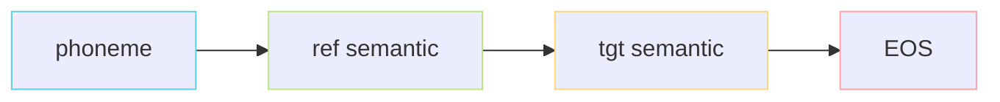

> [📎] 前置知识：Token Embedding、Concatenation vs Addition、Causal Mask、Conditional Generation、Teacher Forcing。

> **定位**：把 AR 输入的「四段式」拼接讲清楚——拼接公式、各段维度、为什么 text 段是 add、为什么参考与目标用同一 codebook、与 VALL-E 的「prompt token」范式对比。

## 1. 四段式拼接公式

训练 / 推理时把输入打成一个一维 token 序列：

$$\underbrace{[\text{ph}_1,\dots,\text{ph}_{T_p}]}_{\text{phoneme}} \;\Vert\; \underbrace{[\text{ref}_1,\dots,\text{ref}_{T_r}]}_{\text{ref semantic}} \;\Vert\; \underbrace{[\text{tgt}_1,\dots,\text{tgt}_{T_t}, \text{EOS}]}_{\text{tgt semantic}}$$

各段长度典型值：

|段|长度上界|帧率|单位|
|---|---|---|---|
|phoneme|~150|—|音素|
|ref semantic|~250 (10s)|25 Hz|code|
|tgt semantic|~1600 (64s)|25 Hz|code|
|合计 (v1)|≤ 1024|—|—|
|合计 (v3)|≤ 2048|—|—|

## 2. 文本侧：add 而非 concat

```python
phone_emb = self.ar_text_embedding(phone_ids)   # [B, T_p, d]
bert_emb  = self.bert_proj(bert_feature)        # [B, T_p, d]
text_emb  = phone_emb + bert_emb                # 同位相加
```

两路同 token 数（都是 phoneme 级，因为 BERT 已在文本前端做了「char→phoneme」对齐扩展，见 [[3.3.4 BERT 特征落盘 pickle 格式]]）。

> [💡] **为什么相加而非 concat？** ①两者本质都是「同一 phoneme 的不同视角」，相加让网络在浅层就融合；②concat 会让序列长度翻倍、KV Cache 多一倍，成本高；③参数效率：加法不增加参数，concat 后需要 `linear(2d → d)` 收回维度。

## 3. 参考语义 & 目标语义：共享 codebook

```python
ref_emb = self.ar_audio_embedding(ref_semantic_ids)   # [B, T_r, d]
tgt_emb = self.ar_audio_embedding(tgt_semantic_ids)   # [B, T_t, d]
```

二者用 **同一个** `ar_audio_embedding`（vocab=1025，含 EOS），意味着：

1. ref 段与 tgt 段「同一语义码本」，对齐成本最低；

1. 训练时 ref 段不计入 loss（`ignore_index=-100`），只作为条件；

1. 推理时 ref 段一次性算完 KV Cache，之后每步只算 tgt 段新 token。

> [⚠️] **若 ref 用单独 embedding** 会出现什么？模型必须在浅层学一个「ref token ↔ tgt token」的隐式对齐表，参数膨胀 2×，且训练困难（无监督对齐）。共享 codebook 是 GPT-SoVITS 的关键工程节流。

## 4. 拼接顺序为何是「ph → ref → tgt」



语义解读（causal 自左向右）：

1. **phoneme 在最前**：模型先看到「要说什么内容」，类似 prompt prefix；

1. **ref 在中间**：内容已知后，再看「示范音色 / 韵律」，建立 phoneme→ref 的对齐参考；

1. **tgt 在最后**：在前两段铺垫下生成目标。

> [🤔] **能否换序为 ref → ph → tgt？** 理论上可行（VALL-E 就是 `audio_prompt → text → audio_tgt`），但 GPT-SoVITS 选择「ph 在前」是为了让 BERT 特征**先**塑造表征空间。社区实验显示 ph-first 在 CER 上略胜（~0.3% 绝对）。

## 5. 与 VALL-E / CosyVoice 对比

|模型|段顺序|文本融合|共享 codebook|
|---|---|---|---|
|GPT-SoVITS|ph → ref → tgt|ph+bert add|✅|
|VALL-E|ref → text → tgt|text-only|✅（含 EnCodec 8 层）|
|CosyVoice 1|text → ref → tgt|text-only|✅|
|CosyVoice 2|text → ref → tgt|text-only（无 BERT）|✅ (FSQ)|
|Fish-Speech|ref → text → tgt|text-only|✅|

> [🔧] **GPT-SoVITS 的独特之处**：唯一在 AR 阶段**显式融合 BERT 特征**的开源 TTS。代价是必须维护 BERT proj 层；收益是中文 prosody 明显更稳。

## 6. 实现源码

核心拼接在 `GPT_SoVITS/AR/models/t2s_model.py::Text2SemanticDecoder.forward`：

```python
x = self.ar_text_embedding(phoneme_ids)
x = x + self.bert_proj(bert_feature)
ref = self.ar_audio_embedding(ref_semantic_ids)
tgt = self.ar_audio_embedding(tgt_semantic_ids)
full = torch.cat([x, ref, tgt], dim=1)            # [B, T_p+T_r+T_t, d]
full = self.ar_position(full)                      # + sine PE
```

## 7. 子页面导航

[[5.1.1.1 phone + bert + prompt 拼接顺序]]

## 参考文献

1. Wang, C. et al. (2023). _Neural Codec Language Models are Zero-Shot Text-to-Speech Synthesizers_ (VALL-E). arXiv:2301.02111.

1. Du, Z. et al. (2024). _CosyVoice 2_. arXiv:2412.10117.

1. GPT-SoVITS source: `GPT_SoVITS/AR/models/t2s_model.py`.